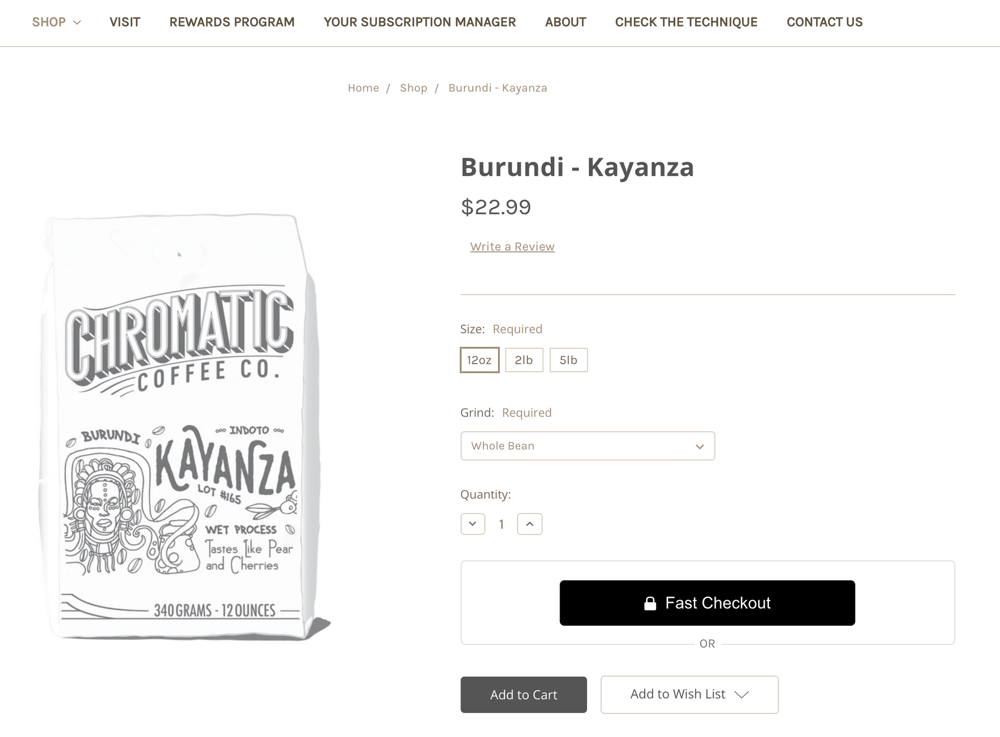
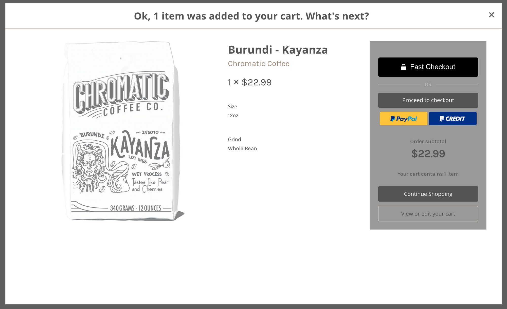
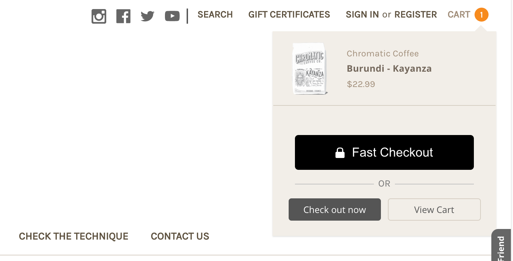

# Install Fast Checkout Examples

NOTE: For legacy theme templates (Blueprint). You must include the following script tag in the HTMLHead.html file

**AND** remove cart_id="{{cart_id}}" from the Fast checkout button

``

NOTE: Replace the app_id variables with your own app id. You can get this from your [**Seller Dashboard →**](https://www.fast.co/business/dash/profile)

## Product Detail Checkout Buttons

### Product detail page

Cornerstone location: /templates/components/products/add-to-cart.html

Blueprint location: Snippets/ProductAddToCart.html

Insert just above:
{{#or customer (if theme_settings.restrict_to_login '!==' true)}}

<code>
<!------ FAST CHECKOUT BUTTON START ----------->

   
OR

   <fast-checkout-button app_id="REPLACE-WITH-YOUR-APP-ID"></fast-checkout-button>

   .fast-wrapper {
     padding-bottom: 20px;
     margin-bottom: 20px;
   }
   .fast-or {
       position: relative;
       top: 80px;
       background: white;
       width: 40px;
       text-align: center;
       margin-left: auto;
       margin-right: auto;
       color: #757575;
   }
   @media only screen and (max-width: 767px){
       .fast-wrapper {
           border-bottom: 1px solid #dfdfdf;
           border-radius: none;
           padding-right: 1%;
           padding-left: 1%;
       }
   }
   @media only screen and (min-width: 768px) {
       .fast-wrapper {
           border: 1px solid #dfdfdf;
           border-radius: 5px;
           padding-right: 20%;
           padding-left: 20%;
       }
   }
<!------ FAST CHECKOUT BUTTON END ----------->
</code>

## Cart checkout buttons

### Cart Preview overlay

Cornerstone location: /templates/components/cart/preview.html

Blueprint location: Snippets/FastCartThickBoxContent.html

Insert just below: `class="previewCartCheckout">{{#if cart.show_primary_checkout_button}}`

<code><!------ FAST CHECKOUT BUTTON START ----------->

 
OR

 <fast-checkout-cart-button cart_id="{{cart_id}}" app_id="REPLACE-WITH-YOUR-APP-ID"></fast-checkout-cart-button>

.fast-overlay-wrapper {
   clear:both;
   margin-bottom:20px;
   border-bottom: 1px solid #c1c1c1;
   padding-bottom: 20px;
}.fast-overlay-or {
   position: relative;
   top: 80px;
   background: #e5e5e5;
   width: 40px;
   text-align: center;
   margin-left: auto;
   margin-right: auto;
   color: #757575;
}
<!------ FAST CHECKOUT BUTTON END -----------></code>

### Mini Cart Preview

Cornerstone location: `/templates/components/common/cart-preview.html`

Insert just above: `

`

<code><!------ FAST CHECKOUT BUTTON START ----------->

 
OR

 <fast-checkout-cart-button cart_id="{{cart_id}}" app_id="REPLACE-WITH-YOUR-APP-ID"></fast-checkout-cart-button>

.fast-mini-cart-wrapper {
   clear:both;
   margin-bottom:20px;
   border-bottom: 1px solid #c1c1c1;
   padding-bottom: 20px;
   margin-left: 20px;
   margin-right: 20px;
}.fast-mini-cart-or {
   position: relative;
   top: 80px;
   background: white;
   width: 40px;
   text-align: center;
   margin-left: auto;
   margin-right: auto;
   color: #757575;
}
<!------ FAST CHECKOUT BUTTON END -----------></code>