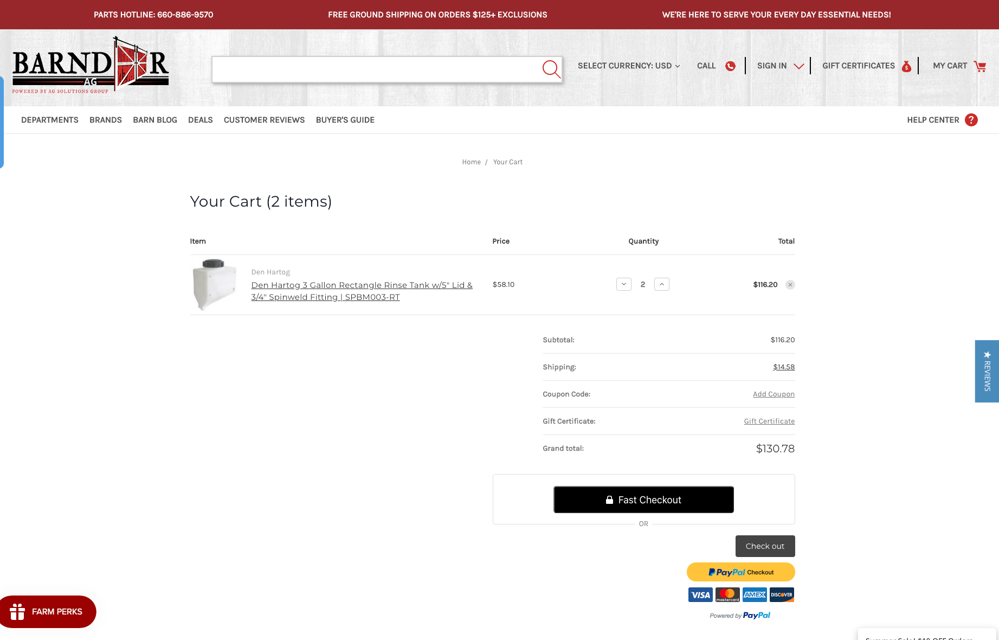
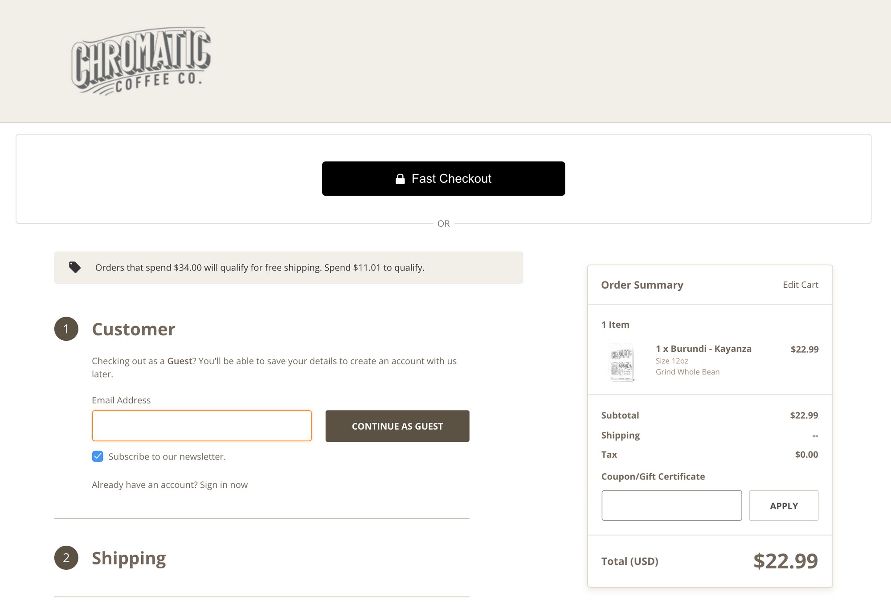

# Button placement on BigCommerce

## Getting Started
To install the Fast Checkout buttons to your BigCommerce site, you will need to add each button's code snippet directly to
your current theme's source code. To access your theme's source code, you will complete the following:
1. Log into to your BigCommerce store account
2. Click on **Storefront**
3. In your **My Themes** page, you will see your *Current Theme*
4. Click on the **Advanced** dropdown menu
5. Click on **Edit Theme Files**
    - If you do not see the **Edit Theme Files** option, then you will need to make a copy of your current theme and
    then set the newly copied version as your current theme. Once you do this, then you will see the option to **Edit Theme Files**.
6. This will open **Stencil Editor**, which is where you can edit your theme's source code and where you will add the Fast Checkout code snippets.

**For all of the Fast Checkout code snippets below, you will need to replace the section *REPLACE-WITH-YOUR-APP-ID* with
your own Fast App Id. Make sure it's wrapped in quotes. You can get this from your [**Seller Dashboard →**](https://www.fast.co/business/dash/profile)

## Installation

### 1. Product Detail Page Button


Cornerstone theme location: `/templates/components/products/add-to-cart.html`

Insert the Fast Checkout code snippet right above this line:
`{{#or customer (if theme_settings.restrict_to_login '!==' true)}}`

Blueprint theme location: `Snippets/ProductAddToCart.html`


```
<!------ FAST CHECKOUT BUTTON START ----------->
<div class="fast-wrapper">
    <div class="fast-or">OR</div>
    <fast-checkout-button app_id="REPLACE-WITH-YOUR-APP-ID" />
</div>
<style>
.fast-wrapper {
    padding-bottom: 20px;
    margin-bottom: 20px;
}
.fast-or {
    position: relative;
    top: 80px;
    background: white;
    width: 40px;
    text-align: center;
    margin-left: auto;
    margin-right: auto;
    color: #757575;
}
@media only screen and (max-width: 767px) {
    .fast-wrapper {
        border-bottom: 1px solid #dfdfdf;
        border-radius: none;
        padding-right: 1%;
        padding-left: 1%;
    }
}
@media only screen and (min-width: 768px) {
    .fast-wrapper {
        border: 1px solid #dfdfdf;
        border-radius: 5px;
        padding-right: 20%;
        padding-left: 20%;
    }
}
</style>
<!------ FAST CHECKOUT BUTTON END ----------->
```


### 2. Cart Preview Overlay Button


Cornerstone theme location: `/templates/components/cart/preview.html`

Insert the Fast Checkout code snippet right below:
`<section class="previewCartCheckout"> {{#if cart.show_primary_checkout_button}}`

Blueprint theme location: `Snippets/FastCartThickBoxContent.html`


```
<!------ FAST CHECKOUT BUTTON START ----------->
<div class="fast-overlay-wrapper">
    <div class="fast-overlay-or">OR</div>
    <fast-checkout-cart-button cart_id="{{cart_id}}" app_id="REPLACE-WITH-YOUR-APP-ID" />
</div>
<style>
.fast-overlay-wrapper {
    clear:both;
    margin-bottom: 20px;
    border-bottom: 1px solid #c1c1c1;
    padding-bottom: 20px;
    margin-top: -30px;
}
.fast-overlay-or {
    position: relative;
    top: 80px;
    background: #e5e5e5;
    width: 40px;
    text-align: center;
    margin-left: auto;
    margin-right: auto;
    color: #757575;
}
</style>
<!------ FAST CHECKOUT BUTTON END ----------->
```

### 3. Mini Cart Preview Button


Cornerstone theme location: `/templates/components/common/cart-preview.html`

Insert the Fast Checkout code snippet right below: `<div class="previewCartAction"> {{#if cart.show_primary_checkout_button}}`

Blueprint theme location: `Panels/SideCartContents.html`


```
<!------ FAST CHECKOUT BUTTON START ----------->
<div class="fast-mini-cart-wrapper">
    <div class="fast-mini-cart-or">OR</div>
    <fast-checkout-cart-button cart_id="{{cart_id}}" app_id="REPLACE-WITH-YOUR-APP-ID" />
</div>
<style>
.fast-mini-cart-wrapper {
    clear: both;
    margin-bottom: 20px;
    border-bottom: 1px solid #c1c1c1;
    padding-bottom: 20px;
    margin-left: 20px;
    margin-right: 20px;
    margin-top: -30px;
}
.fast-mini-cart-or {
    position: relative;
    top: 80px;
    background: white;
    width: 40px;
    text-align: center;
    margin-left: auto;
    margin-right: auto;
    color: #757575;
}
</style>
<!------ FAST CHECKOUT BUTTON END ----------->
```

### 4. Main Cart Page Button



Cornerstone theme location: `/templates/pages/cart.html`

   - Insert the Fast Checkout code snippet right below: `{{#if cart.show_primary_checkout_button}}`

Blueprint location: `Panels/CartContent.html`

   - Insert the Fast Checkout code snippet right below: `<div class="ProceedToCheckout">`


```
<!------ FAST CHECKOUT BUTTON START ----------->
<div class="fast-wrapper">
    <div class="fast-or">OR</div>
        <fast-checkout-cart-button cart_id="{{cart_id}}" app_id="REPLACE-WITH-YOUR-APP-ID" />
    </div>
<style>
.fast-wrapper {
    clear:both;
    margin-bottom: 20px;
    border-bottom: 1px solid #dfdfdf;
    border-radius:none;
    padding-bottom: 20px;
}
.fast-or {
    position: relative;
    top: 80px;
    background: white;
    width: 40px;
    text-align: center;
    margin-left: auto;
    margin-right: auto;
    color: #757575;
}
@media (min-width: 551px) {
    .fast-wrapper {
        margin-left: auto;
        margin-right: 0;
        width: 100%;
        border: 1px solid #dfdfdf;
        padding-left: 10%;
        padding-right: 10%;
        padding-bottom: 20px;
        border-radius: 5px;
    }
}
@media (min-width: 801px) {
    .fast-wrapper {
        width: 50%;
    }
}
@media (min-width: 1261px) {
    .fast-wrapper {
        width: 42%;
    }
}
</style>
<!------ FAST CHECKOUT BUTTON END ----------->
```

### 5. Main Checkout Page Button



Cornerstone theme location: `/templates/pages/checkout.html`

- Insert the Fast Checkout code snippet right above this line: `{{{ checkout.checkout_content }}}`

Blueprint theme location: `Layouts/checkout.html`


```
<!------ FAST CHECKOUT BUTTON START ----------->
<div class="fast-wrapper">
    <div class="fast-or">OR</div>
    <fast-checkout-cart-button cart_id="{{cart_id}}" app_id="REPLACE-WITH-YOUR-APP-ID" />
</div>
<style>
.fast-wrapper {
    clear: both;
    margin-top: 40px;
    margin-bottom: 20px;
    padding-bottom: 40px;
    padding-top:20px;
}
@media (max-width: 799px) {
    .fast-wrapper {
        margin-left: 8%;
        margin-right: 8%;
        margin-bottom: 20px;
        border-bottom: 1px solid #dfdfdf;
        border-radius: none;
        padding-right: 12%;
        padding-left: 12%;
    }
}
@media (min-width: 800px) {
    .fast-wrapper {
        margin-left: auto;
        margin-right: auto;
        margin-bottom: 20px;
        border: 1px solid #dfdfdf;
        border-radius: 5px;
        padding-right: 25%;
        padding-left: 25%;
    }
}
.fast-or {
    position: relative;
    top: 100px;
    background: white;
    width: 40px;
    text-align: center;
    margin-left: auto;
    margin-right: auto;
    color: #757575;
}
</style>
<!------ FAST CHECKOUT BUTTON END ----------->
```

For Cornerstone theme: you will need to create a new script with the code snippet below in Script Manager with the following settings:

- Name: **Fast Checkout Placement**
- Location: **Footer**
‍
- Pages where script is added: **Checkout**
‍
- Script category: **Essential**
‍
- Script type: **Script**

For Blueprint theme, add the code snippet below directly below the Fast Checkout code snippet in `Layouts/checkout.html`

```
<script type="text/javascript">
    var oldOnload = window.onload;
    window.onload = function () {
        if (typeof oldOnload == 'function') {
            oldOnload();
        }
      const fw = document.getElementsByClassName("fast-wrapper")[0];
      const lm = document.getElementsByClassName("layout-main")[0];
      lm.prepend(fw);
    }
</script>
```

## Testing Fast Checkout Buttons (Cornerstone Theme Only)
If you would like to test the Fast Checkout buttons before making them publicly available for your customers, then you will
need to wrap each Fast Checkout code snippet with the following:
```
{{#if customer.name '===' 'Fast Testing'}}

// FAST CHECKOUT CODE SNIPPET HERE

{{/if}}
```

You will need to create a customer account on your website with the following inputs:

- Fist Name: Fast

- Last Name: Testing

All other form field inputs can be random. Once you have tested the buttons, you will need to remove the lines
`{{#if customer.name '===' 'Fast Testing'}} and {{/if}}` from each Fast Checkout button location in order to make the
buttons visible to your customers.


