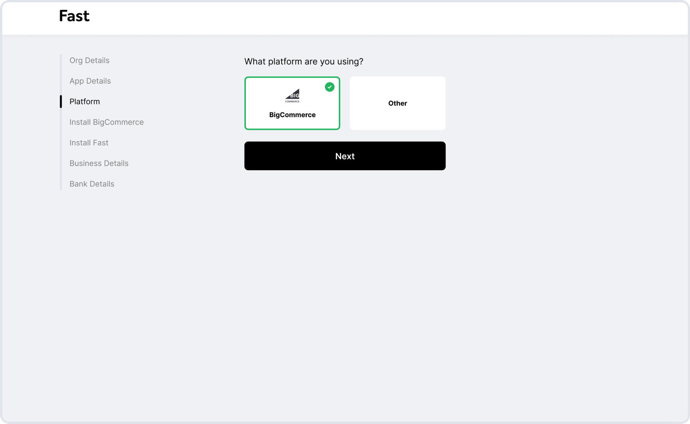
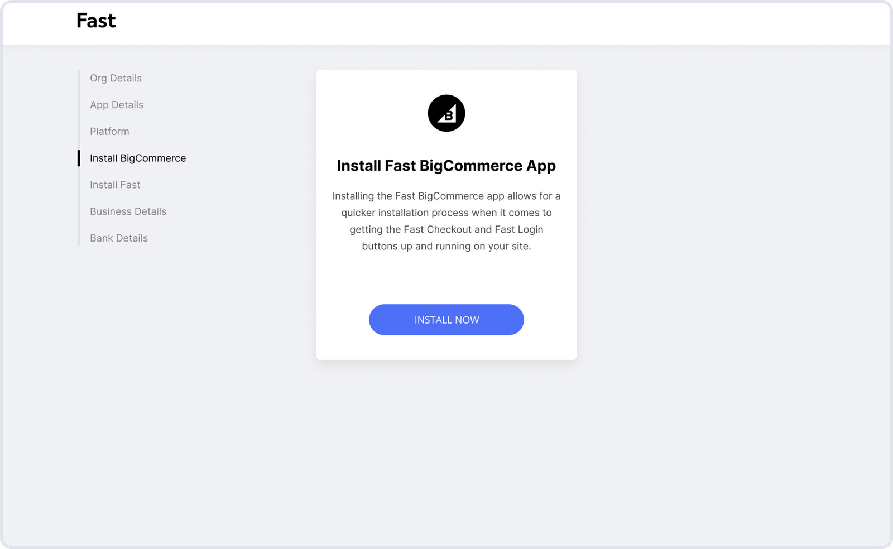

# Fast Checkout for BigCommerce Installation Guide
Ready to get Fast? Here’s how to quickly install Fast Checkout for your BigCommerce store. It’s easy, with no custom integration required.

## Become a Seller

### Complete Seller Signup
Make sure that you've completed your seller signup until you reach the section [**Follow technical integration steps**](/developer-portal/seller-signup/#follow-technical-integration-steps). If you've done these steps already, you're ready to move forward.

[](https://www.fast.co/business)

### Choose BigCommerce
Continue with BigCommerce, or continue here if your website is hosted elsewhere.

[](images/bigcommerce/choose-bigcommerce.png)

### Get the Fast BigCommerce app
Select BigCommerce as your platform. If your site is hosted elsewhere, follow these instructions instead.

[](images/bigcommerce/install-fast-bigcommerce-app.png)

## Install the button

### Copy the code
Use this snippet in your code to install the Fast Checkout button.

```html
<fast-checkout-button app_id="{{app_id}}" />
```
  
[See Examples →](/developer-portal/bigcommerce-install-checkout-examples)

## Complete your business details

[**Return to Seller Signup documentation →**](/developer-portal/seller-signup/#return-to-fast-seller-account-dashboard) to complete your seller profile.