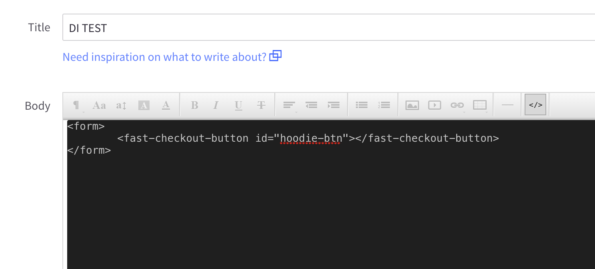
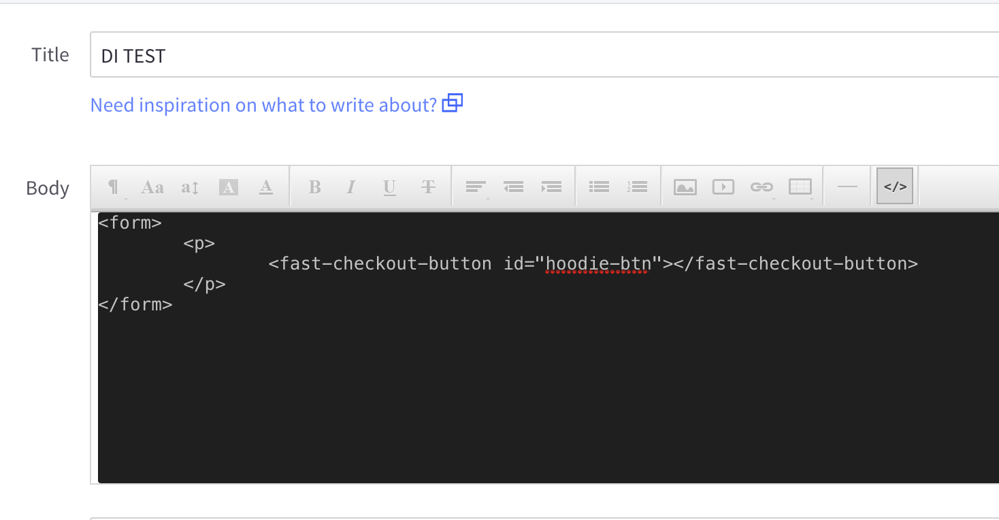
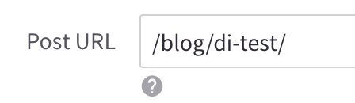

# Fast Checkout for BigCommerce Blog Posts

This guide will tell you how to implement Fast Checkout on your blog posts for your eCommerce site hosted on
BigCommerce. This guide assumes you have an existing eCommerce site on BigCommerce with Fast Checkout on your product
pages already and want to write code to integrate Fast into your website's blog posts. See our
[**other documentation**](https://fast.co/docs) for more detailed information on integrating Fast with
BigCommerce, WooCommerce, and other platforms without needing to write code.


## Getting Started
To add Fast Checkout to your blog posts, you will need to:

1. Log into to your BigCommerce store account
2. Click on **Storefront**
3. Click on **Blog**
4. Click on the *plus sign button* to start a new blog post


## Adding Code to Your Blog Post
In your newly created blog post, you will need to add the following code snippet to it. You will need to assign a unique
identifier to the `fast-checkout-button id` section. The button also needs to be enclosed in a form field:

```
<form>
		<fast-checkout-button id="{INSERT-UNIQUE-ID}"></fast-checkout-button>
</form>
```
In the blog post text editor section, click on `</>` and paste the code snippet here:



When you save the blog post,`<p>` tags will automatically appear around the `fast-checkout-button' line.


## Adding Code to your Theme Files
To access your theme's source code, you will complete the following:
2. From **Storefront**, click on **My Themes**
3. In your **My Themes** page, you will see your *Current Theme*
4. Click on the **Advanced** dropdown menu
5. Click on **Edit Theme Files**
6. This will open **Stencil Editor**, which is where you can edit your theme's source code and where you will add the Fast Checkout code snippets.

Navigate to `templates/components/blog/post.html` and paste the following JavaScript to the bottom of your `post.html` page
```
{{#if settings.request.absolute_path '===' '/blog/di-test/'}}
    <script>
        // If you have multiple fast-checkout-button elements on a single page, you'll want to use a more specific selector
        // here, such as giving each button an id attribute and selecting based off of that.
        var {INSERT-BUTTON-NAME} = document.querySelector('{INSERT-UNIQUE-ID}');
        {INSERT-BUTTON-NAME}.addEventListener('click', (event) => {
            Fast.checkout(
            {
                    // Required. appId is your Fast app ID that you were provided during seller onboarding.
                    appId: '{INSERT-APP-ID}',

              // Required. buttonId is the id attribute of the button that was clicked
              // after an order was placed or canceled, as well as let you identify which button was clicked when listening for
              // postMessage events.
              // If you gave your fast-checkout-button an id attribute, then you can just use event.target.id here.
              buttonId: event.target.id,

              // Either cartId or products must be provided. If both or neither are provided, an error will be thrown before
              // checkout is opened.

                    // When performing a cart checkout, you only need to provide buttonId and cartId.
              // cartId is a unique identifier for a user's cart.
              cartId: 'my-unique-cart-id',

                    // When performing a products checkout, you only need to provide buttonId and products. You can also optionally
                    // provide couponCode and affiliateInfo
              // products is a list of products the user is ordering.
              products: [
                {
                  // Each product has an identifier, a variant identifier, and, optionally, a set of configurations (called
                            // options) that are used to describe the exact product being ordered.
                  // You can think of the id as the product SKU, the variant ID as a sub-identifier to the product, and the
                            // options as things like color, size, etc. Or, if your product identifiers already define exactly one
                            // product, you can just use id and forgo providing options.
                  // The data provided here is what will reach your backend, so describe your products however makes the most
                  // sense to you.
                  // Required. id is an identifier for the product being ordered
                  id: '{INSERT-PRODUCT-ID}',
                            // Optional. variantId represents a unique sub-idenfifier for this product. These are sometimes used to
                            // denote size / color, etc.
                            variantId: 'my-large-product-variant-id',
                  // Optional. options is a set of configurations that further describe the product being ordered (e.g. color
                  // and size).
                  options: [
                    {
                      // Required. id is the name of the option.
                      id: 'color',
                      // Required. value is the value of the option.
                      value: 'blue',
                    }
                  ],
                  // Required. quantity is the number of this product with these configurations being ordered.
                  quantity: 1,
                }
              ],
                  // Optional. couponCode is a coupon that the user might have entered that you would like to pass on to your
              // backend.
              couponCode: '10OFF',
                    // Optional. affiliateInfo contains information about affiliates that you would like to attribute this purchase
                    // with on your backend.
                    affiliateInfo: {
                        // affiliateInfo contains a single field named affiliates, that is an array of affiliate objects.
                        affiliates: [
                            // An affiliate object contains a single field named id, which is a unique identifier associated with this
                            // affiliate. This ID can be whatever string your system is prepared to interpret.
                            id: 'my-affiliate'
                        ]
                    }
            }
          );
        });
    </script>
{{/if}}
```
Same code snippet, but without the comments:
```
{{#if settings.request.absolute_path '===' '/blog/di-test/'}}
    <script>
        var {INSERT-BUTTON-NAME} = document.querySelector('{INSERT-UNIQUE-ID}');
        {INSERT-BUTTON-NAME}.addEventListener('click', (event) => {
            Fast.checkout(
            {
              appId: '{INSERT-APP-ID}',
              buttonId: event.target.id,
              cartId: '{INSERT-UNIQUE-CART-ID}',
              products: [
                {
                  id: '{INSERT-PRODUCT-ID}',
                            variantId: '{INSERT-PRODUCT-VARIANT-ID}',
                  options: [
                    {
                      id: 'color',
                      value: 'blue',
                    }
                  ],
                  quantity: 1,
                }
              ],
              couponCode: '10OFF',
                    affiliateInfo: {
                        affiliates: [
                            id: 'my-affiliate'
                        ]
                    }
            }
          );
        });
    </script>
{{/if}}
```
Same code snippet, but without the optional fields:
```
{{#if settings.request.absolute_path '===' '/blog/di-test/'}}
    <script>
    	(function () {
            var {INSERT-BUTTON-NAME} = document.getElementById("{INSERT-UNIQUE-ID}");
            {INSERT-BUTTON-NAME}.addEventListener("click", (event) => {
            	Fast.checkout(
                {
	    			appId: "{INSERT-APP-ID}",
            	    buttonId: event.target.id,
            	    products: [
                        {
                            id: "{INSERT-PRODUCT-ID}",
                            quantity: 1,
                        },
         			],
        		});
        	});
        })();
    </script>
{{/if}}
```

Make sure to update the `/blog/di-test/` within the script above with the blog url path found on blog post under SEO:


Once you have completed the last ste, click on `Save & apply file`.
