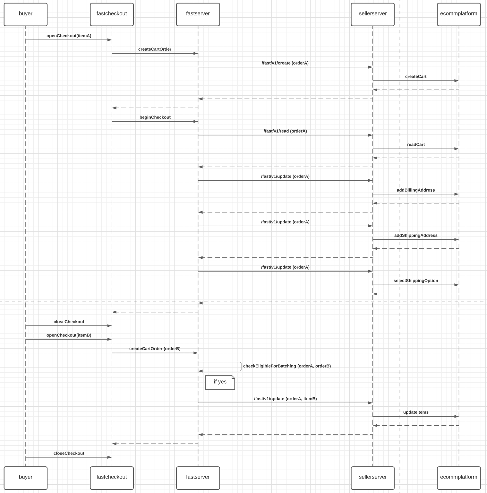

# How Batching Works

## What is batching?
Please refer to the [batching reference documentation](/developer-portal/fast-api-reference-batching) for more information on batching.

## What it looks like within Fast
When the user batches multiple orders together one can think about this as "order piggybacking".

1. Buyer purchases item A on order #1.
2. Buyer exits the checkout experience.
3. Buyer finds another item B that they would like to also order.
4. Buyer purchases item B before order #1 is fully processed.
5. Fast system attaches (or piggy backs) item B onto order #1.
6. Buyer exits the checkout experience for the final time.
7. Fast system processes order #1 and processes payment for both item A and B simultaneously.
8. Seller receives the order with both item A and B.

This flow allows the seller to increase Average Order Value (AOV) and reduce transaction processing costs.

## What it looks like for the Integration Engineer

