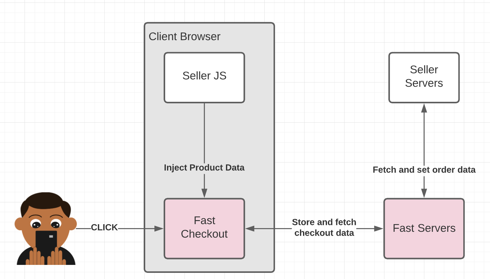
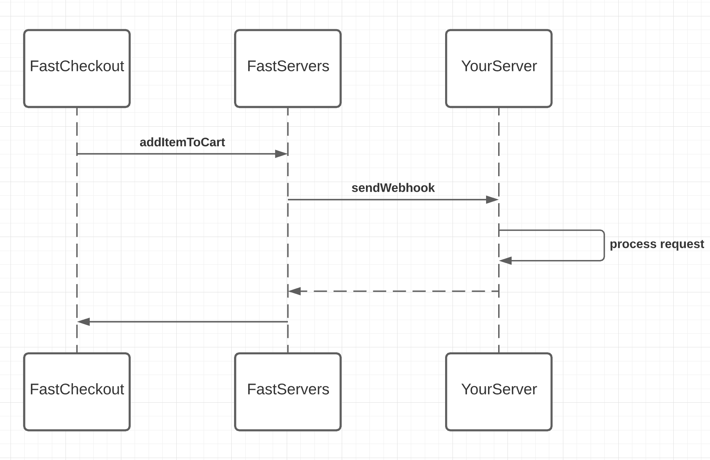

# Fast API Integration Guide

Let's add the Fast Checkout button to your product page to power higher conversion. This guide assumes you have an existing eCommerce system and want to write code to integrate Fast into your website. See our other documentation sections for more detailed information on integrating Fast with BigCommerce, WooCommerce, and other platforms without needing to write code.

[](images/fast-api-overview.png)

# 1. Set up Fast

You'll need a Fast account and sandbox credentials to start integrating. 

[Create a Fast Developer Account](https://sdash.fast.co)

🚨 Note: Your account will have separate credentials for testing and production use. The sandbox credentials are for your development and test environments and will allow you to try Fast using fake credit cards without any money moving. The separate production credentials should be used for real customers performing real transactions.

You can pick up onboarding anytime, if it's your first time doing this you'll likely need to pause at the "Install Fast Checkout" section of onboarding. We will pick up again in the later steps of this guide.

# 2. Add Fast.js to your page

On your product page, load the `fast.js` script:

```jsx
<script src="https://js.fast.co/fast.js"></script>
```

# 3. Use the Fast Checkout button

## Render the button on your page

Decide where you want the button to appear on your product page and add a container for it:

```html
<fast-checkout-button></fast-checkout-button>
```

## Open Fast Checkout when the button is clicked

When the button is clicked, use Fast.js to place an order for the item. Make sure to include any product-specific options:

```jsx
// If you have multiple fast-checkout-button elements on a single page, you'll want to use a more specific selector
// here, such as giving each button an id attribute and selecting based off of that.
var checkoutButton = document.querySelector('fast-checkout-button');
checkoutButton.addEventListener('click', (event) => {
    Fast.checkout(
    {
            // Required. appId is your Fast app ID that you were provided during seller onboarding.
            appId: 'my-fast-app-id',

      // Required. buttonId is the id attribute of the button that was clicked
      // after an order was placed or canceled, as well as let you identify which button was clicked when listening for
      // postMessage events.
      // If you gave your fast-checkout-button an id attribute, then you can just use event.target.id here.
      buttonId: event.target.id,

      // Either cartId or products must be provided. If both or neither are provided, an error will be thrown before
      // checkout is opened.

            // When performing a cart checkout, you only need to provide buttonId and cartId.
      // cartId is a unique identifier for a user's cart.
      cartId: 'my-unique-cart-id',

            // When performing a products checkout, you only need to provide buttonId and products. You can also optionally
            // provide couponCode and affiliateInfo
      // products is a list of products the user is ordering.
      products: [
        {
          // Each product has an identifier, a variant identifier, and, optionally, a set of configurations (called
                    // options) that are used to describe the exact product being ordered.
          // You can think of the id as the product SKU, the variant ID as a sub-identifier to the product, and the
                    // options as things like color, size, etc. Or, if your product identifiers already define exactly one
                    // product, you can just use id and forgo providing options.
          // The data provided here is what will reach your backend, so describe your products however makes the most
          // sense to you.
          // Required. id is an identifier for the product being ordered
          id: 'my-product-id',
                    // Optional. variantId represents a unique sub-idenfifier for this product. These are sometimes used to
                    // denote size / color, etc.
                    variantId: 'my-large-product-variant-id',
          // Optional. options is a set of configurations that further describe the product being ordered (e.g. color
          // and size).
          options: [
            {
              // Required. id is the name of the option.
              id: 'color',
              // Required. value is the value of the option.
              value: 'blue',
            }
          ],
          // Required. quantity is the number of this product with these configurations being ordered.
          quantity: 1,
        }
      ],
          // Optional. couponCode is a coupon that the user might have entered that you would like to pass on to your
      // backend.
      couponCode: '10OFF',
            // Optional. affiliateInfo contains information about affiliates that you would like to attribute this purchase
            // with on your backend.
            affiliateInfo: {
                // affiliateInfo contains a single field named affiliates, that is an array of affiliate objects.
                affiliates: [
                    // An affiliate object contains a single field named id, which is a unique identifier associated with this
                    // affiliate. This ID can be whatever string your system is prepared to interpret.
                    id: 'my-affiliate'
                ]
            }
    }
  );
});
```
🚨 It is important that you call `fast.checkout` synchronously within the `click` event handler. Many browsers will block new windows like Fast Checkout unless they are clearly connected to a user action such as clicking a button. If you perform asynchronous logic that takes several seconds, or call checkout in code in a different frame or window, the browser will prevent Fast Checkout from opening.

## Handle events from Fast Checkout

Once the user has clicked the Fast Checkout button, the Fast popup window will have launched and the user can continue with their checkout. While this is going on, you can listen for Fast.js `postMessage` events (link coming soon for Events list) if you want to keep up with the status of the order on your frontend.

This is useful if you wish to forward data to your analytics provider, or if you want to do things like redirect to an order complete page after the user has finished their order and closed the Fast window.

```jsx
// You can add an event listener for user_events onto your fast object to listen for any Fast-related events.
fast.addEventListener('user_event', (event) => {
  console.log(`Got a user_event of type: ${event.name}`);
  console.log(event);

  // For example, when the user clicks the "Keep shopping" button after finalizing their order, you could redirect to an
  // order confirmation page
  if (event.name === 'Checkout - Order Completed') {
    window.location = 'https://example.com/order-completed';
  }
});
```

🚨 In some environments, such as the embedded browsers inside of mobile apps, the Fast Checkout window will open in a separate browser and not be able to communicate these events back to your page. You should not rely on these events for mission-critical analytics and should always provide another way for buyers to see that their purchase is complete.

# 4. Handle order creation in your backend

Now we will set up your server to communicate with Fast Checkout.

While users interact with the Fast Checkout application, Fast will send requests to your server for processing.

[](images/handle-order-creation.png)

As users add items, apply coupons, and submit orders, Fast will send these events and changes in data to your server for further processing. See the full specification [here](https://www.notion.so/DRAFT-Public-BE-Reference-Checkout-Documentation-79f563ec12d04dbe807fe6f3f146e8ac).

To start developing & testing your integration, you'll likely need to simulate some traffic to your machine. You can do this via our testing environment and developer tools.

### Connecting to Fast Sandbox

If you haven't already, begin onboarding here [https://sandbox.sdash.fast.co](https://sandbox.sdash.fast.co). 

Complete the forms to complete your sandbox store onboarding. You will need to provide your the URL that your API is hosted at in the "**Install Fast Checkout**" section. Once you have registered your API and have a Fast credentials associated with your sandbox store, continue on to the next section.

### Simulating test traffic

To see what data our system will send you in production for a given payload, you'll need the fast developer tools.

Install the fast-cli developer tool with this command.

```bash
pip install fast
```

Finally, execute this command to request a test scenario.

```bash
fast-sandbox test-suite simple-pdp-newuser '{"products": [{"product_id": "<YOUR_PRODUCT_ID>"}]}'
```

**NOTE:** You'll need to replace variables in the initial payload to match actual products that are registered in your system. We expect the seller to recognize the payload we pass. For full documentation on the possible options and full schema, see the [full reference here.](https://www.notion.so/DRAFT-Public-BE-Reference-Checkout-Documentation-79f563ec12d04dbe807fe6f3f146e8ac)

The `test-suite pdp-simple-newuser` command will emit a series of test requests from the Fast backend to yours, that has the same pattern of calls as it will in production. The `pdp-simple-newuser` test suite will run multiple operations.

[pdp existing user notes] we make one call for both 1&2, obvious to get shipping options back

1. CreateOrder in cart state with no user
2. Add shipping address to order
3. Get shipping options
4. Select shipping option
5. Configurable timer wait time
6. ConvertOrder

Here we will be able to validate that the responses you said are valid, and you will be able to see the exact call chain for several scenarios. To see all possible test scenarios, see the [full reference here](https://www.notion.so/DRAFT-Public-BE-Reference-Checkout-Documentation-79f563ec12d04dbe807fe6f3f146e8ac).

The `test-suite pdp-simple-newuser` command will first emit a series of simulated creation, fetch, and update requests from our servers to yours. 

The first request to create the order will hit the `/v1/create` endpoint on your server, with the shape:

```json
{
    "id": "d65f265a-7a4f-4a7c-9bc6-a9e687d596b9",
    "xref_order_id": "costco-123",
    "total_amount":"10.11",
    "total_tax": "0.12",
    "is_cart": false,
    "order_lines": [
        {
            "id": "e4e291d1-a040-4df4-bdb2-5a66893c84d2",
            "name": "Fast Hoodie",
            "xref_product_id": "<YOUR_PRODUCT_ID>",
            "quantity": 1,
        }
    ],
    "custom_values": [],
    "currency_code": "USD"
}
```

Against each request that `test-suite pdp-simple-newuser` sends, the fast dev tools will validate the responses and return you a list of failures and successes as seen below.

```json
REPORT:
- InitialOrderCreation: PASSED
- UpdateOrderShippingAddr: PASSED
- GetShippingOptions: PASSED
- SelectShippingOption: PASSED
- UpdateOrderStatus: FAIL
   > FAIL: order status not changed
```

For more information on what gets validated on these requests and responses, see the [full reference documentation here](https://www.notion.so/DRAFT-Public-BE-Reference-Checkout-Documentation-79f563ec12d04dbe807fe6f3f146e8ac).

Once your server can reply to these messages, Fast Checkout is able to construct a Checkout Session and collect all the information from the customer to complete the order.

### Tailing logs

Engineers can also leverage `fast-cli` to tail logs from Fast about their app. 

`fast --env sandbox tail '{"app_id": "<app_id>"}'`

# 5. Testing your integration

Please visit [https://sdash.sandbox.fast.co](https://sdash.sandbox.fast.co) to resume your onboarding. If you have already done this in step #4, continue to r**un the full test suite.**

### Run the full test suite

Using the fast-cli execute the following command to run all various testing scenarios on your server in sandbox.

`fast --env=sandbox test-suite *`

For full documentation on the list of test cases, see the full reference documentation [here](https://www.notion.so/DRAFT-Public-BE-Reference-Checkout-Documentation-79f563ec12d04dbe807fe6f3f146e8ac).

# 6. Moving to production

Now that your integration is working in your development environment against the Fast Sandbox, you will need to make several changes to enable it to work for real customers. Firstly, you'll need to repeat the onboarding steps in [production](https://sdash.fast.co). Once you have completed that, you're all set!