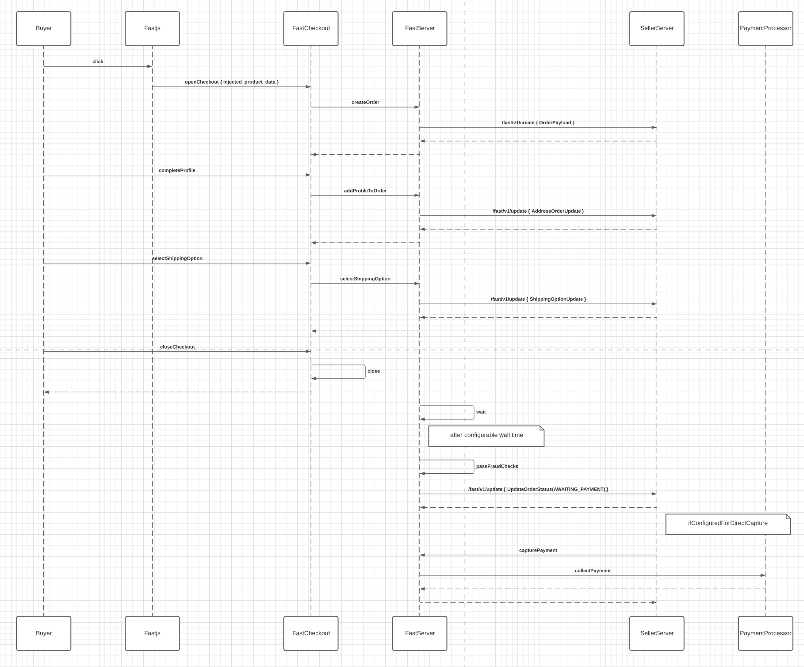

# Order & Checkout Reference Documentation

> This product is in Early Access

## Sample sequence diagram

This sequence diagram illustrates the sequence of API calls for a new user PDP flow with a seller configured for direct capture. See the *Configurable & Direct Capture [BETA]* section for more information on direct capture.



# Key concepts for order processing

## Types of checkout origin

1. Product page checkout (PDP)
    - A checkout that occurs from a single product.
    - Can be batched with other PDP checkouts or Cart checkouts
2. Cart checkout
    - A checkout that occurs from an ecommerce cart
    - Can be batched with other Cart checkouts or PDP checkouts
3. Re:order 
    - A checkout that occurs on a historical order from the Fast buyer dashboard (bDash).
    - Creates a new order with the source as `"re:order_checkout"`
    - Can be batched with other cart checkouts or pdp checkouts.

## Order Batching

> *Order Batching: When 2 or more customer shopping carts are merged into one order*

In the Fast Checkout customer experience, users have 5 minutes to make changes to their order. During the time window, they are able to update items in the cart, cancel order, and other checkout related interactions. If the user closes the window and purchases another item on the same store during the 5 minute timer, their new purchase will be "batched" with the previous one. 

Today this works by piggybacking the new item into their active order. Most of this is handled invisibly to the seller. What it will look like in the server API calls is when an order is batched with a new purchase, the original order will get an update call with a new item. 

## Product Item Identification

Many ecommerce stores have complex & detailed setups for their products. As a result, Fast's data model allows for any combination of unique identifiers. This is a representation of an item in Fast.

```json
Option: {
	option_id: string, // identifier for the option, used to indicate size or color
  option_value: string, // value for the option provided, i.e. small, medium, large, blue
}

Item: {
	external_id: string, // uniquely identifies an exact item, i.e. Small Navy Blue Hoodie
	external_product_id: string, // identifies a product, i.e. Hoodie
	external_variant_id: string, // can be used in combination with product_id to identify an exact item.
	external_product_options: []Option, // can be used in combination with product_id to identify an exact item.
}
```

You will need to see how this schema will map to your representation of items in your system. It is best to provide as much data as possible to the checkout window so that your system does less work to identify which product is being purchased.

### Unsupported product item types

1. Subscription products
2. THC products
3. Weapons
4. More

### **Guidelines for item identification**

Fast expects data for items to be injected into checkout, here are a couple guidelines for providing that data. It is recommended to approach each unique product / item set up in order. That is to say for Item A, if guideline #1 fits, you should use #1 and not #2.

1. If the browser has the data to uniquely identify the item
    - Provide the unique identifier as the `external_item_id`
    - **Expectation**: Your backend should recognize this `external_item_id`
2. If the product has no settings or modifiers the customer can pick
    - Provide the `external_product_id`
    - **Expectation**: Your backend should recognize the `external_product_id`
3. If the product has settings/modifiers & a unique identifier for the exact product variant is present
    - Provide the `external_product_id`
    - Provide the unique identifier for the settings as the `external_variant_id`
    - **Expectation:** Your backend should be able to recognize the `external_product_id + external_variant_id` as a unique item
4. If the product has settings/modifiers but a unique identifier for the exact product cannot be fetched from the browser
    - Provide the `external_product_id`
    - Provide the list of `external_product_options` in the specified format
    - **Expectation:** Given the `external_product_id` + its optional key/value pairs, your backend should be able to recognize the exact item that is being operated on.

## Internal financial values representation

To avoid floating point arithmetic issues and to provide for exactness in calculations across many currencies, Fast uses the [google.protobuf.Money](https://github.com/googleapis/googleapis/blob/master/google/type/money.proto) data schema internally to represent financial values. Fast internally uses no rounding in the backend, however our checkout UI does round values to (2,3,4) digits for display.

```json
Price: {
	Units: int64 // the whole portion of the total price
	Nanos: int32 // the partial value of the total price. represented as an integer * 10e9,
	CurrencyCode: string, // ISO 4217 currency code
}
```

## Public financial value representation

We convert our internal financial representation (with zero rounding) and send financial values as a string.

## Fast Order lifecycle


## Configurable & Direct Capture [BETA]

> *Configurable & Direct Capture: the ability to control payment capture timing via the API.*

To enable configurable capture, please engage with our support team here. If you are a seller that is registered to use configurable capture, Fast will expect you to make the capture call for orders processed through our system. This can be done by using the Capture API. 

When orders in Fast have been converted from a cart to an order, we perform risk & fraud checks to mitigate against chargebacks. After an order has passed all checks, we will send a `Update` request to your server with a field in `convert_cart_to_order: true`. This lets your server know that order's with this signal are ready for payment processing and fulfillment.

On the Capture API request, Fast servers will initiate payment capture on the order. Once payment has been collected successfully, we will change the order status to `AWAITING_FULFILLMENT`.

# API Spec

### Why POST for everything? Why not GET?

This was a conscious decision made to allow for polymorphic endpoints and enable ease of integrating new features in the future. As Fast scales and enables more features for your customers, these features will simply be integrated as additional, backwards-compatible data (opt-in) features rather than setting up new endpoints in your infrastructure.

## Error Codes

Fast uses the standard well known error codes for many behaviors.

```json
401: Unauthorized
404: Not Found
422: UnprocessableEntity
500: Unknown Server Error
503: Unavailable
```

## Fast → Seller APIs

[fastoutbound.json](%5BBETA%5D%20Order%20&%20Checkout%20Reference%20Documentation%2026cc5ffeda9d4736a6e61cc207efe0b1/fastoutbound.json)

### Create Request

`POST /fast/v1/create`

1. *entity_type: the type of entity being created*
    - possible values: `["ENTITY_ORDER"]`
2. *order: wrapper object for the order. metadata is kept in the top level outside of the inner order*
    - *is_cart: boolean indicating if order is in cart phase*
3. *request_id:* *idempotency key of request. ensure that your operations are idempotent against this field*
4. *app_id: store identifier within fast*

```json
{
	"entity_type": string,
	"order": {
		"is_cart": boolean,
		"order": FastOrder,
	},
	"request_id": string,
	"app_id": string
}
```

### Create Response

1. *order: FastOrder data entity*

```jsx
{
	"order": FastOrder
}
```

### Read Request

`POST /fast/v1/read`

1. *entity_type: the type of entity being read*
    - possible values: `["ENTITY_ORDER", "ENTITY_SHIPPING_OPTION"]`
2. *order: FastOrder data entity*
    - *is_cart: boolean indicating if the order is in cart phase*
    - *order_id: uuid value string that is the fast unique identifier*
    - *external_order_id: the seller or integrators order_id*
3. *app_id: store identifier within fast*

```json
{
	"entity_type": string,
	
	"order": {
		"is_cart": boolean,		
		"order_id": string,
		"external_order_id": string,
	},
	

	"app_id": string
}
```

### Read Response

1. order*: FastOrder data entity*

```json
{
	"order": FastOrder
}
```

### Update Request

`POST /fast/v1/update`

1. *entity_type: the type of entity being updated*
    - Possible values: `["ENTITY_ORDER"]`
2. order*: FastOrderUpdateRequest data entity*
3. *request_id: idempotency key*
4. *app_id: store identifier within fast*

```json
{
	"entity_type": string,	
	
	"order": FastOrderUpdateRequest,
	

	"request_id": string,
	"app_id": string
}
```

### Update Response

The update API is able to update several different top level components of the order. In the request we send to your server we will supply *only* the incremental data. If we send you data you should check that the item being updated/added is not being duplicated accidentally. We provide unique ids on each item.

**Example 1: Update existing item quantity**

request:

response:

```json
{
	"entity_type": "ENTITY_ORDER",
	"order": {
		"items": [
			{
				"id": "item_1", // pre existing item
				"quantity": 2 // quantity change
			}
		],
	},
}
```

```json
{
	"entity_type": "ENTITY_ORDER",
	"order": {
		"items": [
			{
				"id": "item_1", // pre existing item
				"quantity": 2, // quantity change respected
				"price": "54.02" // new price updated
			}
		],
	},
}
```

**Example 2: Update billing address associated with an order**

request:

```json
{
	"entity_type": "ENTITY_ORDER",
	"order": {
		"bill_to": AddressUpdateEntity
	}
}
```

response:

```json
{
	"entity_type": "ENTITY_ORDER",
	"order": {
		"bill_to": Address,
		"shipping_options": [ShippingOption],
	},
}
```

**Example 3: Add additional item to cart**

request:

response:

```json
{
	"entity_type": "ENTITY_ORDER",
	"order": {
		"items": [
			{
				"id": "item_2" // newly added item
			}
		],
	},
}
```

```json
{
	"entity_type": "ENTITY_ORDER",
	"order": {
		"items": [
			{
				"id": "item_1",
				// ... other previously hydrated data
			},
			{
				"id": "item_2",
				"price": 32.04, // and other newly hydrated data
			},
		]
	}
}

```

**Example 4: Add coupon to cart**

request:

response:

```json
{
	"entity_type": "ENTITY_ORDER",
	"order": {
		"items": [
			{
				"id": "item_2" // newly added item
			},
		"coupon": "COUPONCODE"
		],
	},
}
```

```json
{
	"entity_type": "ENTITY_ORDER",
	"order": {
		"items": [
			{
				"id": "item_1",
				// ... other previously hydrated data
			},
			{
				"id": "item_2",
				"price": 32.04, // and other newly hydrated data
			},
		],
		"coupon": "COUPONCODE"
	}
}

```

### Delete Request

`POST /fast/v1/delete`

1. *entity_type: the type of entity being updated*
    - Possible values: `["ENTITY_ORDER"]`
2. *entity: wrapper object for the request*
    - *order: FastOrderDeleteRequest data entity*
3. *request_id: idempotency key*

```json
{
	"entity_type": string,
	"order": FastOrderDeleteRequest
	"request_id": string,
}
```

### Delete Response

The response to delete should be empty if no issues occurred, or return one of the listed error code in the case something went wrong.

```json
{}
```

## Seller → Fast APIs

NOTE: This is not final and is still in development, real OpenAPI compatible specs will be generated and viewable by the public by 03/31/2021

[fastinbound.json](%5BBETA%5D%20Order%20&%20Checkout%20Reference%20Documentation%2026cc5ffeda9d4736a6e61cc207efe0b1/fastinbound.json)

### Refund Order

An endpoint to refund an order. Fast supports partial refunds and will respect multiple unique refund requests up to the order's total original price.

### BusinessEvent

An endpoint to attach trigger business logic associated with a business event on an order. Examples may include:

- Order payment: `"BUSINESS_EVENT_TYPE_CLEAR_TO_COLLECT_PAYMENT"`
- Order shipped: `"BUSINESS_EVENT_TYPE_FULFILLMENT"`

### CancelOrder

An endpoint to cancel an order from the merchant side. This could be in the case that an error occurred on your side, or an inability to fulfill the order. See cancel codes documentation below.

### Cancel Codes

```jsx
1: Buyer canceled
2: Entity not found
3: Unprocessable order
4: Insufficient Stock
5: Fraud check failed
6: Payment declined 
```

### GetOrder

An endpoint to fetch information regarding an order.