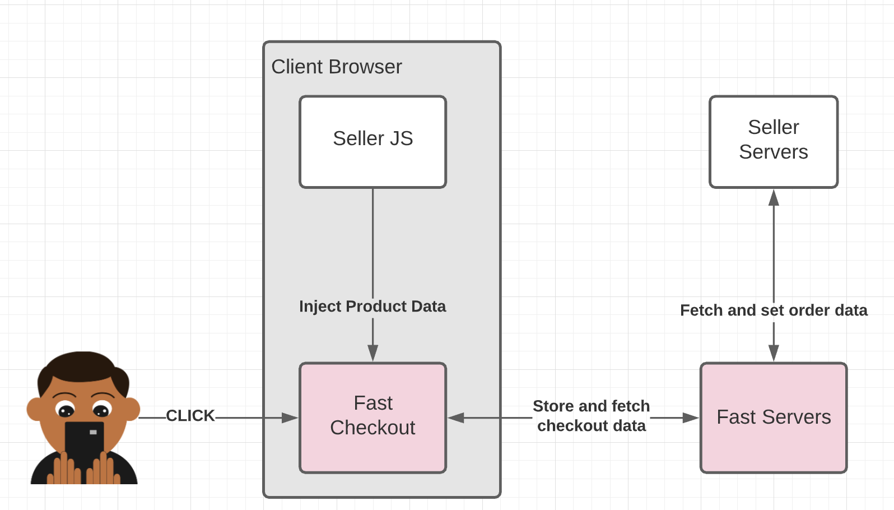

# Fast API Overview

> This product is in Early Access

Use of the Fast Developer Platform is subject to our [**Developer Terms of Use**](https://www.fast.co/terms/developer-terms)

Welcome! You will find useful information regarding the design and specifications of the Fast API.

Got questions? Concerns? Contact Fast at devrel@fast.co. 

# **High Level Diagrams**
* [New buyer clicks Fast Checkout](#new-buyer-clicks-fast-checkout)
* [Buyer interacts with Fast Checkout](#buyer-interacts-with-fast-checkout)
* [Buyer canceled order](#buyer-canceled-order)
* [Checkout timer ended & fraud check](#checkout-timer-ended--fraud-check)
* [Process Payment](#process-payment)
* [Refund order](#refund-order)

# New buyer clicks Fast Checkout

This diagram covers the high level flow for when a new buyer clicks the Fast checkout button.

]

# Buyer interacts with Fast Checkout

This diagram covers the high level flow for when a buyer interacts with Fast Checkout.

# Buyer canceled order

This diagram covers the specific case when a user cancels an order in Fast Checkout.

# Checkout timer ended & fraud check

This diagram covers our high level post processing steps prior to payment capture.

# Process payment

This diagram covers the high level flows for payment capture. NOTE: there are 2 possible flows dependent on the seller's [configurable & direct capture](#) configuration.

# Refund Order

This diagram covers the high level flow for refunding an order.

