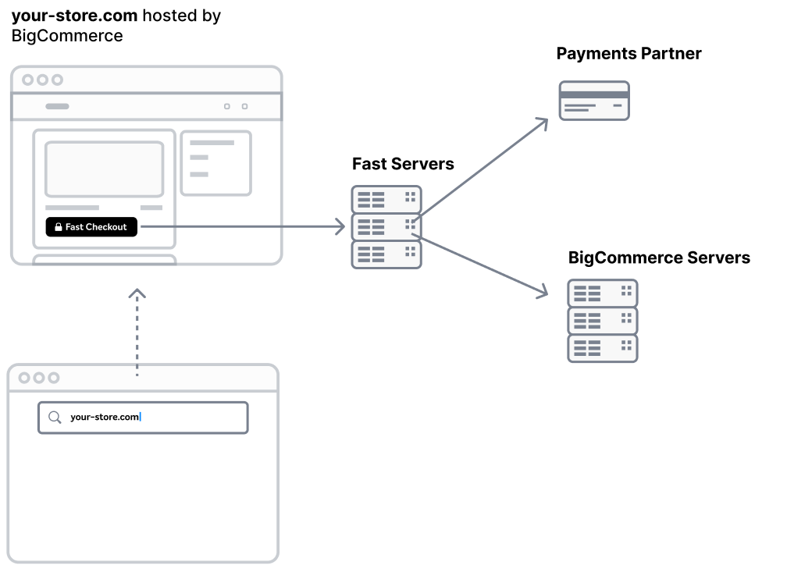

# How Fast Checkout Works
One-click checkout for customers. One smart move for your business.

Fast handles login, checkout, payment processing and communication with your ecommerce platform, so you can focus on what’s important: your store.

When a customer uses the Fast Checkout button on your site, we automatically create an account for them for your store. It’s as simple as that, with no extra steps required by you or the customer. Then, we send the order for fulfillment and get you paid.

 