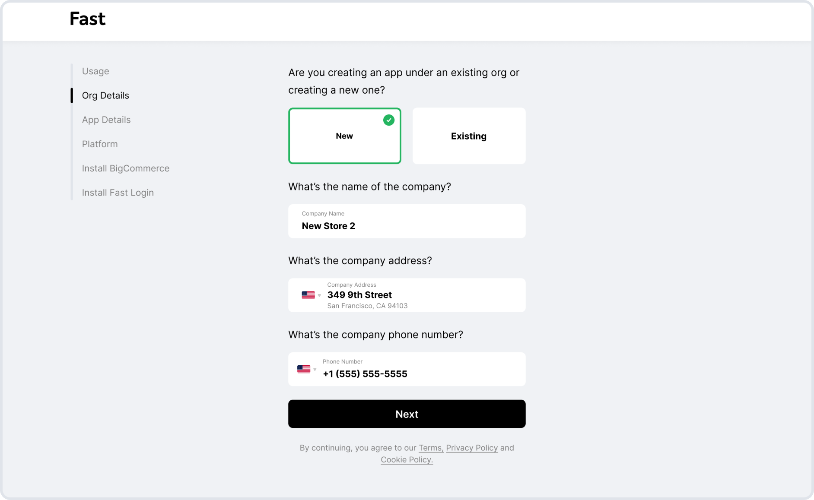

# Fast Login for BigCommerce Installation Guide
Ready to get Fast? Here’s how to quickly install Fast Login for your BigCommerce store. It’s easy, with no custom integration required.

[**Installing Fast Login on a different platform? →**](/developer-portal/fast-login-install)

# Start Onboarding
First up: answer a few questions about your business in the seller dashboard. You’ll need a Fast account and a BigCommerce account to get started.

[**Start onboarding in Fast's seller dashboard →**](http://fast.co/business)

## Tell us about your website

We use this information to verify your account.

## Fill out app details

Next, tell us about the website where you’re installing Fast Login.

## Choose BigCommerce

Select BigCommerce as your platform. If your site is hosted elsewhere, follow [these instructions](/developer-portal/fast-login-install) instead.

## Get the Fast BigCommerce app

Install the Fast app from the BigCommerce Apps Marketplace for easier integration.

## Copy the code
Leverage the [examples](/developer-portal/fast-login-install-examples) to see how to install the Fast Login button in your store.

[**View Fast Login Examples  →**](/developer-portal/fast-login-bigcommerce-examples)

## Go Fast 🚀
That’s it! You’re now all set up with the world’s fastest login.

# FAQ

## How do you update an existing organization?
When in the seller dashboard onboarding, select “Existing Org”. You should then be able to see your organization in the dropdown. You may now add an existing app to your organization.

## My store doesn’t use an ecommerce platform. Can I still use Fast?
Yes, see the custom login integration information [here.](/developer-portal/fast-login-install)

## I am using a BigCommerce store. How can I make sure Fast uses my registered store email?
When you log into a BigCommerce store, if you have a BigCommerce account associated with that email address, we will use the same account. Otherwise we will create a new BigCommerce account for you. No effort required on your part.

## I use more than one email. Do I need to make multiple Fast accounts?
No - You can add an additional email to your account by going to any currently logged in site and adding your other email. Once you have successfully resolved the pin challenge this email will now be associated with your account.

## How long is my login active?
Your login session will be active for at minimum 1 calendar month, and increases by one calendar month with each additional login.
