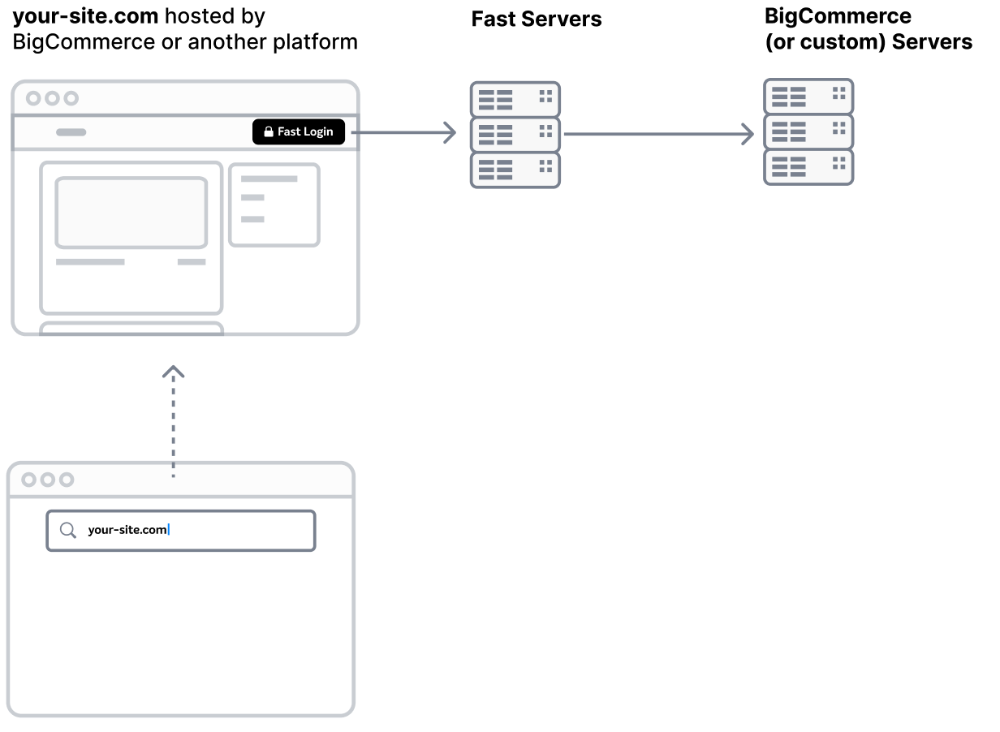

# How Fast Login Works

Fast makes it quick and painless for new and existing customers to log into your site.

If someone visiting your site already has a Fast account, we authenticate them and log them into your site with just one click. If they don’t, we create a new fast account with their email and authenticate them with that new Fast account. Once Authenticated, you can choose to create an account on your site for them, if one doesn’t exist already.
‍
Either way, the next time they visit your site, they’ll automatically be logged in — across devices, from anywhere in the world. Seamless, hassle-free, and yep, fast.

