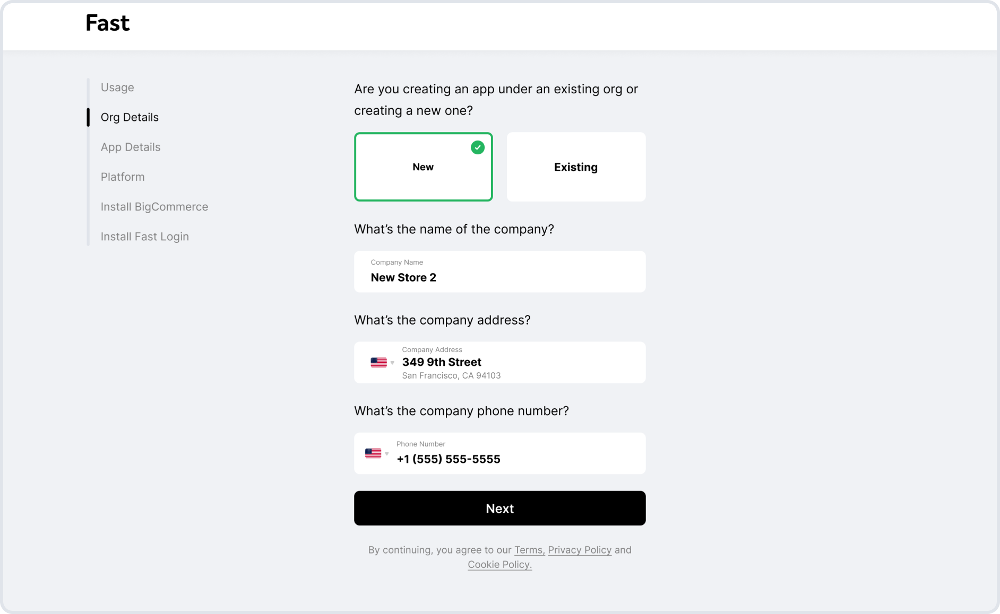
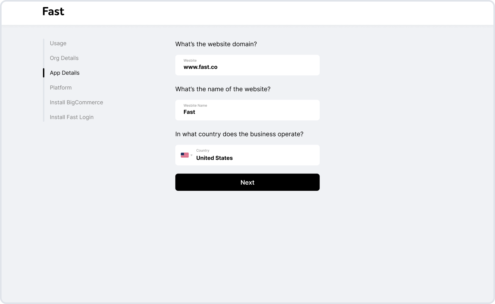
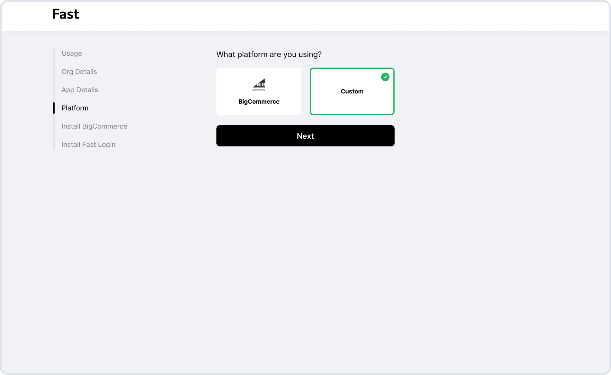
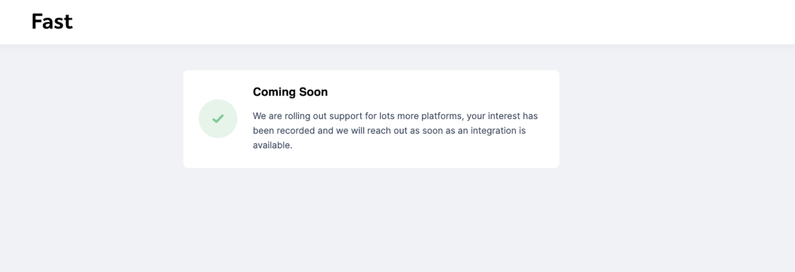
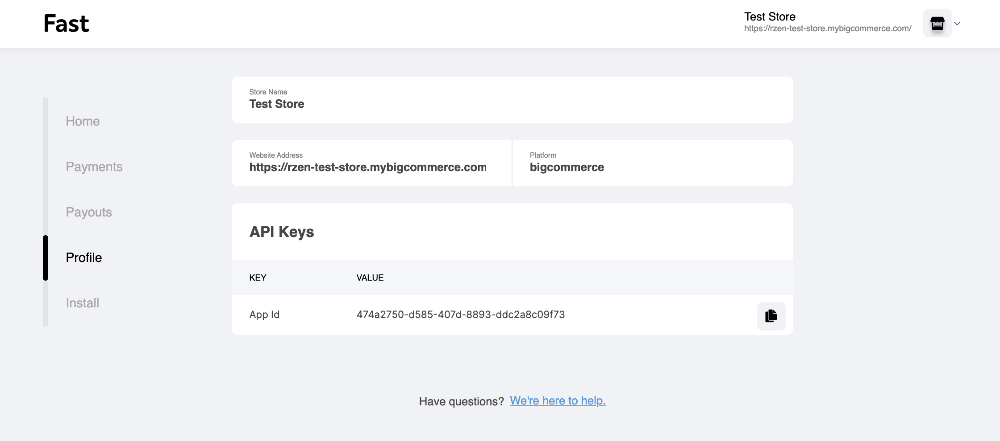

 # Install Fast Login

Ready to get Fast? Here’s how to easily install Fast Login with your e-commerce store.

[**Looking to install Fast Login for your BigCommerce store? →**](/developer-portal/fast-login-bigcommerce)

## Start Onboarding
First up: answer a few questions about your business in the seller dashboard. You’ll need a Fast account and a BigCommerce account to get started.

[**Start onboarding in Fast's seller dashboard →**](http://fast.co/business)

### Tell us about your website

We use this information to verify your account.



### Fill out app details

Next, tell us about the website where you’re installing Fast Login.



### Choose Custom
Select “Custom” as your platform. If your site is hosted on BigCommerce, follow these instructions instead.



### View the “Coming Soon” page
Once you reach this page, you can go to this link to continue: [https://www.fast.co/business/dash/profile](https://www.fast.co/business/dash/profile)



### Extract the App ID
The result you’ll need to save for the next step is the app id. In this screenshot, it’s 0584d114-d0df-4b14-8fd1-9184c89d3ef1.



## Copy the code

### Install fast.js in your header

Copy the following script into your header

`<script src="https://js.fast.co/fast.js"></script>`

### Add the Fast Login button

Copy the following code to install the Fast Login button to your desired location. The code contains both the button as well as a Javascript listener that sends the resulting token to your backend. 
‍
Values to modify in the script:

* {{APP_ID}} is the APP_ID you obtained by completing step 1 above (Start Onboarding).
* '/landing-page' can be replaced with your desired redirect page after a successful login 
* '/api/auth/fast-login' is the login endpoint you’ll need to implement to receive the login token in your server
* Please add conditional logic to only display this button when the user is not logged in

```
<fast-login id="fastloginbutton" app_id="{{APP_ID}}"><script></script></fast-login>
  document.querySelector('#fastloginbutton').addEventListener("complete", (event) => {
      const data = { token: event.detail.token }
      Http.Post('/api/auth/fast-login', data)
        .then(() => {
                window.location.href = '/landing-page';
        })
  })
```

## Authenticate the user
After installing the Fast Login button, the next step is to write server-to-server authentication code to authenticate the user.
‍
To authenticate the user, the token must be sent by your frontend client to a backend endpoint (eg. '/api/auth/fast-login') and then verified by your server using our public signing key. Note that tokens expire after 30 seconds.

### Process the token in your server

1. Decode the token you received from your client, and extract the key ID (“kid”) from the header. The token will have the following format when decoded with a JSON Web Token (JWT) library:

```
{
 "header": {
   "alg": "RS256",
   "kid":"g8G3l8eClfeAkM-xkG817CONXZhiVlJt8Iqzq1-JpXs",
   "typ":"JWT"
 },
 "payload":{
   "email": "user@domain.tld",
   "aud": "7b0986a7-e4f7-42af-9a93-3330f77f9e15",
   "exp": 1601062152,
   "jti": "5d9f6571-18c2-43c6-a35d-98bcac7d408f",
   "iat": 1601062122,
   “ipaddr”: “192.0.2.0”
 },
 "signature": "<some rsa="" signature="">"</some>
}
```

2. Fetch the latest set of public keys for Fast from https://api.fast.co/v1/oauth2/jwks, which returns data encoded in the JSON Web Key Set (JWKS) format

* You may get multiple keys, in which case, you need to select the key with the same key ID (kid) tokenkey-ID -> token key ID

3. Use the public key with the tokenkey-ID to verify the signature of the JWT (see example below)

### Verify the token payload

**Example code for verifying the token**

The following snippet is a demo example of a merchant’s NodeJS server code (written in the Express JS framework in Typescript) that verifies a Fast login token. JTI uniqueness checks and IP address checks are not performed in this example.

```
import jsonwebtoken from 'jsonwebtoken';
import JwksRsa from 'jwks-rsa';
import { APP_ID } from '@config/config'

interface IFastLoginData {
  jti:         string;
  iat:         number;
  exp:         number;
  aud:         string;
  email:       string;
  ipaddr:      string;
}

export class JwtService {

  private readonly fastJwksClient: JwksRsa.JwksClient;

  constructor() {
      this.fastJwksClient = JwksRsa({
          cache: true,
          jwksRequestsPerMinute: 6, // Limit JWKS network calls to 6 a minute
          cacheMaxEntries: 2, // no more than two signing keys will be active at a time
          cacheMaxAge: 21600, // 6 hour caching period
          jwksUri: 'https://api.fast.co/v1/oauth2/jwks'
      });
  }  

    /**
   * Decode and verify Fast JWT
   *
   * @param jwt
   */
‍
  public async verifyFastJwt(jwt: string): Promise<ifastlogindata> {</ifastlogindata>
      const token = jsonwebtoken.decode(jwt, {complete: true}) as { [key: string]: any}
      // throws if the key ID can’t be found
      const key = await this.fastJwksClient.getSigningKeyAsync(token.kid)
      // throws if the signature is invalid, token is expired, algorithm doesn’t match,
      // or audience doesn’t match the app ID
      jsonwebtoken.verify(jwt, key.getPublicKey(), {
          algorithms: ['RS256'],
          audience: APP_ID,
      });
      return token.payload as IFastLoginData
  }
}
```

1. The audience (“aud”) field must match your Fast app ID. 
2. The expiration time (“exp”) field must be less than the current Unix time in seconds (tokens expire within 30 seconds)
3. (Optional) The IP address (“ipaddr”) field should match the true IP address of the end user. Skip this check if you’re not sure how to get the true IP address of the end user.
4. (Optional) You should not have received another token in the past with the same JTI (“jti”) field. Store token JTIs for 30 seconds in order to perform this check on top of the expiration check to prevent replay attacks.

### Use the email in the token

Finally, you can use the verified email in the decoded payload of the verified Token to authenticate the user. 

* If the user with the provided email address exists in your system, you can log them in and authorize them.
* If they don’t exist in your system, you can create a new user for that email address by using the email address in the response.

## Go Fast 🚀
That’s it! You’re now all set up with the world’s fastest login.

***

## Coding recommendations
* To improve login latency, key IDs and keys should be cached for up to a day. 
* In order to handle unexpected key rotations, whenever a token is encountered with a key ID not present in your cache, the JWKS should be fetched again from our server and searched for the key ID.
* We recommend the use of the [rsa-jwks](https://www.npmjs.com/package/jwks-rsa) Node library for fetching our public keys due to its configurable caching and rate-limiting features. 
* We also deemed the [jsonwebtoken](https://www.npmjs.com/package/jsonwebtoken) Node library to be safe and easy to use for token decoding and verification. 
* In the future, we will provide custom SDKs to streamline integration across languages.

## Security checklist
Your dos and don’ts for keeping things secure.

Tl;dr: In general, don’t trust anything sent by the client in the login flow.

* **Don’t** perform token verification in the client. 
* **Do** perform token verification on the server.
* **Don’t** use an email provided by an API call from the client. 
* **Do** use the email stored in the token after the signature is verified.
* **Don’t** accept an app ID sent by an API call from the client when verifying the token audience.
* **Do** store your store’s app ID in the server configuration and use it to verify the token audience.
* **Don’t** accept the email field as part of your Fast Login integration API call exposed to the client. 
* **Do** accept the login token.
* **Don’t** store the login token anywhere.
* **Do** (securely) store the user’s email in your backend server to handle future logins.

> Fast cannot be queried for the user’s email and name except through the verify endpoint along with a valid token. The custom application must store this information itself in order to make persistent use of it in the web client. **Do not store or otherwise reuse the login token.**
