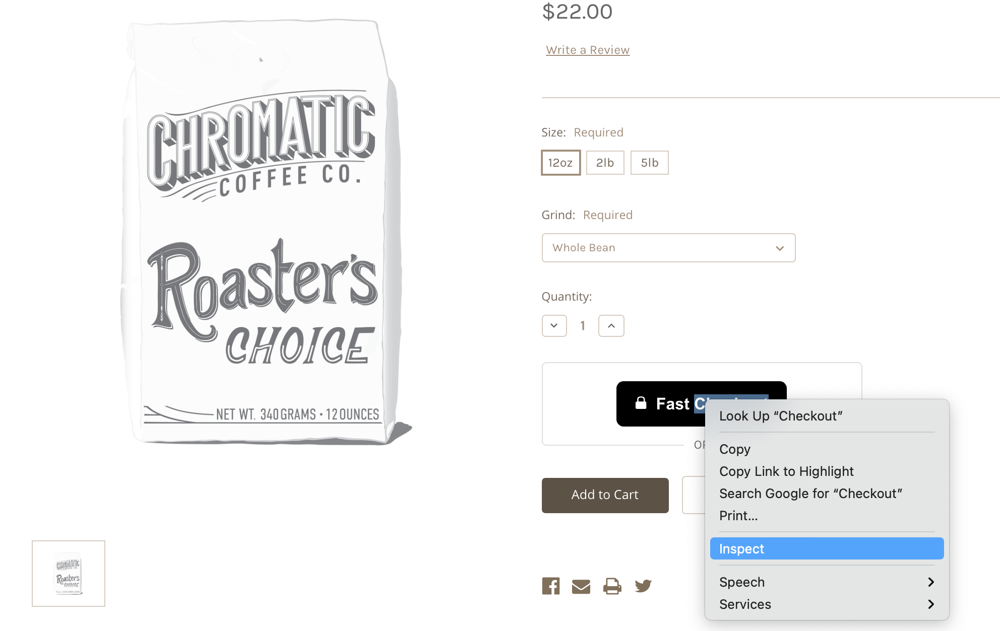
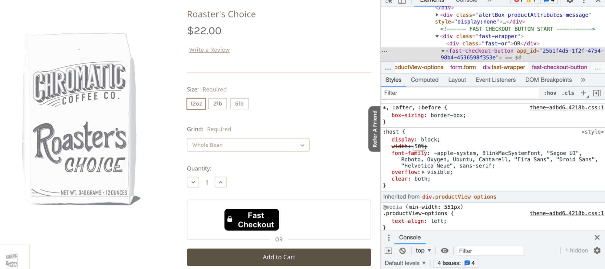

# Styling Fast Buttons

## Button Style Variants

<embed src="/reusables/customization/_button-styles.md" />

## Fixing Button Styles

Sometimes our default button styles are overwritten by page styles and needs to be updated.

1. On the page in your online store that you want to edit, **right click or control click the Fast button and click “Inspect”**.

2. In the code that appears, **click `
` or one of the lines below that line**.
3. Then, in the styling box below, **make adjustments to the width or font size or anything else you need to change in order to make the button look more like our [3 button style variants](/developer-portal/for-developers/bigcommerce/customization/custom-styling/#button-style-variants)**.
   > Keep adjusting until the Fast button and the other elements around it appear exactly how they need to.

4.  Once you know that you like the Fast button to have a certain styling feature like a certain width or font size, **go to the theme file that that button lives in and apply that change there**.

5.  **Click “Save File”**.
    > Note: The page might say “Save & apply file” instead of “Save File.” If that is the case, click “Save & apply file.”
