# Install Step 3: Installing "Fast Checkout" Buttons on BigCommerce

There are **5 different parts in a typical store's website you can embed the "Fast Checkout" button**:

- Product Pages
- Cart Preview Page
- Mini Cart
- The Cart
- Checkout Page

Let's get started -->

## Installing "Fast Checkout" Button to Product Page

1. Click “templates” → “components” → “products” → “add-to-cart.html.”

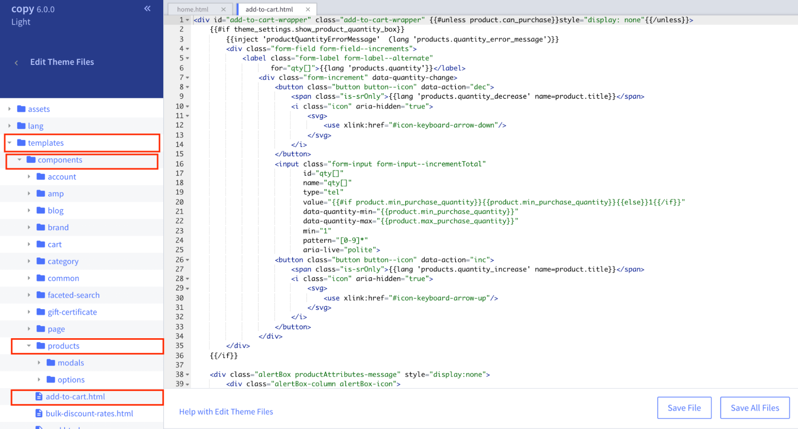

2. Use command-F to find the line:
   ```javascript
   {{#or customer (if theme_settings.restrict_to_login '!==' true)}}.
   ```
3. **ABOVE this line**, copy and paste the following code. When you do this, replace REPLACE-WITH-YOUR-APP-ID with your app ID.

   ```html
   {{#if customer.name '===' 'Fast Testing'}}
   <!------ FAST CHECKOUT BUTTON START ----------->
   <div class="fast-wrapper">
     <div class="fast-or">OR</div>
     <fast-checkout-button app_id="REPLACE-WITH-YOUR-APP-ID" />
   </div>
   <style>
     .fast-wrapper {
       padding-bottom: 20px;
       margin-bottom: 20px;
     }
     .fast-or {
       position: relative;
       top: 80px;
       background: white;
       width: 40px;
       text-align: center;
       margin-left: auto;
       margin-right: auto;
       color: #757575;
     }
     @media only screen and (max-width: 767px) {
       .fast-wrapper {
         border-bottom: 1px solid #dfdfdf;
         border-radius: none;
         padding-right: 1%;
         padding-left: 1%;
       }
     }
     @media only screen and (min-width: 768px) {
       .fast-wrapper {
         border: 1px solid #dfdfdf;
         border-radius: 5px;
         padding-right: 20%;
         padding-left: 20%;
       }
     }
   </style>
   <!------ FAST CHECKOUT BUTTON END ----------->
   {{/if}}
   ```

4. After copying and pasting that code, indent the code so it matches up with the other indentations in the rest of the code.

5. Click “Save File.”
   > Note: The page might say “Save & apply file” instead of “Save File.” If that is the case, click “Save & apply file.”
6. Go to the Product page on your online store and make sure that the Fast Checkout button, which appears there now, looks good to you. (You may have to refresh the page a few times before the Fast Checkout button appears.)

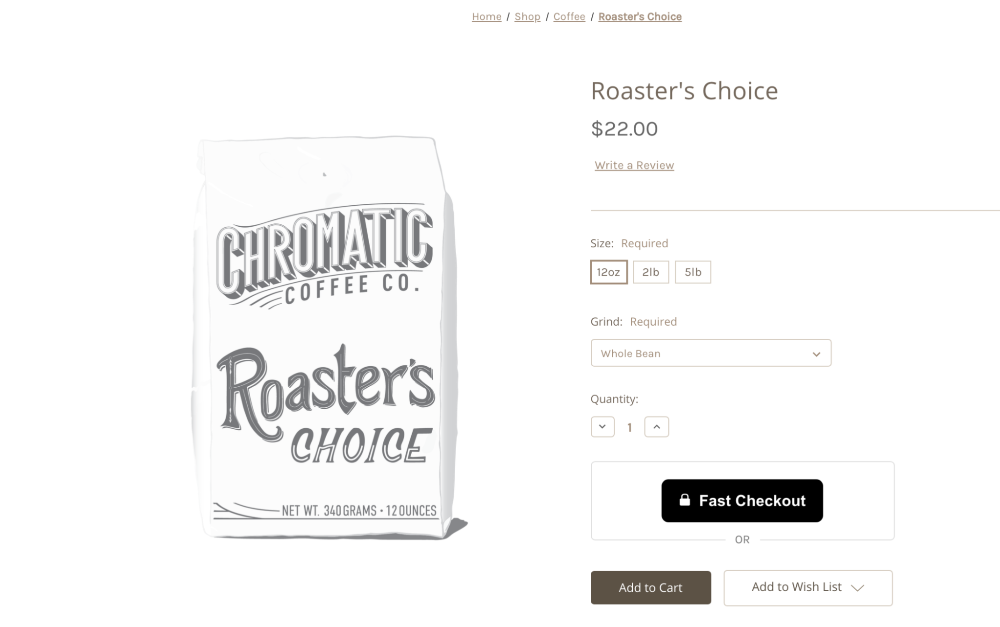

:::info Check Styling

If you want to adjust how it looks, like make it bigger or less stretched out, follow the steps in the section, [Styling Fast Buttons](/developer-portal/for-developers/bigcommerce/customization/custom-styling/). Then go to the next section.

:::

## Installing "Fast Checkout" Button to Cart Preview Page

1. In the theme files, click “templates” → “components” → “cart” → “preview.html.”

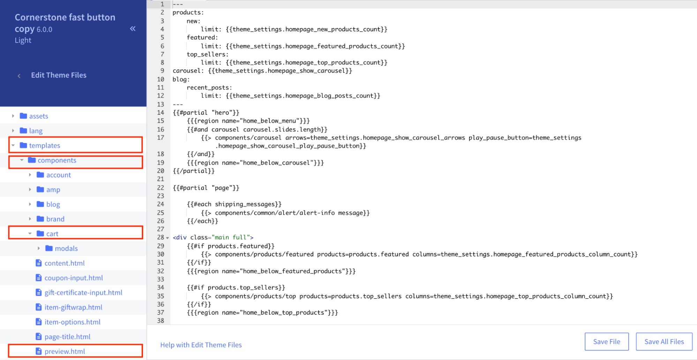

2.Use command-F to find the line:

```javascript
{{#if cart.show_primary_checkout_button}}
```

3. **BELOW this line**, copy and paste the following code. When you do this, replace REPLACE-WITH-YOUR-APP-ID with your app ID.

   ```html
   {{#if customer.name '===' 'Fast Testing'}}
   <!------ FAST CHECKOUT BUTTON START ----------->
   <div class="fast-overlay-wrapper">
     <div class="fast-overlay-or">OR</div>
     <fast-checkout-cart-button
       cart_id="{{cart_id}}"
       app_id="REPLACE-WITH-YOUR-APP-ID"
     />
   </div>
   <style>
     .fast-overlay-wrapper {
       clear: both;
       margin-bottom: 20px;
       border-bottom: 1px solid #c1c1c1;
       padding-bottom: 20px;
       margin-top: -20px;
     }
     .fast-overlay-or {
       position: relative;
       top: 80px;
       background: #e5e5e5;
       width: 40px;
       text-align: center;
       margin-left: auto;
       margin-right: auto;
       color: #757575;
     }
     /*@media only screen and (max-width: 767px) {*/
     /*    .fast-overlay-or {*/
     /*        background: #ffffff;*/
     /*    }*/
     /*}*/
   </style>
   <!------ FAST CHECKOUT BUTTON END ----------->
   {{/if}}
   ```

4. Click “Save File.

   > Note: The page might say “Save & apply file” instead of “Save File.” If that is the case, click “Save & apply file.”

5. Go to the Checkout page on your online store and make sure that the Fast Checkout button, which appears there now, looks good to you. (You may have to refresh the page a few times before the Fast Checkout button appears.)
   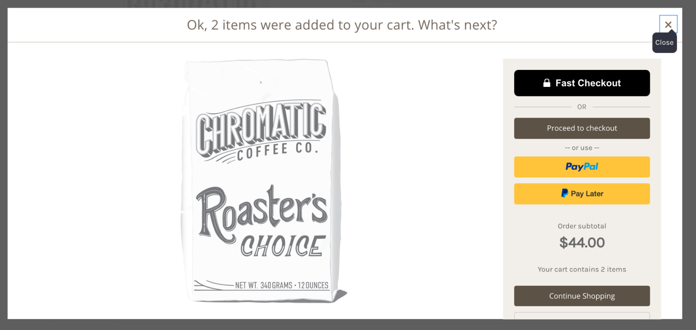

:::info Check Styling

If you want to adjust how it looks, like make it bigger or less stretched out, follow the steps in the section, [Styling Fast Buttons](/developer-portal/for-developers/bigcommerce/customization/custom-styling/). Then go to the next section.

:::

## Installing "Fast Checkout" Button to Mini Cart Page

> Note: If your store doesn’t have a mini cart page, you can skip this entire section and go to the section, Installing Checkout Button to Cart Page.

1. In the theme files, click “templates” → “components” → “common” → “cart-preview.html.”
   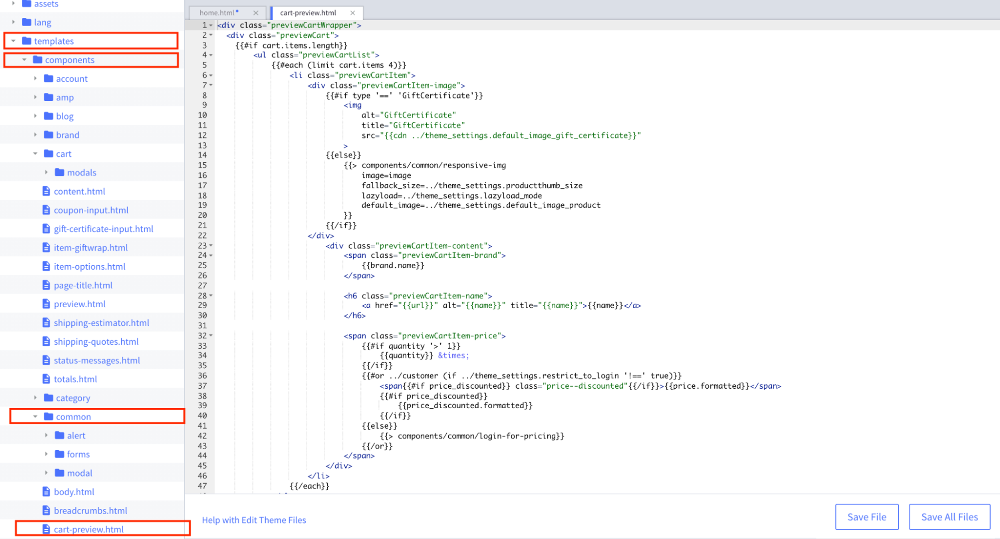
2. Use command-F to find the line:
   ```javascript
   <div class="previewCartAction">
   ```
3. ABOVE this line, copy and paste the following code. When you do this, replace REPLACE-WITH-YOUR-APP-ID with your app ID.
   ```html
   {{#if customer.name '===' 'Fast Testing'}}
   <!------ FAST CHECKOUT BUTTON START ----------->
   <div class="fast-mini-cart-wrapper">
     <div class="fast-mini-cart-or">OR</div>
     <fast-checkout-cart-button
       cart_id="{{cart_id}}"
       app_id="REPLACE-WITH-YOUR-APP-ID"
     />
   </div>
   <style>
     .fast-mini-cart-wrapper {
       clear: both;
       margin-bottom: 20px;
       border-bottom: 1px solid #c1c1c1;
       padding-bottom: 20px;
       margin-left: 20px;
       margin-right: 20px;
     }
     .fast-mini-cart-or {
       position: relative;
       top: 80px;
       background: white;
       width: 40px;
       text-align: center;
       margin-left: auto;
       margin-right: auto;
       color: #757575;
     }
   </style>
   <!------ FAST CHECKOUT BUTTON END ----------->
   {{/if}}
   ```
4. Click “Save File.”
   > Note: The page might say “Save & apply file” instead of “Save File.” If that is the case, click “Save & apply file.”
5. Go to the Mini Cart page on your online store and make sure that the Fast Checkout button, which appears there now, looks good to you. (You may have to refresh the page a few times before the Fast Checkout button appears.)
   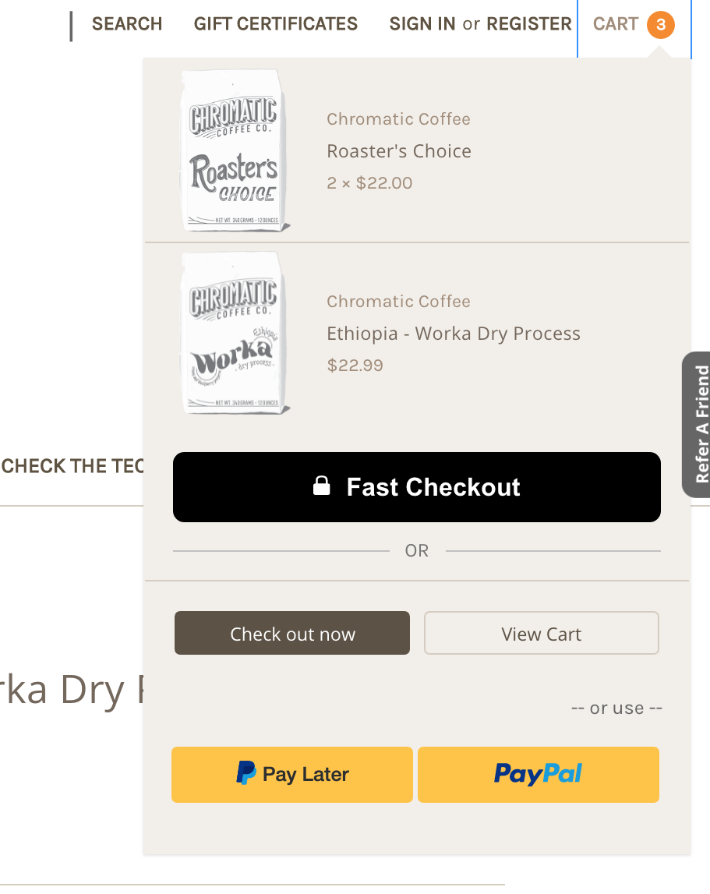

:::info Check Styling

If you want to adjust how it looks, like make it bigger or less stretched out, follow the steps in the section, [Styling Fast Buttons](/developer-portal/for-developers/bigcommerce/customization/custom-styling/). Then go to the next section.

:::

## Installing "Fast Checkout" Button to Cart Page

1. In the theme files, click “templates” → “pages” → “cart.html.”
   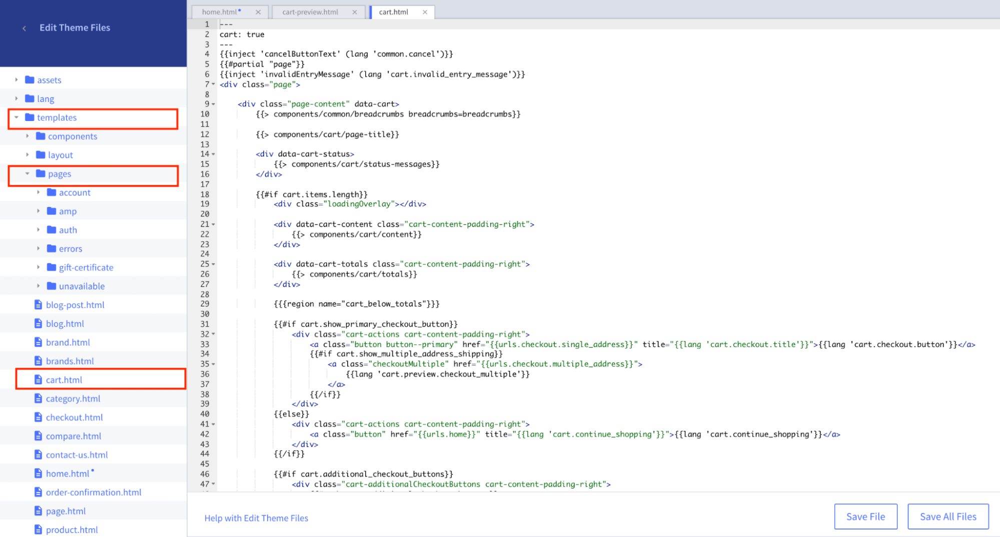

2. Use command-F to find the line:

```javascript
{{#if cart.show_primary_checkout_button}}
```

3. **BELOW this line**}, copy and paste the following code. When you do this, replace REPLACE-WITH-YOUR-APP-ID with your app ID.

```html
{{#if customer.name '===' 'Fast Testing'}}
<!------ FAST CHECKOUT BUTTON START ----------->
<div class="fast-wrapper">
  <div class="fast-or">OR</div>
  <fast-checkout-cart-button
    cart_id="{{cart_id}}"
    app_id="REPLACE-WITH-YOUR-APP-ID"
  />
</div>
<style>
  .fast-wrapper {
    clear: both;
    margin-bottom: 20px;
    border-bottom: 1px solid #dfdfdf;
    border-radius: none;
    padding-bottom: 20px;
  }
  .fast-or {
    position: relative;
    top: 80px;
    background: white;
    width: 40px;
    text-align: center;
    margin-left: auto;
    margin-right: auto;
    color: #757575;
  }
  @media (min-width: 551px) {
    .fast-wrapper {
      margin-left: auto;
      margin-right: 0;
      width: 100%;
      border: 1px solid #dfdfdf;
      padding-left: 10%;
      padding-right: 10%;
      padding-bottom: 20px;
      border-radius: 5px;
      width: 58.66%;
      /*width: 26.33rem;*/
    }
  }
  @media (min-width: 801px) {
    .fast-wrapper {
      width: 58.66%;
      /*width: 27.66rem;*/
    }
  }
  @media (min-width: 1261px) {
    .fast-wrapper {
      width: 42%;
      /*width: 35.33rem;*/
    }
  }
</style>
<!------ FAST CHECKOUT BUTTON END ----------->
{{/if}}
```

4. Click “Save File.”

   > Note: The page might say “Save & apply file” instead of “Save File.” If that is the case, click “Save & apply file.”

5. Go to the Cart page on your online store and make sure that the Fast Checkout button, which appears there now, looks good to you. (You may have to refresh the page a few times before the Fast Checkout button appears.)
   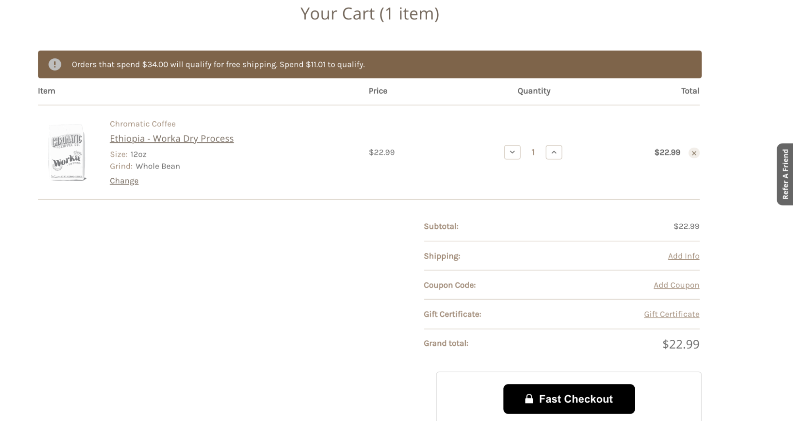

:::info Check Styling

If you want to adjust how it looks, like make it bigger or less stretched out, follow the steps in the section, [Styling Fast Buttons](/developer-portal/for-developers/bigcommerce/customization/custom-styling/). Then go to the next section.

:::

## Installing "Fast Checkout" Button to Checkout Page

1. In the theme files, click “templates” → “pages” → “checkout.html.”
   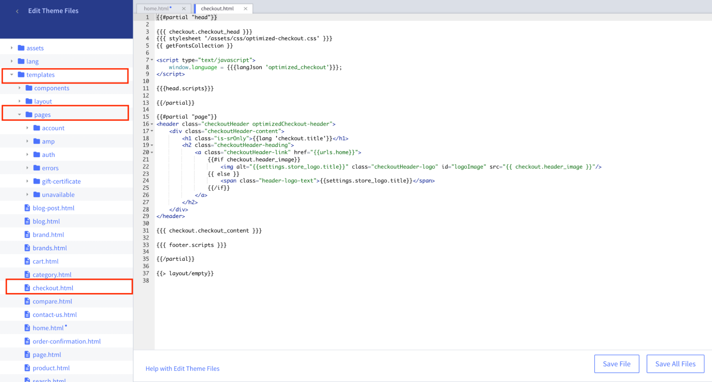
2. Use command-F to find the line:
   `{{{ checkout.checkout_content }}}`
3. **ABOVE this line**, copy and paste the following code. When you do this, replace REPLACE-WITH-YOUR-APP-ID with your app ID.
   ```html
   {{#if customer.name '===' 'Fast Testing'}}
   <!------ FAST CHECKOUT BUTTON START ----------->
   <div class="fast-wrapper">
     <div class="fast-content">
       <h1 class="fast-header text">Check out with Fast</h1>
       <p class="fast-copy text">
         Securely pay with a single click. You'll never want to check out
         another way again.
       </p>
       <fast-checkout-cart-button
         cart_id="{{cart_id}}"
         app_id="REPLACE-WITH-YOUR-APP-ID"
       ></fast-checkout-cart-button>
       <p class="fast-label text">One click. Zero hassle.</p>
     </div>
   </div>
   <style>
     .fast-wrapper {
       clear: both;
       background: white;
       border: 1px solid #d4d4d4;
       border-radius: 6px;
       box-sizing: border-box;
       box-shadow: 0px 1px 5px rgba(0, 0, 0, 0.11);
       position: sticky;
       z-index: 3;
       top: 10px;
       margin-top: 40px;
       margin-right: -15px;
       margin-left: -15px;
       padding: 0;
     }
     .fast-content {
       padding: 24px;
     }
     .text {
       text-align: center;
       font-family: Inter, Montserrat, Arial, Helvetica, sans-serif;
       font-style: normal;
     }
     .fast-header {
       margin-bottom: 12px;
       font-weight: bold;
       font-size: 21px;
       line-height: 28px;
       color: #000000;
     }
     .fast-copy {
       margin-bottom: 24px;
       font-weight: normal;
       font-size: 16px;
       line-height: 24px;
       color: #444444;
     }
     .fast-label {
       font-weight: normal;
       font-size: 14px;
       line-height: 20px;
       margin: 12px 0 0 0;
       color: #707070;
     }
     .fast-checkout-cart-button {
       width: 100%;
       margin-left: auto;
       margin-right: auto;
     }
     @media (min-width: 969px) {
       .fast-wrapper {
         margin-right: 0;
         margin-left: 0;
       }
       .fast-checkout-cart-button {
         width: 193px;
       }
     }
   </style>
   <!------ FAST CHECKOUT BUTTON END ----------->
   {{/if}}
   ```
4. Click “Save File.”
   > Note: The page might say “Save & apply file” instead of “Save File.” If that is the case, click “Save & apply file.”
5. Go to the homepage of your BigCommerce account.
6. On the sidebar, click “Storefront” → “Script Manager.”
   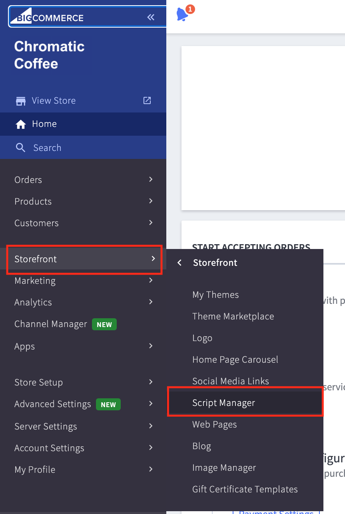
7. Click “Create a Script.”
   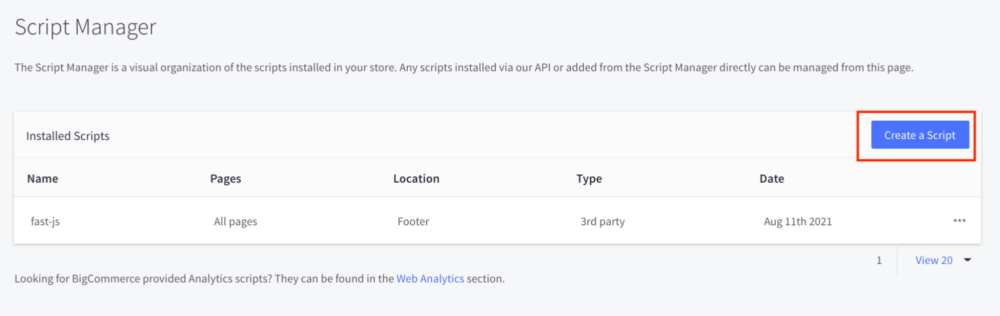
8. Fill out the script with the following fields:
   - **Name of Script**: Fast Checkout Placement
   - (Leave the description blank)
   - **Location on Page**: Footer
   - **Select pages where script will be added**: Checkout
   - **Script category**: Essential
   - **Script type**: Script
     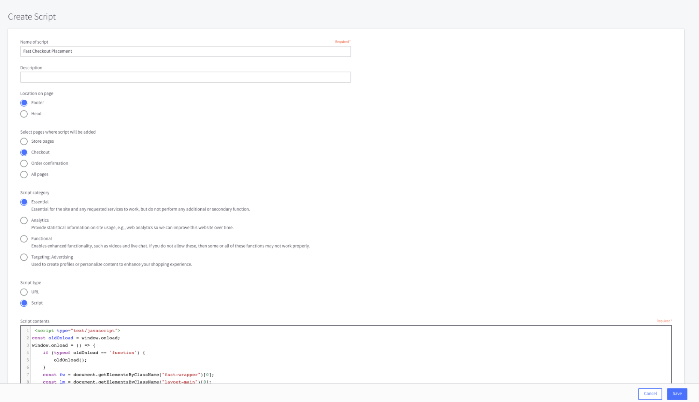
9. Copy and paste this script into the section, “Script Contents.”
   ```javascript
   <script type="text/javascript"> const oldOnload = window.onload; window.onload = () => { if (typeof oldOnload == 'function') { oldOnload(); } const fw = document.getElementsByClassName("fast-wrapper")[0]; const lm = document.getElementsByClassName("layout-main")[0]; if (typeof fw !== 'undefined') { lm.prepend(fw); } } </script>
   ```
10. Click “Save.”
11. Go to the Checkout page on your online store and make sure that the Fast Checkout button, which appears there now, looks good to you. (You may have to refresh the page a few times before the Fast Checkout button appears.)
    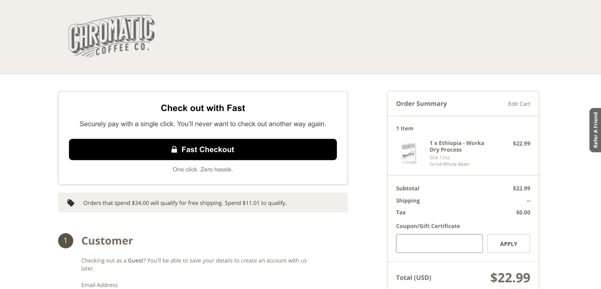

:::info Check Styling

If you want to adjust how it looks, like make it bigger or less stretched out, follow the steps in the section, [Styling Fast Buttons](/developer-portal/for-developers/bigcommerce/customization/custom-styling/). Then go to the next section.

:::
