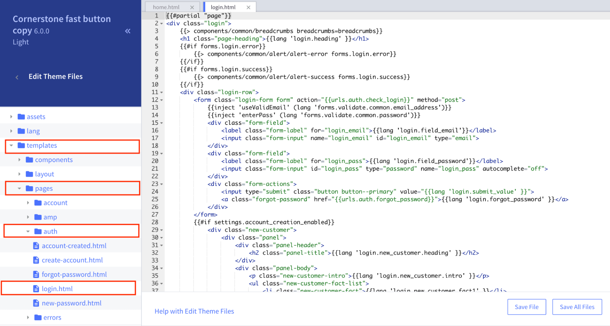
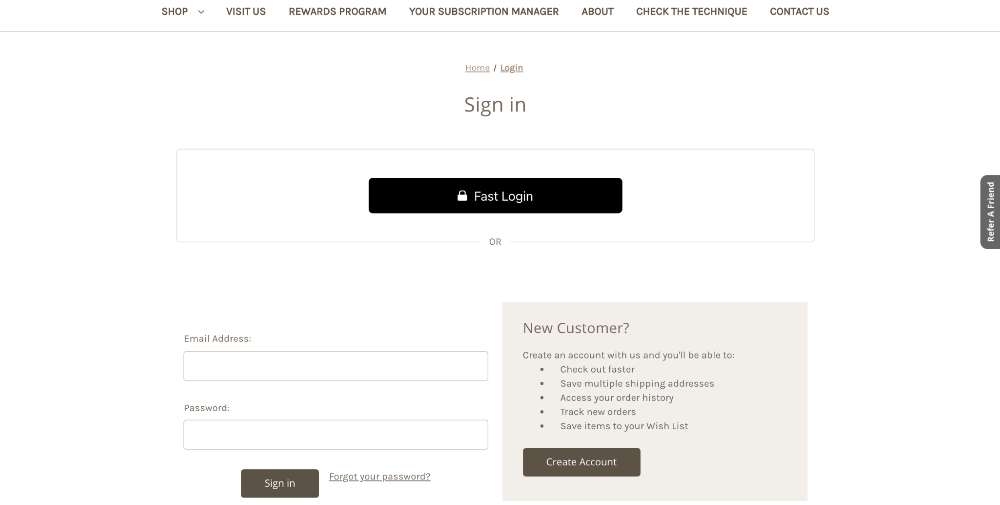
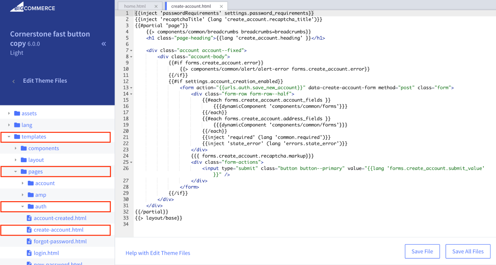
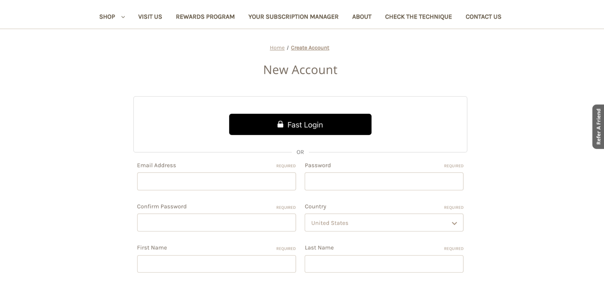

# Install Step 4: Installing "Fast Login" Buttons on BigCommerce

There are **2 different pages you can install our "Fast Login" button**:

- Login Page
- Create Account Page

Let's get started -->

## Installing "Fast Login" Button to Login Page

1. In the theme files, click “templates” → “pages” → “auth” → “login.html.”
   
2. Use command-F to find the line:

```html
<h1 class="page-heading">{{lang 'login.heading' }}</h1>
```

3. **BELOW this line**, copy and paste the following code. When you do this, replace REPLACE-WITH-YOUR-APP-ID with your app ID.

```html
{{#if customer.name '===' 'Fast Testing'}}
<!------ FAST LOGIN BUTTON START ----------->
{{#unless customer}}
<div class="fast-wrapper-login">
  <div class="fast-or-login">OR</div>
  <fast-login app_id="REPLACE-WITH-YOUR-APP-ID" />
</div>
<style>
  .fast-wrapper-login {
    margin-left: auto;
    margin-right: auto;
    width: 100%;
    border-bottom: 1px solid #dfdfdf;
    padding-bottom: 40px;
    margin-bottom: 20px;
    padding-top: 20px;
  }
  .fast-or-login {
    position: relative;
    top: 100px;
    background: white;
    width: 40px;
    text-align: center;
    margin-left: auto;
    margin-right: auto;
    color: #757575;
  }
  @media (min-width: 551px) {
    .fast-wrapper-login {
      padding-left: 20%;
      padding-right: 20%;
      border: 1px solid #dfdfdf;
      border-radius: 5px;
      /*width: 98%;*/
    }
  }
</style>
{{/unless}}
<!------ FAST LOGIN BUTTON END ----------->
{{/if}}
```

4. Click “Save File.”

   > Note: The page might say “Save & apply file” instead of “Save File.” If that is the case, click “Save & apply file.”

5. Go to the Login page on your online store and make sure that the Fast Login button, which appears there now, looks good to you. (You may have to refresh the page a few times before the Fast Login button appears.)
   

:::info Check Styling

If you want to adjust how it looks, like make it bigger or less stretched out, follow the steps in the section, [Styling Fast Buttons](/developer-portal/for-developers/bigcommerce/customization/custom-styling/). Then go to the next section.

:::

## Installing "Fast Login" Button to Create Account Page

1. In the theme files, click “templates” → “pages” → “auth” → “create-account.html.”
   
2. Use command-F to find the line:
   ```javascript
   <h1 class="page-heading">{{lang 'create_account.heading' }}</h1>
   ```
3. **BELOW this line**, copy and paste the following code. When you do this, replace REPLACE-WITH-YOUR-APP-ID with your app ID.

   ```html
   {{#if customer.name '===' 'Fast Testing'}}
   <!------ FAST LOGIN BUTTON START ----------->
   {{#unless customer}}
   <div class="fast-wrapper-create-account">
     <div class="fast-or-create-account">OR</div>
     <fast-login app_id="REPLACE-WITH-YOUR-APP-ID" />
   </div>
   <style>
     .fast-wrapper-create-account {
       margin-left: auto;
       margin-right: auto;
       width: 100%;
       border-bottom: 1px solid #dfdfdf;
       padding-bottom: 40px;
       margin-bottom: 20px;
       padding-top: 20px;
     }
     .fast-or-create-account {
       position: relative;
       top: 100px;
       background: white;
       width: 40px;
       text-align: center;
       margin-left: auto;
       margin-right: auto;
       color: #757575;
     }
     @media (min-width: 551px) {
       .fast-wrapper-create-account {
         padding-left: 20%;
         padding-right: 20%;
         border: 1px solid #dfdfdf;
         border-radius: 5px;
         /*width: 68.33%;*/
       }
     }
   </style>
   {{/unless}}
   <!------ FAST LOGIN BUTTON END ----------->
   {{/if}}
   ```

4. Click “Save File.”
   > Note: The page might say “Save & apply file” instead of “Save File.” If that is the case, click “Save & apply file.”
5. Go to the Create Account page on your online store and make sure that the Fast Login button, which appears there now, looks good to you. (You may have to refresh the page a few times before the Fast Login button appears.)
   

:::info Check Styling

If you want to adjust how it looks, like make it bigger or less stretched out, follow the steps in the section, [Styling Fast Buttons](/developer-portal/for-developers/bigcommerce/customization/custom-styling/). Then go to the next section.

:::
