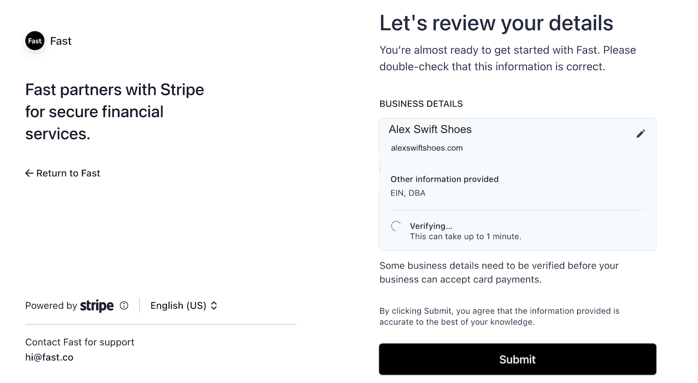

# Pre-Install Step 3: Onboard as a Seller with BigCommerce

## Prerequisites

Before you begin this process, you’ll need an online store hosted by BigCommerce.

<embed src="/reusables/for-developers/_platform_all_sign_up_as_a_seller.md" />

3. On the Platform Page, click “BigCommerce.” Then click “Next.”

   

## Connect to BigCommerce

1. On the page that says “Connect to BigCommerce,” click “Connect.”

2. Click “Log in” and log into your BigCommerce account.
   **Note**: You need BigCommerce Store Owner access to do this.
   **Note**: When you reach this specific step, you’ll need to complete the step immediately, without clicking the back button. Otherwise, you’ll have to restart this process from the beginning. This rule does not apply to other steps.

   

3. Click the checkbox and click “Confirm.”
   

4. If you want to, you can click “Help Me go Fast.” You don’t have to do this step. If you do this step, then also click the X in the pop-up that appears and continue to step 10. If you choose not to do this step, simply go straight to step 10.

   

   

5. Click “Next.”
6. Click “Continue account setup.”

   

7. Enter your tax ID, such as your EIN or the equivalent depending on your region. Then click “Continue.”

   

8. Wait several seconds while Stripe verifies your business. If this verification is unsuccessful, contact customer success at seller-support@fast.co. Otherwise, move onto step 14.
   **Note**: If you operate under a DBA, you will need to click the pencil icon in order to enter your legal name that correlates with your tax ID.

   

9. On the Bank Details page, enter the following information and click “Finalize Application:”

   - The legal entity the bank account was registered under
   - The currency you use, such as dollars or Euros
   - The country your bank account is in
   - The applicable bank account details depending on your region
     **Note**: Which settlement currency you can use depends on which country your business is registered in. And which bank account details you see depends on what settlement currency you use. See [this article](https://stripe.com/docs/connect/bank-debit-card-payouts#supported-settlement) for more information.

     

10. Click “Continue to Dashboard.”

    
