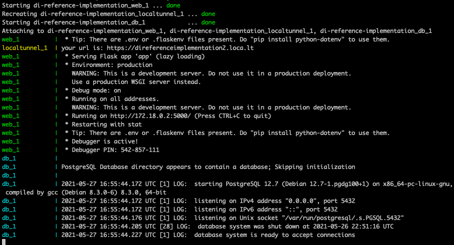

# Reference Implementation

**The [reference implementation github repo](https://github.com/fast-af/di-reference-implementation) can be used to help you understand how Fast communicates with the Seller backend**.
Included is a Python web application which implements the same endpoints a Seller would implement when integrating with Fast:

```
/fast/v1/create
/fast/v1/read
/fast/v1/update
/fast/v1/delete
```

There is also a Postgres DB container which contains a couple sample products (this mimics the backend a seller would have).

It also contains a container for localtunnel which is used to expose your localhost to the internel using a simple URL.

## Prerequisites

#### Docker and Docker Compose

You will need Docker and Docker Compose to run the containers.

- [Install Docker](https://www.docker.com/products/docker-desktop)
- [Install Docker Compose](https://docs.docker.com/compose/install/#:~:text=Docker%20Compose%20relies%20on%20Docker,part%20of%20those%20desktop%20installs.)

:::attention Heads up

Docker Compose comes with the Docker installation on MacOS and Linux

:::

## Setup

### 1. Clone Repo

You will need to clone the reference implementation repository on your machine.

```
git clone https://github.com/fast-af/di-reference-implementation.git
cd di-reference-implementation
```

Alternatively you can directly download the project as a zip file [here](https://github.com/fast-af/di-reference-implementation/archive/refs/heads/main.zip)

### 2. Setup .env file

We will be using [localtunnel](https://theboroer.github.io/localtunnel-www/) to expose the server running on your localhost to the internet.
To configure a static URL you will need to update the variable `LOCALTUNNEL_SUBDOMAIN` in the .env file to something unique.

:::attention Note
Please make sure to edit this field, if you use `LOCALTUNNEL_SUBDOMAIN=direferenceimplementation` you will get errors.
:::

When localtunnel runs it will take the value in `LOCALTUNNEL_SUBDOMAIN` and create the URL: `https://<LOCALTUNNEL_SUBDOMAIN>.loca.lt`

### 3. Setup Seller App in Sandbox

Next you will setup your sandbox application.
Navigate [here](https://sdash.sandbox.fast.co/) to begin setup.

1. **Homepage**

   - Enter your name and email and click Fast Login

2. **Org Details**

   - Enter your relevant Org details including name and address

3. **Store Details**

   - Enter your website, name of business, and country

4. **Platform**

   - Make sure to select `Direct API` here

5. **Install Fast Checkout**

   - In the Rest API URL field, input the localtunnel address you create above. (should be `https://<LOCALTUNNEL\_SUBDOMAIN>.loca.lt` where `<LOCALTUNNEL\_SUBDOMAIN>` is equal to the value you put in the .env file)

   - Copy your App ID and put it somewhere safe (you will need this later)

   - Copy your Token and put it somewhere safe (you will also need this later)

6. **Business Verification**

   - Select - `Skip for now`

### 4. Start Application

**Open a terminal window and run `docker-compose up`**

Your logs should look something like this:



Make sure that the log for localtunnel that says `your url is: https://direferenceimplementation2.loca.lt` matches the url you put in the Rest API URL while onboarding.
If it does not match please navigate to [step 1](/developer-portal/for-developers/custom-integration/developer-tools/reference-implementation/#1-clone-repo) to review how it's done.

### 5. Setup Fast Test Suite CLI

Now that the application is running, **you can use the Fast Test Suite CLI to make calls to the Fast backend**, which will then call your Seller Application running locally.
Please navigate [here](https://github.com/fast-af/fast-test-suite-cli) to get the CLI setup. Make sure to have your App ID and Token from onboarding handy, as they will be required to run the CLI.
NOTE: You will need to open a new terminal window/tab to run the CLI.

Once the Test Suite CLI is setup, you can run these commands:

`./fast-test-suite login`

`./fast-test-suite pdp-simple-new-user --product-id=123 --app-id=<your-app-id>`

`./fast-test-suite pdp-simple-existing-user --product-id=123 --app-id=<your-app-id>`

### 6. Review logs to see input requests and outgoing responses

After running the CLI, you can navigate to the terminal running the docker containers and **view the logs**, which will contain all of the calls from Fast->Seller App, as well as all of the responses from Seller App->Fast.
