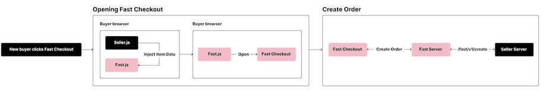
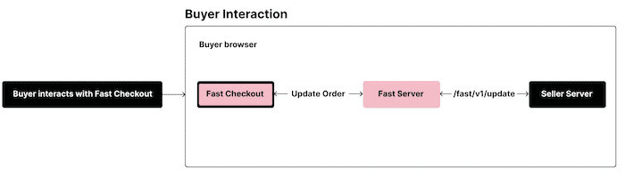
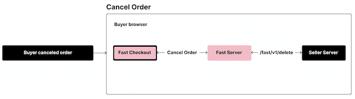
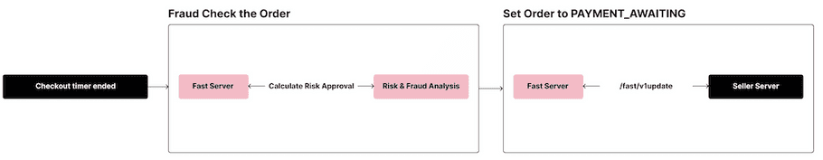
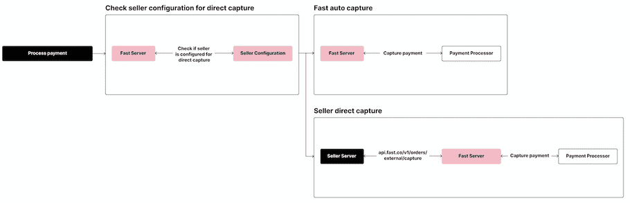
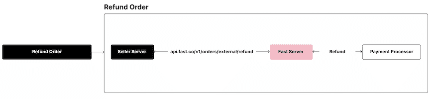

# High Level fast.js API Diagrams

## New Shopper Clicks Fast Checkout

This diagram covers the high level flow for when a new Shopper clicks the Fast checkout button.

## Shopper Interacts With Fast Checkout

This diagram covers the high level flow for when a Shopper interacts with Fast Checkout.

## Shopper Canceled Order

This diagram covers the specific case when a user cancels an order in Fast Checkout.

## Checkout Timer Ended & Fraud Check

This diagram covers our high level post processing steps prior to payment capture.

## Process Payment

This diagram covers the high level flows for payment capture. NOTE: there are 2 possible flows dependent on the seller's configurable & direct capture configuration.

## Refund Order

This diagram covers the high level flow for refunding an order.

