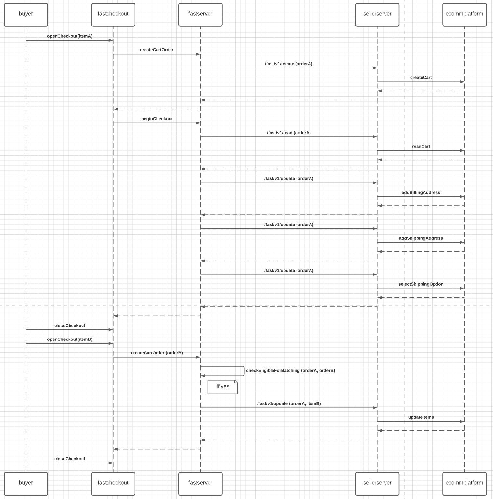

# Order Batching

## What is "Batching"?

> Order Batching: When 2 or more customer shopping carts are merged into one order

In the Fast Checkout customer experience, users have 5 minutes to make changes to their order. During the time window, they are able to update items in the cart, cancel order, and other checkout related interactions. If the user closes the window and purchases another item on the same store during the 5 minute timer, their new purchase will be "batched" with the previous one.

Fast piggybacks the new item into the user's active order. Most of this is handled invisibly to the seller. What it will look like in the server API calls is when an order is batched with a new purchase, the original order will get an update call with a new item.

## What it looks like within Fast

When the user batches multiple orders together one can think about this as **"order piggybacking"**.

1. Buyer purchases item A on order #1.
2. Buyer exits the checkout experience.
3. Buyer finds another item B that they would like to also order.
4. Buyer purchases item B before order #1 is fully processed.
5. Fast system attaches (or piggy backs) item B onto order #1.
6. Buyer exits the checkout experience for the final time.
7. Fast system processes order #1 and processes payment for both item A and B simultaneously.
8. Seller receives the order with both item A and B.

This flow allows the seller to increase Average Order Value (AOV) and reduce transaction processing costs.

## What it looks like for the Integration Engineer

