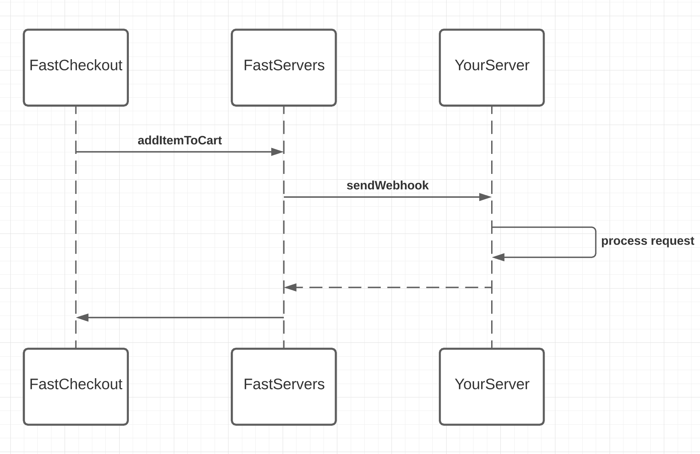

# Setup Step 3: Handle Order Creation

Now we will set up your server to communicate with Fast Checkout.

While users interact with the Fast Checkout application, Fast will send requests to your server for processing.

As users add items, apply coupons, and submit orders, Fast will send these events and changes in data to your server for further processing.

To start developing & testing your integration, you'll likely need to simulate some traffic to your machine. You can do this via our testing environment and developer tools.
