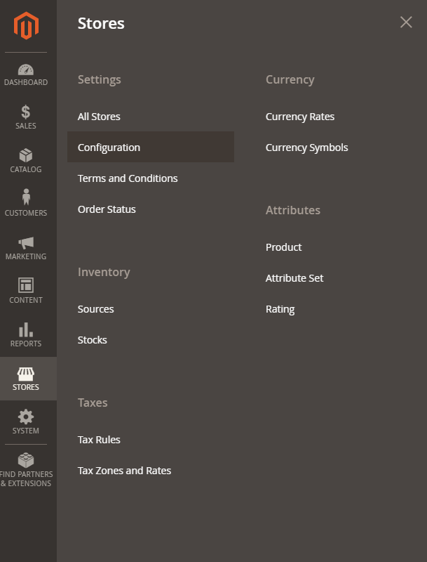
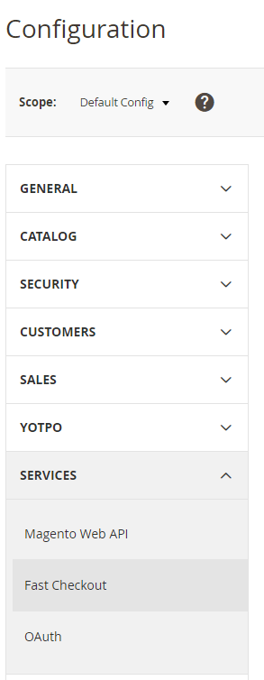
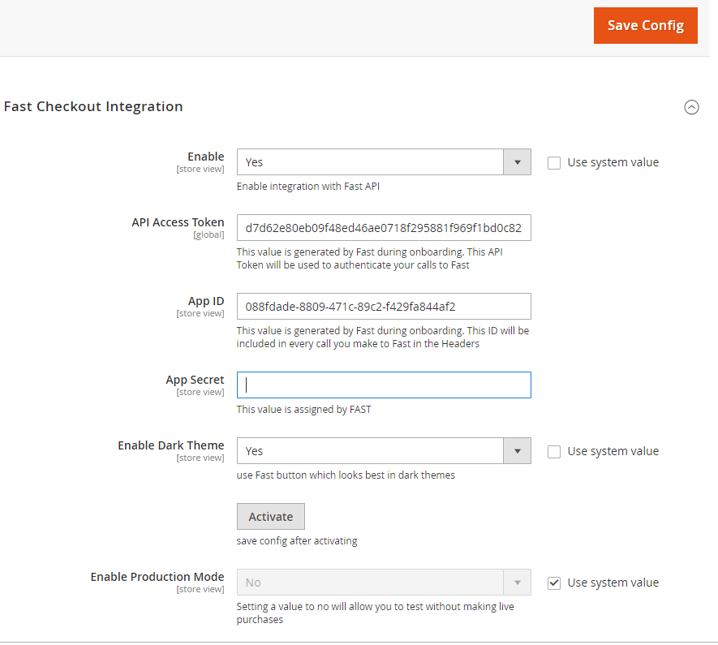

# Install Step 2: Enable Fast Checkout on Magento

The module includes the necessary code for Fast buttons to appear and work on the following pages without requiring any changes:

- Simple PDP
- Configurable PDP
- Minicart
- Cart

## Configuration

1. **Log in** to your admin panel.
2. **Navigate to** Stores → Configuration.
3. **Navigate to** Services → Fast Checkout.
4. **Fast Checkout Integration** -->

   
   

5. **Enter your configuration details** as appropriate

   

6. **Set the module to “enabled” on the appropriate store(s)**. This is a store-level configuration setting that allows you to quickly enable or disable Fast.
7. **Enter your Access Token and App ID given to you from Fast**. This should be the sandbox credentials for initial testing.

   > Select dark theme if your site has a dark/black background.

   > If capturing up front, select Enable Auth+Capture.

   > Only select Production mode when ready to go live.

8. **Save Config**.
9. **Press the activate button**. A successful activation is indicated in green and will fill in the App Secret.

:::info Heads up
Completing this step will also create an integration record and payment method in your store. The integration record is used so that Fast can communicate with Magento REST APIs as part of the order process. The payment method will be included for orders placed through Fast Checkout.
:::
