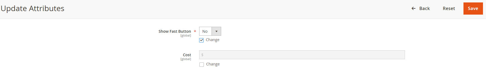

# Install Step 3: Specify Fast Eligible Product(s)

You’ll have the ability to limit Fast Checkout for certain products. **This is a configurable product attribute that defaults to disabled to avoid accidentally enabling Fast for products you don’t intend.** This can be edited individually, or in bulk, depending on which products you’d like to enable for Fast Checkout.

**The Fast Checkout button will only appear on the PDP for products that are Fast-enabled.** If a Customer has a cart that contains one or more Fast-disabled products, the Fast checkout button will not appear for them on the cart or mini-cart pages.
