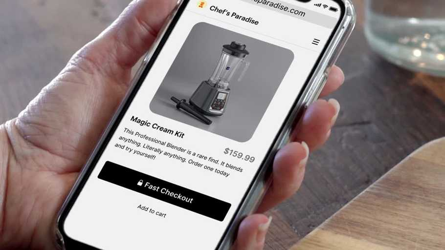

<!------import { OpenApiResponse } from "@redocly/developer-portal/ui";---->

# One-click checkout on Salesforce Commerce Cloud

## One smart move for your business.

Get the Checkout button that increases conversion, boosts sales and delights customers.

Fast Checkout enables a hassle-free, secure one-click checkout experience for your customers. Install it in minutes so your customers can check out in seconds.

Simply install the Fast Checkout button on your product detail pages and cart pages to start seeing fewer abandoned carts and more sales for your business. Our top sellers have seen a 20-35% uplift in conversion within one week of installing Fast Checkout.

In addition to skyrocketing conversion, Fast delights your customers by letting them skip the headache of creating accounts, remembering passwords and filling out long forms. After making a purchase, they'll get free access to a one-stop dashboard where they can view transactions, track deliveries, and re-order with one-click.

## App features

### Fast Checkout Button

The Fast Checkout button lets your customers check out in seconds, with just one click. No passwords, no hassle. If it's a customer's first time using Fast, they'll be guided through a simple one-page form that creates a Fast account for them and enables 1-click checkout for their next purchase.

### Payments & Orders

When a customer purchases a product from your store using Fast Checkout, Fast accepts and processes payments on your behalf and submits an order once the transaction has been approved by the card issuer.

### Refunds

Need to refund a customer? You can leverage the [Seller -> Fast API to Refund an order](/developer-portal/for-developers/custom-integration/fast-api/fast-to-seller-api/docs/#operation/ExternalOrderManagementService_RefundOrder).

<!----<OpenApiResponse definitionId="order" pointer="/developer-portal/for-developers/custom-integration/fast-api/seller-to-fast-api/paths/v1@external@orders@{order_id.value}@refund.yaml"/>----->

### Order Tracking

After making a purchase with Fast, customers get free access to a one-stop dashboard where they can view transactions, track deliveries and re-order in one click.
