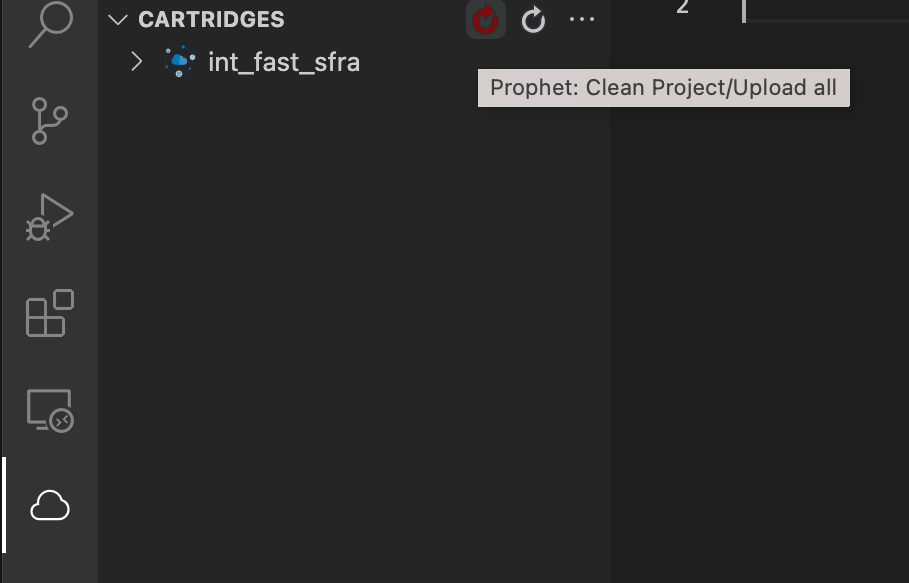
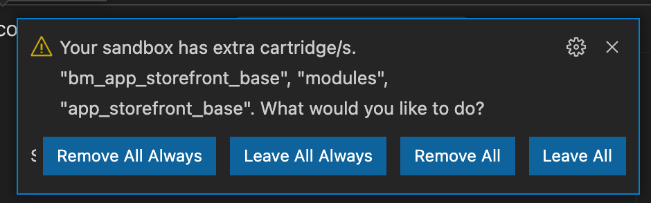

# Install Step 1: Acquiring the Fast SFCC SFRA Cartridge

:::info AVAILABLE SOON:
The Fast Salesforce Reference Architecture (SFRA) Cartridge should be available via the [Commerce Cloud Partner Marketplace](https://www.salesforce.com/products/commerce-cloud/partner-marketplace/), which allows you to download the compressed Cartridge as a ZIP file.
:::

:::attention Required Accounts

Prior to downloading the cartridge, you will need:

- Salesforce Commerce Cloud credentials to [access the Salesforce Commerce Cloud GitHub Organization](https://github.com/orgs/SalesforceCommerceCloud/sso/sign_up)
- An existing GitHub account (or [sign up for a new one](https://github.com/join))

:::

## Download the Fast Cartridge

Download one of the following versions of the Fast Cartridge:

- [(Recommended for Most Users) Marketplace Fast Cartridge](https://github.com/SalesforceCommerceCloud/link_fastcheckout) - the SFCC Marketplace version of the Fast Cartridge. Stable and recommended for most users.
- [(Latest Version) Dev Fast Cartridge](https://github.com/fast-af/sfcc-integration/) - our in-development version of the Fast Cartridge with the latest features (e.g. for site admins who want to try development builds in Sandbox).

:::attention Custom Cartridge ZIP File
If needed, a Fast team member can also provide the cartridge as a ZIP file incorporating the [additional details you provided prior to starting the installation process](../pre-install/requirements.md).
:::

## Upload the Cartridge to Your Storefront

Once you have the Cartridge downloaded, **you will need to upload it to your Storefront Reference Architecture (SFRA) storefront**.

This can be accomplished several ways, including the options outlined below.

### Upload Option 1: Using the SFRA command-line upload tool

Please follow the steps in the [SFRA command-line upload tool documentation](https://documentation.b2c.commercecloud.salesforce.com/DOC1/topic/com.demandware.dochelp/content/b2c_commerce/topics/sfra/b2c_adding_custom_cartridges.html) to get started.

:::attention Custom JSON file required for command-line upload tool
This method will require setting up a `dw.json` file to connect to your site.
:::

```json dw.json for SFRA command-line upload tool
{
  "hostname": "yoursandbox-inside-your-realm.demandware.net",
  "username": "YOUR_BUSINESS_MANAGER_USERNAME",
  "password": "YOUR_BUSINESS_MANAGER_PASSWORD",
  "code-version": "version1"
}
```

### Upload Option 2: Using the Prophet Debugger VS Code extension

1. Add the [Prophet Debugger extension](https://marketplace.visualstudio.com/items?itemName=SqrTT.prophet) to your VS Code.
2. Open the Fast Cartridge you downloaded in VS Code and create a `dw.json` file in the `int_fast_sfra` folder (the file path should be `int_fast_sfra/dw.json`)

```json dw.json for Prophet Debugger extension
{
  "hostname": "yoursandbox-inside-your-realm.demandware.net",
  "username": "YOUR_BUSINESS_MANAGER_USERNAME",
  "password": "YOUR_BUSINESS_MANAGER_PASSWORD",
  "code-version": "version1"
}
```

3. Navigate to the Prophet Debugger extension in the VS Code sidebar, and locate the _"CARTRIDGES"_ section. Click on the `Prophet: Clean Project / Upload all` icon.
   
   :::attention Retain extra cartridges
   If you receive a popup that says _"Your popup has extra cartridges... what would you like to do?"_, select `Leave All` or `Leave All Always` from the available options. The extra cartridges are necessary for the SFCC storefront.

   
   :::

### Upload Option 3: Using Salesforce UX Studio

You can also use [Salesforce UX Studio (legacy software)](https://documentation.b2c.commercecloud.salesforce.com/DOC1/topic/com.demandware.dochelp/LegacyDevDoc/UploadCartridges.html) to upload the cartridge.

- File > Import > General > Existing Projects into Workspace.

- Browse to the location of the compressed cartridge file

- Confirm subsequent prompts to finish the upload
