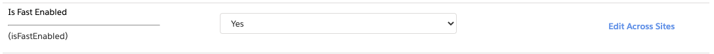
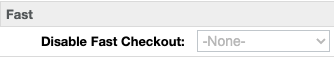

# Install Step 3: Specify Fast Eligible Product(s)

You will have the ability to limit Fast Checkout for certain products. **This is a configurable product attribute to avoid enabling Fast for products at your discretion.**

Once you have enabled Fast Checkout sitewide, you can make exclusions at the product level via the "Disable Fast Checkout" option in your storefront's product catalog.

:::info Heads up
**The Fast Checkout button will only appear on the Product Detail Page (PDP) for products that are Fast-enabled.** If a Shopper includes one or more Fast-disabled product in their cart, the Fast Checkout button will no longer appear for them when viewing Cart pages.
:::
