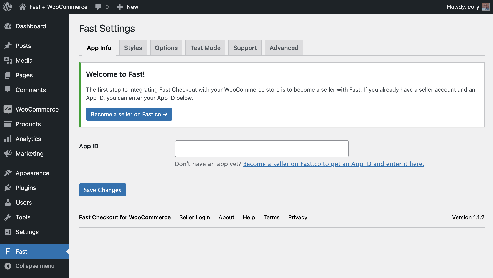
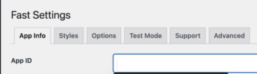
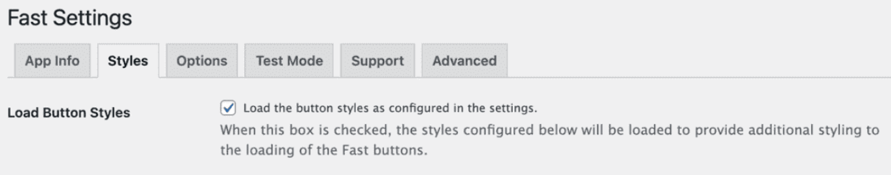
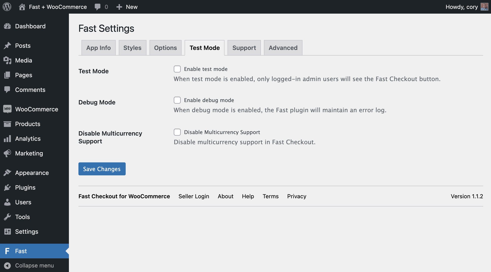

# Checkout for WooCommerce Custom Settings

The Fast Checkout for WooCommerce plugin has several settings to configure your Fast Checkout installation. The Fast Settings page in the WordPress admin dashboard is divided into five tabs. The first four tabs contain settings, and the fifth tab is a Support tab with basic documentation and a link to get help from Fast.

The first four tabs are

- [App Info](#app-info-tab)
- [Styles](#styles-tab)
- [Options](#options-tab)
- [Test Mode](#test-mode-tab)

Direct url to your plugin settings is `http://yourwebsite.com/wp-admin/admin.php?page=fast`

## App Info Tab

### App ID

The App Info tab contains the **App ID** setting, which should have been set during the [plugin installation process](/developer-portal/for-developers/woocommerce/install/install-plugin#connect-your-fast-app-id-to-the-fast-checkout-plugin) of Seller onboarding.

## Styles Tab

### Load Button Styles

This option is checked by default, and it tells the plugin to load styles as defined in the Styles tab. Uncheck the box if you do not wish to load these styles, and instead would prefer to style the Fast buttons another way.

### Custom Button Styles

The Styles tab also provides the ability to render custom button styles for Fast Checkout buttons on WooCommerce product detail pages (PDPs), cart pages, mini cart widgets, and checkout pages. You can also define custom buttton styles for Fast login buttons. For more details about custom styling, please refer to the dedicated [Custom Button Styling page](/developer-portal/for-developers/woocommerce/customization/custom-checkout-button-styling).

## Options Tab

### Hiding Fast Button

**You might have products in your store where it wouldn’t make sense for customers to use one-click checkout,** like a subscription-based purchase (Fast does not currently support subscription-based purchases) or a customized product.

If, for any specific products, you want to hide the Fast button"

1.  **Go to the “Options” tab**.
2.  For each product where you don’t want one-click checkout, **type that product name into the “Hide Buttons for these Products” textbox**. Once you begin typing, the system will autocomplete the rest.
3.  **Add in as many products as you want**.
4.  **Click “Save Changes”**.

### Redirects

**Normally, after a shopper checks out using the Fast Checkout button, they are NOT redirected to any particular page**. If you want shoppers to be redirected to a specific page after they use the Fast button:

1. **Go to the “Options tab”**.
2. **Enter which page you want customers to be redirected to in the “Checkout Redirect Page” textbox**. For example, if you want shoppers to be brought to an order confirmation page after they use the Fast button, type in “Order Confirmation page” here.
3. **Click “Save Changes”**.

### Display Fast Login Button in Footer

**We recommend you uncheck “Display Fast Login Button in Footer” under the “Options tab” because this can cause page layout issues**.

However, if you really want logged out users to see the Fast Login Button in the page footer (and you can do style the button to avoid layout issues), then keep this checked.

To adjust this styling, follow the steps in the dedicated [Custom Button Styling page](/developer-portal/for-developers/woocommerce/customization/custom-checkout-button-styling), and apply the styling changes to the “Login button style” textbox in WooCommerce.

## Test Mode Tab

The Test Mode tab allows you to enable or disable Test Mode (to ensure that Fast Checkout buttons are only visible to store admins), Debug Mode (to temporarily log additional information while debugging site issues), or Multicurrency Support (e.g. if multicurrency support is not needed for your site or is provided by a third-party multicurrency plugin).

| Option                             | Description                                                                                                                                                                                                                                                                                     |
| ---------------------------------- | ----------------------------------------------------------------------------------------------------------------------------------------------------------------------------------------------------------------------------------------------------------------------------------------------- |
| **Test Mode**                      | If you want shoppers to see the changes you made to the online store’s styling, uncheck “Enable test mode” and then click “Save Changes.” Now, everyone can see the Fast buttons.                                                                                                               |
| **Debug Mode**                     | Enables you to log messages within the Fast plugin. If you are a developer looking to troubleshoot issues, you can check the debug mode checkbox to do that. If you check this, click “Save Changes” afterwards.                                                                                |
| **Disabled Multicurrency Support** | Can be used to disable multicurrency support. This is only necessary if you do not need to support multicurrency in the Fast checkout process and the store uses a third-party multicurrency plugin to handle multicurrency in WooCommerce. If you check this, click “Save Changes” afterwards. |

:::info Keep Test Mode Enabled Until Ready to Go Live

Test Mode should be have been enabled by default during the [initial plugin installation process](/developer-portal/for-developers/woocommerce/install/test-mode) and should stay enabled until you have fully configured Fast Checkout buttons (including styling) to work as desired with your store. Disabling Test Mode will enable Fast Checkout and make Fast Checkout buttons visible to customers.

:::
