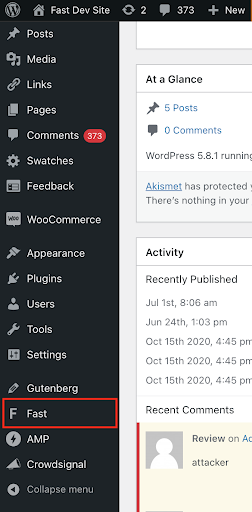
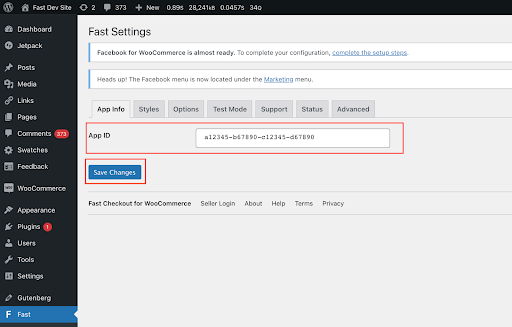

# Step 1: Install Fast Plugin

## Install Fast Checkout for WooCommerce Plugin for the First Time

<embed src="/reusables/for-developers/_platform_woocommerce_wordpress_plugin_initial_install.md" />

:::info Migrating a Manually Installed Plugin Version to WordPress Plugin Directory Version

If you currently have a manually-installed version of the plugin (e.g. a pre-release version installed by the Fast Customer Success Team prior to the official 1.0 release of Fast for WooCommerce in the WordPress plugin directory), please visit the [**Migrating Fast to New Plugin Directory Version (for Early Sellers)** page](../wordpress-plugin/migrating.md) for plugin migration instructions.

:::

## Connect Your Fast App ID to the Fast Checkout Plugin

1. **Log in to the admin dashboard of your WordPress site.** (If you are currently logged in, keep the current tab open)

   > The url for this is usually `https://yourwebsite.com/wp-admin`

2. In a new window (i.e. keep the WordPress admin dashboard open in a separate window) go to the Fast Dashboard at https://www.fast.co/business/dash/install and copy the App ID (`app_id`) you see there to your clipboard.

   

3. Close the current Fast Dashboard window and return to the WordPress admin dashboard window.

4. Because you have previously installed and activated the Fast plugin, you should see "Fast" in the left sidebar of your WordPress admin dashboard.

   

5. Go back to the WooCommerce store window and paste the app ID into the textbox. Then click “Save Changes.”

   
