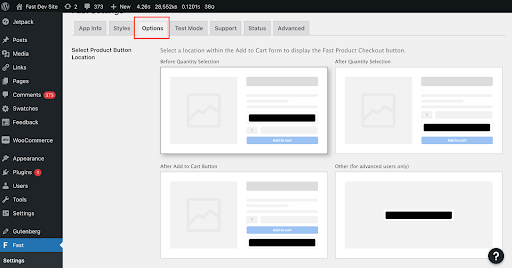

# Step 3: Options

On the screen are several possible layouts for how the Fast button can look on the product page of your online store.

Here is what each option shows, as seen in the above image:

| Option                        | Description                                                                                                                                                                                                                 |
| ----------------------------- | --------------------------------------------------------------------------------------------------------------------------------------------------------------------------------------------------------------------------- |
| **Before Quantity Selection** | This option places the button just above the quantity selection field in the Add to Cart form.                                                                                                                              |
| **After Quantity Selection**  | This option places the button between the quantity selection field and the Add to Cart button.                                                                                                                              |
| **After Add to Cart Button**  | This option places the button just below the Add to Cart button.                                                                                                                                                            |
| **Other**                     | This fourth option is available for users with advanced understanding of WordPress hooks. If Other is selected, a valid WordPress action hook must be entered in the next field, “Enter Alternate Product Button Location.” |

Decide which layout you want for your store and click that layout. Then click “Save Changes.”
