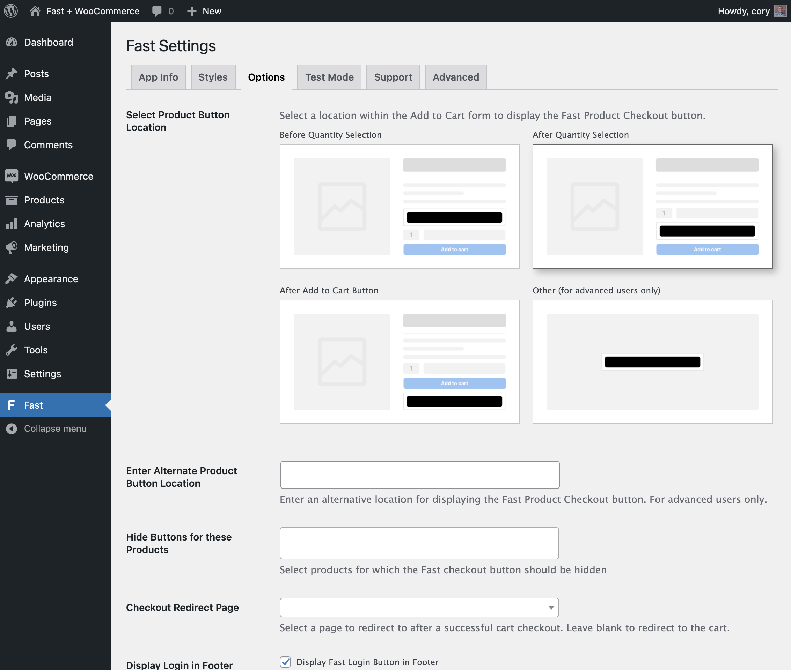

# Step 3: Options

On the screen are several possible layouts for how the Fast button can look on the product page of your online store.

Here is what each option shows, as seen in the above image:

| Option                        | Description                                                                                                                                                                                                                                                                                                                                                        |
| ----------------------------- | ------------------------------------------------------------------------------------------------------------------------------------------------------------------------------------------------------------------------------------------------------------------------------------------------------------------------------------------------------------------ |
| **Before Quantity Selection** | This option places the button just above the quantity selection field in the Add to Cart form.                                                                                                                                                                                                                                                                     |
| **After Quantity Selection**  | This option places the button between the quantity selection field and the Add to Cart button.                                                                                                                                                                                                                                                                     |
| **After Add to Cart Button**  | This option places the button just below the Add to Cart button.                                                                                                                                                                                                                                                                                                   |
| **Other**                     | This option is available for users with advanced understanding of WordPress hooks. If selected, you must the provide the name a valid WordPress [action hook](https://codex.wordpress.org/Plugin_API/Action_Reference) in the next **“Enter Alternate Product Button Location”** field. This will serve as the hook through which the product button is displayed. |

Decide which layout you want for your store and click that layout. Then click **“Save Changes.”**

:::info Additional Options

After initial plugin installation, you can come back to the Options tab to specify additional custom settings (e.g. hiding the Fast button for certain products or specifying a custom post-checkout redirect page). For now, you can just proceed with the rest of the plugin installation steps. You can find more details in the ["Options Tab" section WooCommerce Custom Settings page](/developer-portal/for-developers/woocommerce/customization/custom-settings#options-tab).

:::
