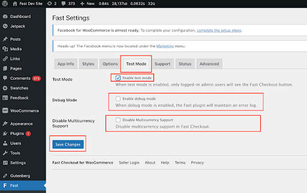

## Step 2: Test Mode

1. Click the “Test Mode” tab.
   **By default, your store will be in test mode**. We recommend you keep the store in test mode by keeping the “Enable test mode” checkbox checked. This way, only you and other store admins will see the Fast buttons.

   

   **Once you are ready to make the Fast buttons go live to the public, you can uncheck “Enable test mode” and the buttons will be visible to everyone who visits your site.**

:::info Additional Settings

After initial plugin installation, you can come back to the Test Mode enable or disable additional settings (e.g. Debug Mode or Multicurrency Support). For now, you can just proceed with the rest of the plugin installation steps. You can find more details in the ["Test Mode Tab" section WooCommerce Custom Settings page](/developer-portal/for-developers/woocommerce/customization/custom-settings#test-mode-tab).

:::
