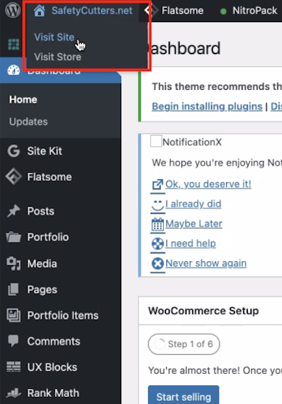
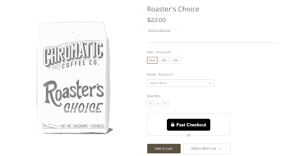
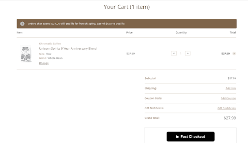
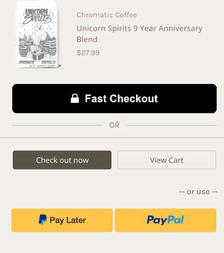
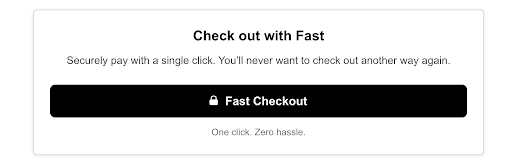
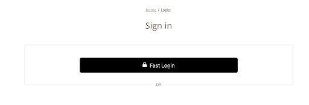

# Step 4: Verify Setup

There are **5 different parts in a typical store's website where you can see "Fast Checkout" button**:

- Product Pages
- Cart Preview Page
- Mini Cart
- The Cart
- Checkout Page

Let's verify how they look and make sure to update anything that needs updating. -->

## Product Page

1. In a new tab, **go to the product page on your online store**.

   > To go to a new tab, in the top left hand corner of the WooCommerce page, you will see your website name. Hover over that and command-click/right-click “Visit site” to open your online store in a new tab.

2. **Go to a product page**.

   

3. **Make sure that the Fast button is located in a place on the page that looks good**. If you want to change the location of the Fast button, repeat the previous step.

   

4. **See if you like the way the Fast button looks or if you want to change something else about it like the width or the length**.

<embed src="/reusables/for-developers/_platform_woocommerce_refer_to_custom_button_styling_page.md" />

5. **Add the product to your cart**.

## Cart

**Go to the cart page of your online store and see how the Fast button looks**.

<embed src="/reusables/for-developers/_platform_woocommerce_refer_to_custom_button_styling_page.md" />

## Mini Cart

**Go to the mini cart page of your online store and see how the Fast button looks**.

<embed src="/reusables/for-developers/_platform_woocommerce_refer_to_custom_button_styling_page.md" />

## Checkout Page

**Go to the checkout page of your online store and see how the Fast button looks**.

<embed src="/reusables/for-developers/_platform_woocommerce_refer_to_custom_button_styling_page.md" />

## Login Page

**Go to the login page of your online store and see how the Fast button looks**.

<embed src="/reusables/for-developers/_platform_woocommerce_refer_to_custom_button_styling_page.md" />

