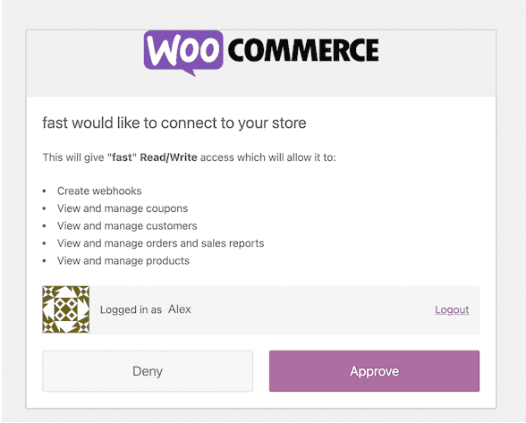

# Pre-Install Step 3: Onboard as a Seller with WooCommerce

## Prerequisites

Before you begin this process, you’ll need an online store hosted by WooCommerce.

<embed src="/reusables/for-developers/_platform_all_sign_up_as_a_seller_banner_sandbox_and_contact_support.md" />

## PIN Validation

<embed src="/reusables/for-developers/_platform_all_sign_up_as_a_seller_pin_validation.md" />

## Fill Out Your Profile

<embed src="/reusables/for-developers/_platform_all_sign_up_as_a_seller_fill_out_your_profile.md" />

## Provide Platform Details

1. Select “WooCommerce” for your platform type and click "Continue."

<embed src="/reusables/for-developers/_platform_all_sign_up_as_a_seller_platform_details.md" />

### Connect to WooCommerce

1. We need to authorize Fast on WooCommerce to install the Fast Checkout button. You’ll need the information below to connect your platform:

   1. Owner account credentials
   2. WooCommerce account email
   3. WooCommerce account password

   

2. Provide your WooCommerce account credentials and click "Login."
   **Note**: You need WooCommerce Store Admin access or higher to do this.

   

3. Click the checkbox and click “Confirm.”
   

## Verification

<embed src="/reusables/for-developers/_platform_all_sign_up_as_a_seller_business_verification.md" />

## Bank Details

<embed src="/reusables/for-developers/_platform_all_sign_up_as_a_seller_bank_details.md" />
