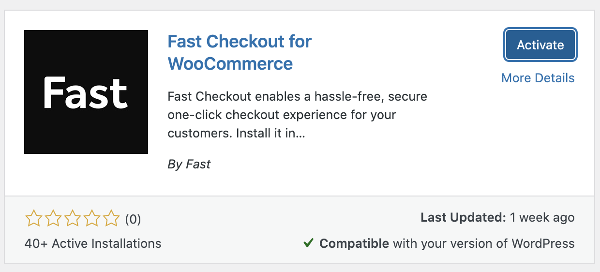

# Migrating Fast to New Plugin Directory Version (for Early Sellers)

**Fast Checkout for WooCommerce is officially live in the WordPress plugin directory!**

[**View our plugin in the plugin directory →**](https://wordpress.org/plugins/fast-checkout-for-woocommerce/)

Our early sellers were onboarded by our customer success team when our plugin was not active in the WordPress plugin directory yet. Managing your plugins through the plugin directory makes it much easier to keep up-to-date. It's imperative that WordPress stores are maintained and plugins are updated frequently.

This will walk you through how to uninstall the version our team installed, and install the plugin directory version, making it easier to keep your plugin up-to-date.

## Requirements

You must have WordPress admin access.

## Steps to Migrate to the plugin directory version

:::info heads up
**Fast Checkout will be temporarily unavailable while you are completing these steps.** Have no fear, your plugin settings will remain intact as those are stored in your database, not the plugin code itself.
:::

1. **Login to the admin side of your WordPress site.**

   > The url for this is usually `https://yourwebsite.com/wp-admin`

2. **Click on Plugins in your admin dashboard menu and locate Fast checkout**.

   > ex: `https://yourwebsite.com/wp-admin/plugins.php? `

3. **Click the box near the Fast Checkout title**.

   

4. Scroll to the very top of the list, or the bottom, and click the Bulk action select box. **Choose Deactivate**.

   

5. Now that the plugin is deactivated, it's time to **delete the plugin**. Remember, your plugin settings will remain intact as those are stored in your database, not the plugin code itself. You can either click delete near the title, or follow the same checkbox method as previously, choosing Delete.

   

6. **Search the plugin directory for "Fast Checkout" or "Fast Checkout for WooCommerce"**. We're really new, so you may need to scroll down a little bit to find us.

   

7. **Click Activate**. Essentially this turns the plugin code functionality "on."

   

8. **Test the following pages and functions of your website** to ensure everything is still working as expected with the plugin code swap we just made.

   - Product page `https://yourwebsite.com/product/PRODUCT-NAME`
   - Cart page `https://yourwebsite.com/cart`
   - Checkout page `https://yourwebsite.com/checkout`
   - Mini cart `varies depending on theme`
   - Login page `https://yourwebsite.com/my-account`

9. When you make plugin changes (e.g. updates, removals, etc.) you may need to manually turn test mode off again. **Navigate to Fast Checkout settings. Scroll to the bottom and ensure test mode is unchecked**.

   > ex: `http://yourwebsite.com/wp-admin/admin.php?page=fast`

   

:::info YAY
That's it. You're back in business.
:::
