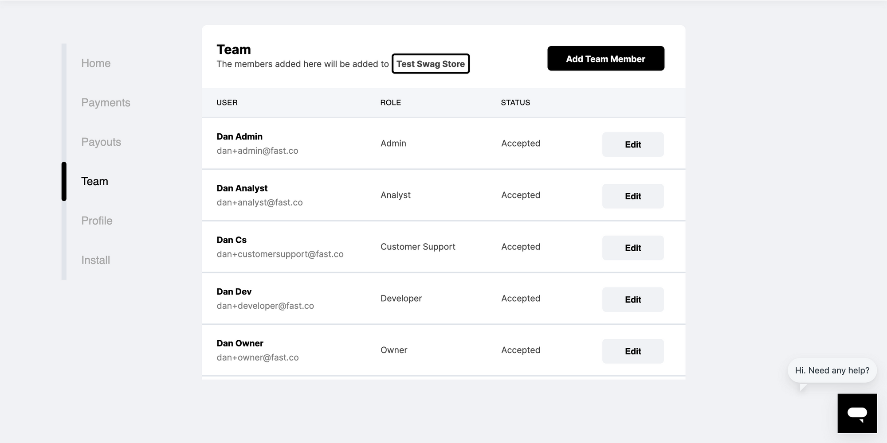

# Adding Multiple Accounts

1. Login to your Fast Seller Dashboard at fast.co/business.
2. Navigate to the Team tab

3. Click "Add Team Member"

4. Input the Team member's settings. The options are:

| Option               | Permissions                                                                                                    |
| -------------------- | -------------------------------------------------------------------------------------------------------------- |
| **Owner**            | Has full access.                                                                                               |
| **Admin**            | Has similar access to owners, except cannot add/edit Orgs or Apps. Can add/edit other users except for Owners. |
| **Developer**        | Can view developer info needed to install and test Fast on your sites.                                         |
| **Customer Support** | Can view order payments status.                                                                                |
| **Analyst**          | Can view and download payments and payouts transaction data.                                                   |
| **View Only**        | Cannot download payouts data.                                                                                  |

5. Click "Send invite"

6. After a team member has accepted the invite, you can modify their settings at any time by clicking "Edit" on their profile in the Team tab
