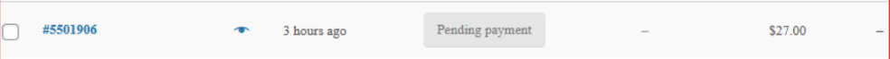

# Pending Payments

:::info heads up
You can view pending payments on your store's dashboard (ex: WooCommerce dashboard) not on your Fast seller dashboard.
:::

A status of "Pending payment" indicates that the customer's cart has been abandoned for less than 1 hour. If the customer's cart has been abandoned for 1 hour, the order will be marked as abandoned in our backend system and will disappear from your Orders view.
