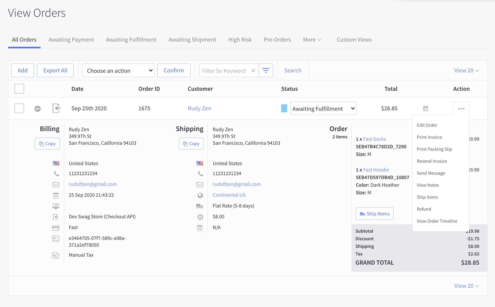
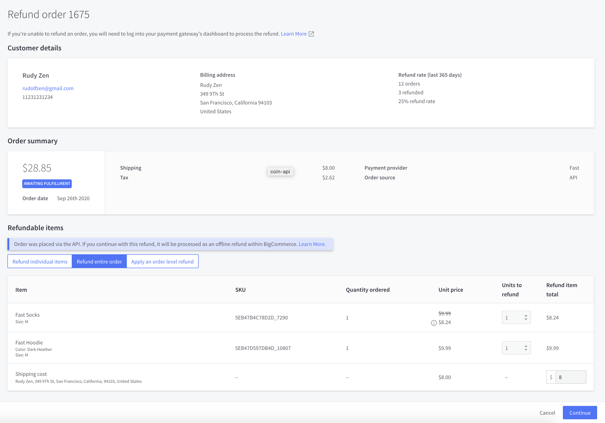
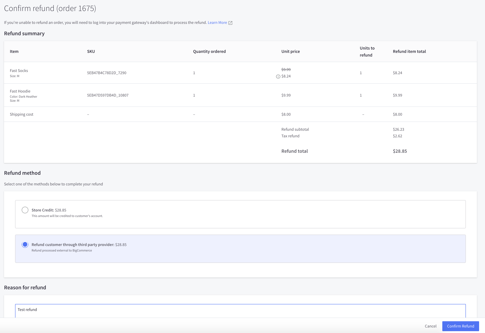
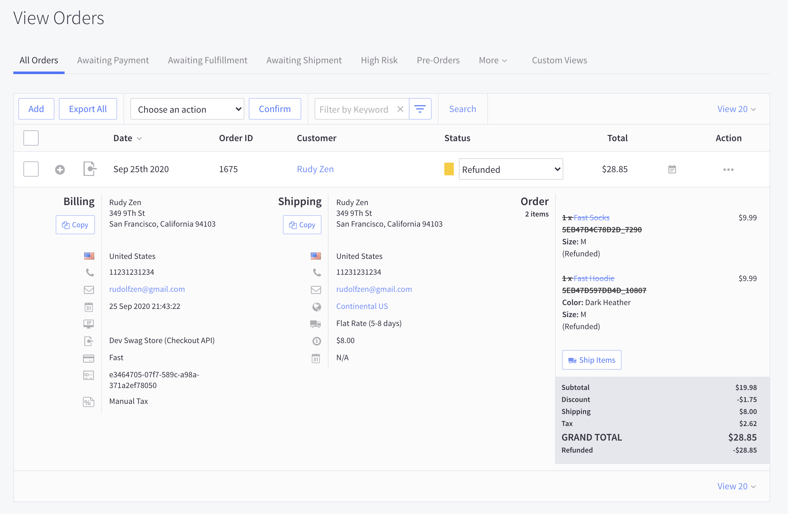
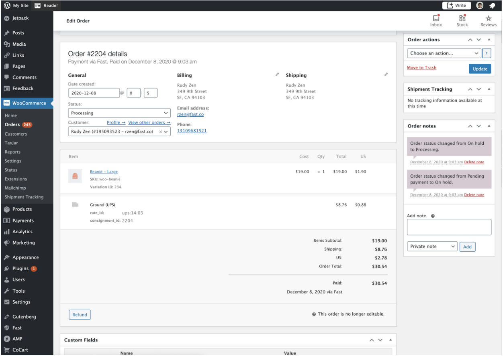
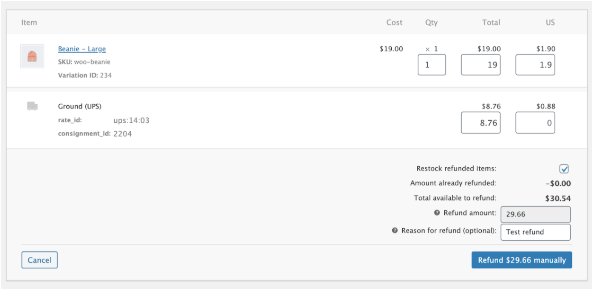
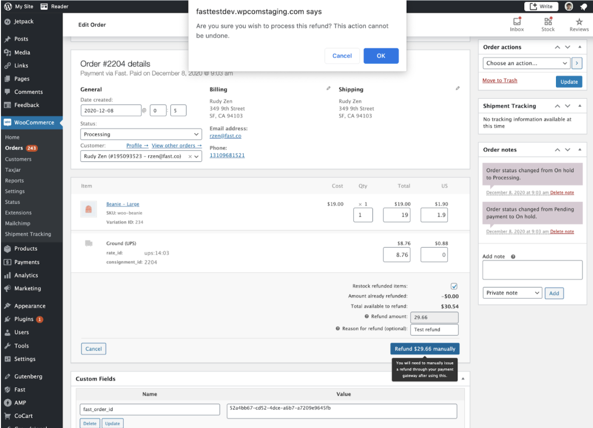

# Refunds

You can issue either partial or full refunds. There are no fees to refund a charge, but the fees from the original charge are not returned.

Refunds work differently depending on your platform. Find your platform below and follow the steps.

## BigCommerce Refunds

To refund a customer, use BigCommerce to refund on a specific order entry. See screenshots below for a step-by-step example.

<iframe src="https://www.loom.com/embed/98d3c1ee44ec48e98b62c5b05f914381" frameborder="0" webkitallowfullscreen mozallowfullscreen allowfullscreen style="width: 100%; height: 300px;"></iframe>

### Steps

1.Locate the order, and click on the Action "..." button to initiate a refund

> Note: Status must be “Awaiting Fulfillment” to process a refund. If you have Cancelled the order, you will need to manually change the status to “Awaiting Fulfillment” before you can refund the order

2. Enter refund details (entire order or individual items or custom amount)

3. Select "Refund customer through third party provider", enter reason, and confirm refund

4. You're all done! The order will show as "Refunded" or "Partially refunded", depending on how much you refunded

> Note: Status will change to “Refunded” after you have completed the refund. To prevent order fulfillment for a Cancelled order, you will need to manually change the status to “Cancelled” after refunding

## WooCommerce Refunds

To refund a customer, use WooCommerce to refund on a specific order entry. See screenshots below for a step-by-step example.

<iframe src="https://www.loom.com/embed/4edbdad3bc0f4245a17c73ba5656d3bc" frameborder="0" webkitallowfullscreen mozallowfullscreen allowfullscreen style="width: 100%; height: 100%;"></iframe>

### Steps

1. Locate the order, and click on the “Refund” button to initiate a refund.

2. Enter the refund amounts and reason.

> Note: You will see a warning that "this refund will be manually processed by your payment gateway" under the Refund manually button; this is normal and indicates that the refund will be processed by Fast.

3. Click OK on the confirmation pop-up.

## Refunds via the Fast -> Seller API

<embed src="/reusables/for-developers/_platform_all_refunds_via_api_quick_summary.md" />
