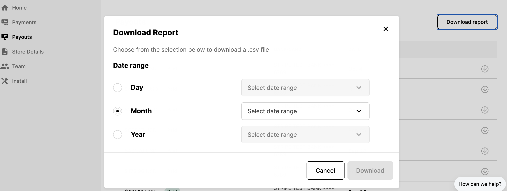

# Exporting Payment data overview

You can view your payout history and download a file for each payout containing a detailed transaction-level report on your Seller Dashboard!

## Steps

1. Log in to your [Seller Dashboard](https://fast.co/business)
2. Click the "Payouts" tab on the left side of the screen
3. In the top-right corner of the page, click "Download report"
4. Specify the date range for the CSV report file
   - You will have the option to select a Day, Month, or Year date range
     
5. Once you export the report as a CSV, you can convert it to a spreadsheet

If you have connected your eCommerce platform store to Fast, then the file should also have a column with the order ID used by that platform to help you look up Fast orders on that platform.
