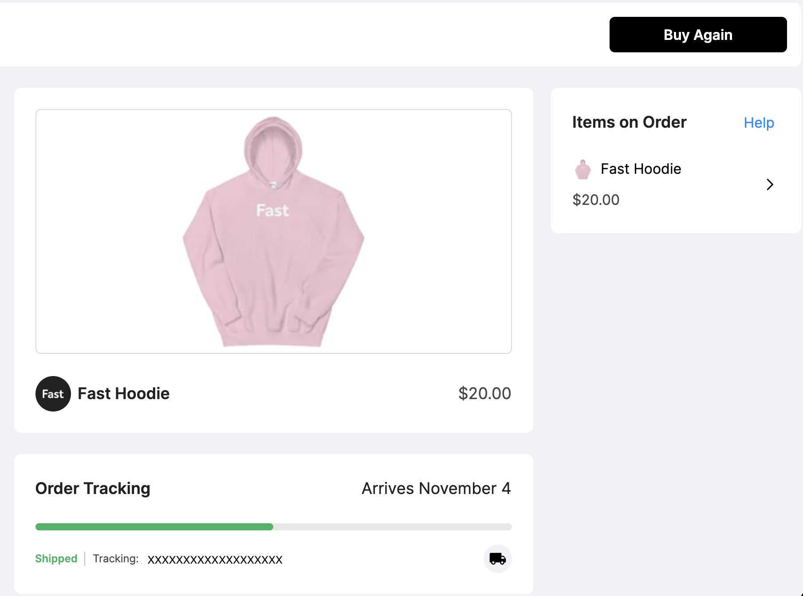

# Tracking Current Orders

You can find your tracking information in your Buyer Dashboard.

We automatically pull in tracking information from the seller, with a link to carrier tracking if available. You can find additional information on your order tracking at the carrier tracking link or by reaching out to the seller.

We are currently unable to pull in separate tracking numbers for deliveries that are being shipped in multiple packages, so you may receive an “Order Delivered” email for a partial delivery. We apologize for any inconvenience; this is a known issue that the team is working hard to resolve.

We always default to the lowest-cost shipping option offered by the seller.

Please contact the seller via the “Contact Us” page on their shop website to receive updated shipping and tracking information.
