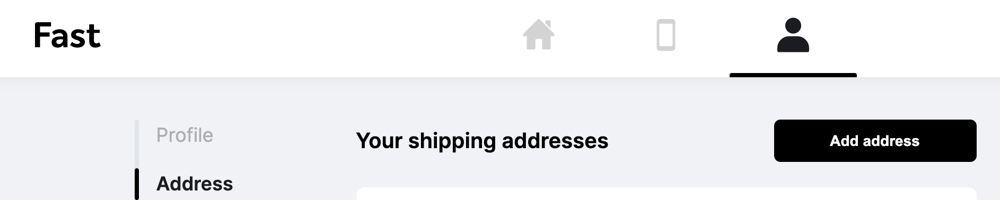

# Update your shipping address

## In your Dashboard

To add or edit shipping addresses for _future_ purchases with Fast:

1. Log in to the [Fast Shopper Dashboard](https://fast.co/profile)
2. Click on the ["Address" tab](https://fast.co/profile/address) found in the left navigation panel.
3. Click the "Add address" button to add in your details.

If you want to keep several addresses on file, you are able to do this once you have selected a "default" option. Once you have selected your "default" shipping address, you are able to delete additional addresses on file.

## During the 5 minute checkout window

Also, during the 5-minute checkout window you have the ability to update your shipping address to a different option listed on your dashboard or you can add a new one during this time. If a shipping address is not added or selected, the "default" shipping address listed in your dashboard will be selected.

## For Current orders past the 5 minute checkout window

If you need to update your address on a current order, please reach out directly to the merchant for assistance. Please refrain from using autofill when adding your address information, as autofill may input your address incorrectly.
