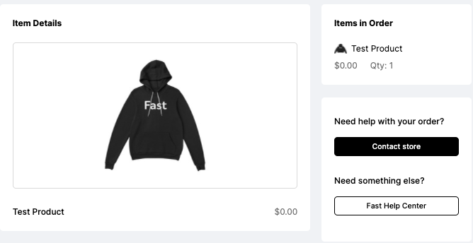

# Orders

**We believe that usernames and passwords are a thing of the past.**

Fast Checkout enables one-click purchases _without requiring a password to log in_! Sign in just once on a given device, and Fast remembers your account and payment information, without compromising security.

When you see a Fast Checkout button on your favorite website (and have already signed up for Fast), **press the Checkout button and your order is confirmed**. There’s no need to add items to a cart - but you can add to or edit your order for up to five minutes! Then, we process your payment and your merchant gets your order ready to go!

When you use Fast products and services, we use alternative authentication methods that don’t involve usernames and passwords, so you’ll never have to worry about remembering or using them ever again!

Explore this section to learn more about how Fast works, how we protect your information, process orders, and make it easy – and FAST – to buy your favorite products across the internet without filling out long, tiresome forms.

As a Shopper, once you have completed your first checkout, you can view order details from your [Fast Dashboard](https://fast.co) or by clicking the order link provided in the confirmation email you received when you made your purchase.

It is important to note that the Fast Checkout process creates an order once completed (either with a confirmed purchase after the 5-minute checkout window concludes, or upon order cancellation).

## Order Details

When you view an order, you can see details including:

- store
- date of purchase
- order ID
- Fast Transaction Number
- shipping details (including address and tracking numbers)

Additionally, you will be able to view:

- list of items in the order
- item details
- links to contact the store

:::info

You will also see a "Buy Again" option that you can use if you wish to re-purchase the same item from that store.

:::
