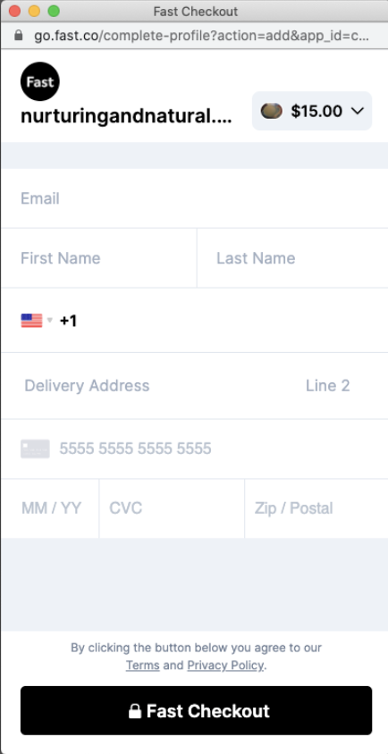
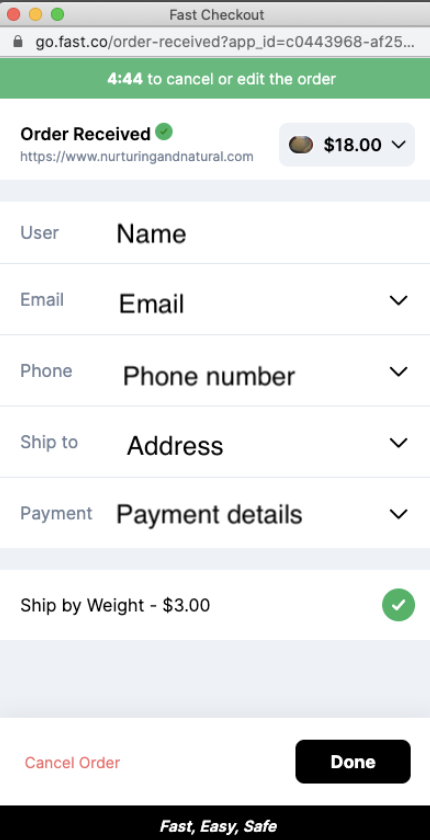

# What Happens When a Customer Clicks Fast Checkout?

When a customer clicks Fast checkout a pop-up window will appear and a customer will either login to their Fast account or create a new account.

## New Fast Account

If you are new to Fast you will be asked to sign up with email, name, phone number, address, payment (image of form fields).

## Existing Account

### Default

Existing account holders will be sent to payment confirmation page (5-min window)

### New Devices

If an existing user is on a new device or if they previously signed out of Fast, they will be prompted to authenticate their email with a PIN code. They will also be able to update their shipping address and payment details before the order is confirmed during the batching window

