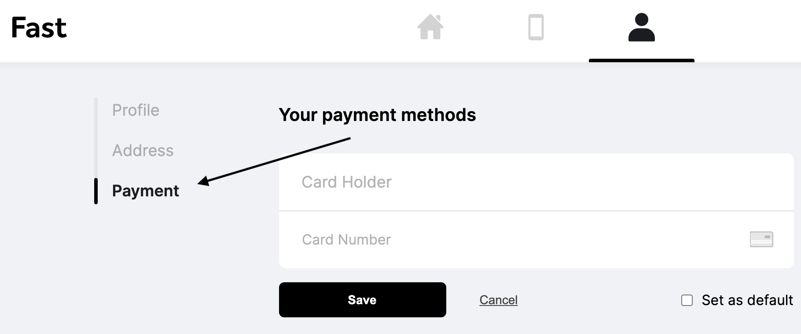

# Updating Your Card Information

## Adding a card

To add a card, log into Buyer Dashboard and click on the Payments icon found in the left navigation panel. Click the "add payment method" button to add your new payment information and you’re good to go! If you want to keep several payment methods on file, you are able to do this as long as one card is selected as your "default". Once you have a payment method selected as the "default" option, you are able to delete any additional credit cards on file.

## During the 5-minute checkout window

During the 5-minute checkout process you have the ability to update your payment method to a different option that is listed on in your dashboard or you can add a new one during this window. If a payment option is not added or selected, the payment method chosen will be your "default" card in your dashboard.

It's important to mention that updating your credit card information is only reflected on future orders. Payment methods can not be updated on current orders, if you need to update your payment details on a current order please contact the merchant directly.

<embed src="/reusables/security/_data_privacy_delete_account.md" />
