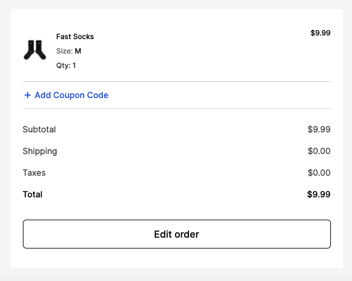
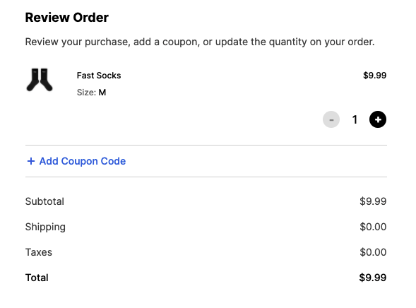
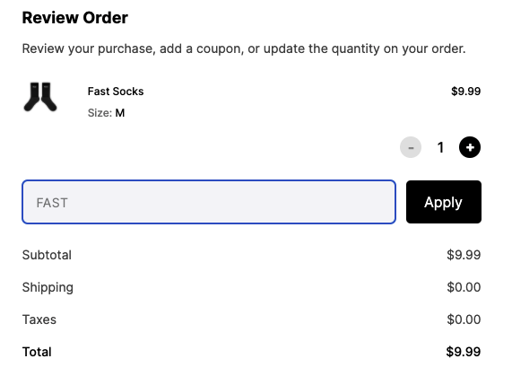

# Promo Codes

## Where do I put a promo code?

You can use promo codes in the pop-up Order Confirmation page:

1. Click "Edit Order"

   

2. Click "Add Coupon Code"

   

3. Click "Apply"

   

## Promo Code Confirmation

You will receive confirmation of the discounted price you paid in your 2nd "Order Processing" email, to accommodate any edits made during the 5 minute batching window.
