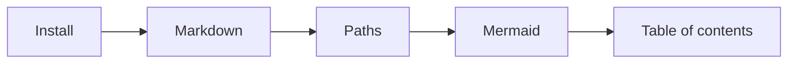

# Mermaid diagrams

You can insert [mermaid](https://mermaidjs.github.io/) charts and diagrams directly into markdown. This allows you to adhere to the docs-as-code philosophy.  To insert a diagram, create a code block and specify the  `mermaid` language.

## An example of a flowchart

````md

````


## Edit the flowchart

This training course won't cover the mermaid library in much depth.

We will replace the `?` in the flowchart with what's up next:

- page table of contents

Try to edit this page and replace the `?` with `TOC`.

Now, try to replace that with `Table of contents`.
You should see an error if you replaced it like this.

````md
```mermaid
graph LR
    Install --> Markdown --> Paths --> Mermaid --> Table of contents
```

Error: Parse error on line 2: ...> Mermaid --> Table of contents -----------------------^ Expecting 'SEMI', 'NEWLINE', 'EOF', 'AMP', 'START_LINK', 'LINK', got 'ALPHA'
````

The space causes mermaid to error. Fix it using this escape technique.

````md

````


## Extra credit

You could spend a day trying all of the different kinds of mermaid diagrams.

Or styling them.
