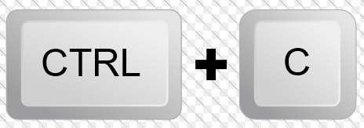

# Setting up the developer portal

## Step 1: Clone the git repo

```bash
git clone git@github.com:Redocly/developer-portal-starter.git

cd developer-portal-starter
```

## Step 2: Install dependencies

Before you start, you will need node and yarn installed on your system.

- [node.js >= 10.15.1](https://nodejs.org/en/)
- [yarn](https://yarnpkg.com/en/)

```bash
yarn install
```

<div class="attention">
Depending on your operating system, you may see warnings when installing dependencies.
</div>

## Step 3: Start the development environment

```bash
yarn start
```

This command will start a development server.
Most functionality exists in the development server except for `search`.
When the server is ready, the url is published to the console and may default to http://localhost:3000.

In a browser, type http://localhost:3000 to see the developer portal load.

## Stop the development environment

To stop the development environment, press control+c.



## Clear cache

<div class="warning">
Troubleshooting? Try this out.
</div>

You many need to clear your cache to view a few changes such as changing the key of a sidebar definition, in the local server.
We actively reduce these to make the best development environment experience possible.

1. Press control+c.
1. In the command prompt, run `yarn clean` to clear the cache.
1. Run `yarn start` to restart the development environment.


## Next steps

You are ready to train!

Go to the [training exercises list](index.md).
