# Checkout for WooCommerce Installation Guide

Ready to get Fast? Here’s how to quickly install Fast Checkout for your WooCommerce store. It’s easy, with no custom integration required.

## Become a Seller

The first step to integrating Fast Checkout with your WooCommerce store is to become a seller with Fast. If you already have a seller account and an App ID, please move to the [Install WordPress Plugin](#install-wordpress-plugin) section.

[**Become a Seller on Fast.co →**](https://www.fast.co/business)

[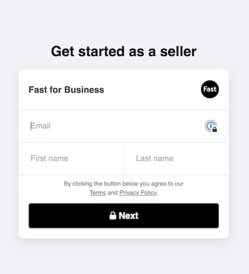](https://www.fast.co/business)

### Organization Details
Complete your organization details. If a Partner sent you our way, we'd really love to hear about it in the supplied field.

[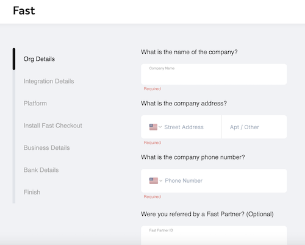](https://www.fast.co/business/onboarding/fast-checkout/org-details)

### Complete your integration details
Complete your integration details. Please be sure to add an active website domain or you will receive a verification error.

[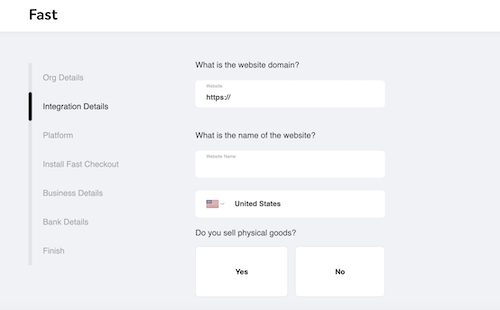](https://www.fast.co/business/onboarding/fast-checkout/checkout-app-details)

### Choose WooCommerce as your platform
Choose your desired platform. In this case, we're using WooCommerce. This WordPress plugin only provides Fast Checkout to WooCommerce-powered WordPress sites.

[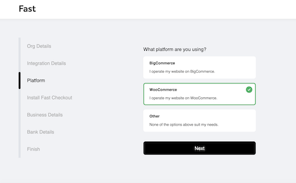](https://www.fast.co/business/onboarding/fast-checkout/platform)

### Authenticate WooCommerce
You will need to give Fast permission to connect with your WooCommerce installation of WordPress. Click Authenticate and enter your admin credentials.

[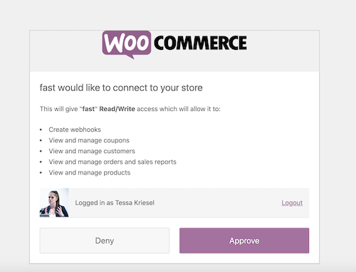](https://www.fast.co/business/onboarding/fast-checkout/install-woocommerce)

### Capture your app ID
Capture your app ID for use in the next section, installing the Fast Checkout for WooCommerce WordPress plugin.

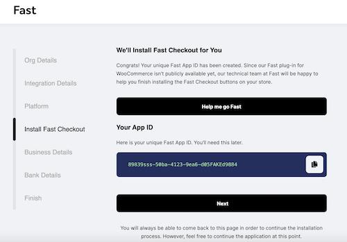

## Install WordPress Plugin

Login to the admin side of your WordPress site. The url for this is usually `https://yourwebsite.com/wp-admin` 

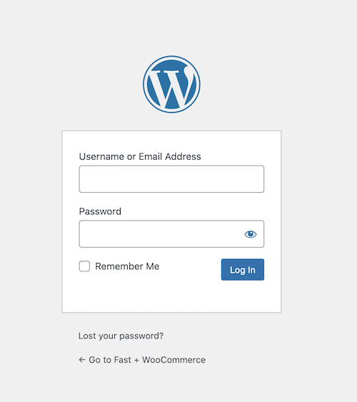

:::info Tip

You must have WordPress admin access in order to install and remove plugins.

:::

## Navigate to Plugins, Add New
In the left hand sidebar of your WordPress admin dashboard, hover over Plugins, then click Add New.

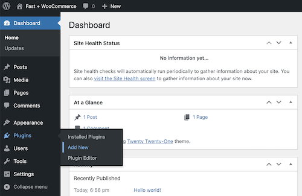

:::info Tip

Depending on your site setup, you may need to search a bit to find navigation items. Some themes and plugins alter the appearance of your WordPress admin dashboard.

:::

## Search & install Fast Checkout for WooCommerce
Search the plugin directory for "Fast Checkout" or "Fast Checkout for WooCommerce."

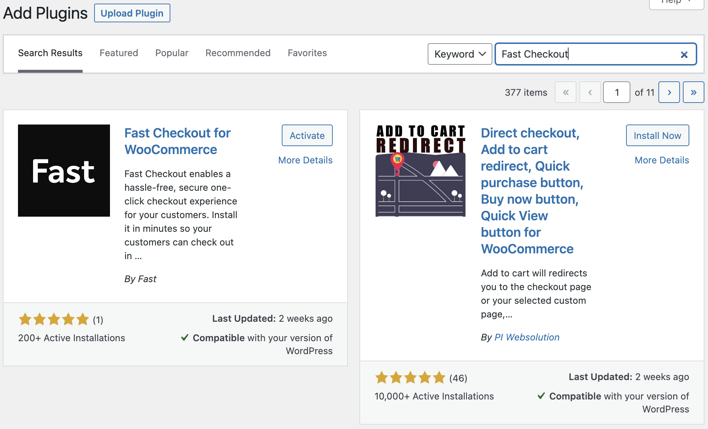

If you find success with Fast Checkout for WooCommerce we'd love a review in the plugin directory. If you are not finding success, please reach out to our team—we want to make sure you're taken care of. 

* [Account support](https://help.fast.co/)

## Activate plugin
Click Activate Plugin. Essentially this turns the plugin code functionality "on."

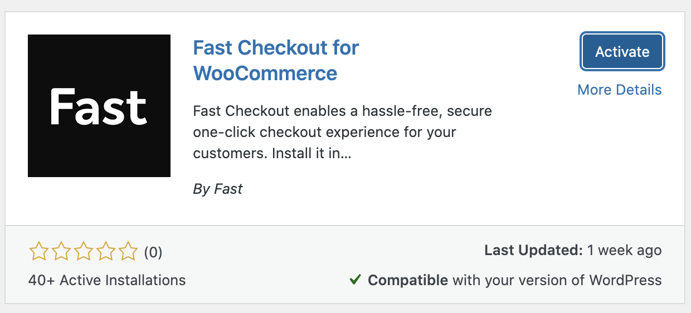

:::info Tip

You can deactivate plugins to troubleshoot website issues. Slowly deactivate them one-by-one, each time checking to see if the error persists. If you find one plugin is the problem, visit their changelog or website for latest news or updates. Also ensure all of your plugins are always up-to-date.

:::

## Configure plugin settings
Now that you activated the plugin, you can click the Fast plugin link now shown in the left side admin navigation (towards the bottom usually), to navigate to the plugin settings window.

Direct url to your plugin settings is `http://yourwebsite.com/wp-admin/admin.php?page=fast`

[**Learn more about all Fast Checkout for WooCommerce plugin settings**](/developer-portal/woocommerce-settings.md)

## Add your App ID
Copy your App ID from your seller dashboard and enter it into the App ID field in the Fast plugin settings. Click Save Changes at the bottom.

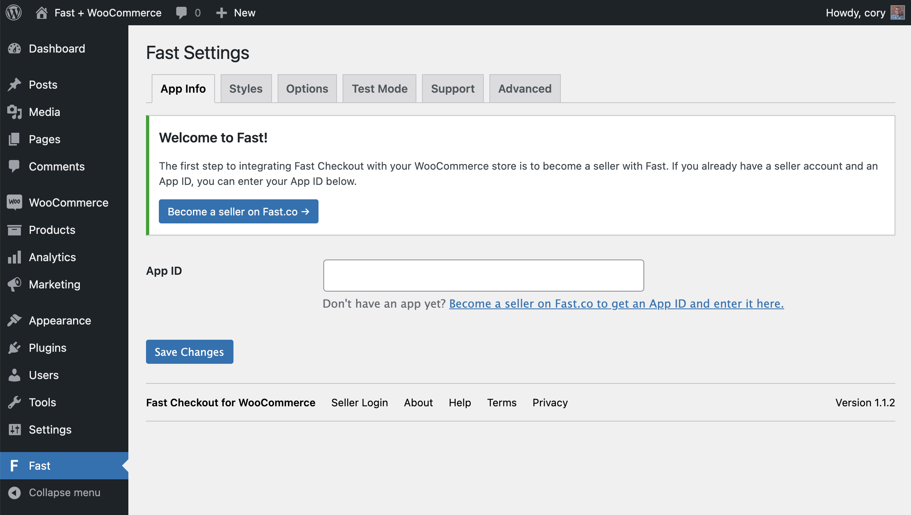

:::info Tip

You can copy & paste your App ID from the seller dashboard to your WordPress website so you don't have to re-type it all. Use your mouse to highlight the text. Navigate to edit in your menu bar, then click Copy. Navigate back to your WordPress admin dashboard and click into the App ID field. Go to edit again, but this time, click Paste.

:::

## Test functionality and review appearance of buttons
Test the following pages and functions of your website to ensure Fast is integrated properly, as well as appears the way you would like it to appear.

* Product page `https://yourwebsite.com/product/PRODUCT-NAME`
* Cart page `https://yourwebsite.com/cart`
* Checkout page `https://yourwebsite.com/checkout`
* Mini cart `varies depending on theme`
* Login page `https://yourwebsite.com/my-account`

If your site is still in test mode, you can place orders without risk. [See Stripe's basic test cards](https://stripe.com/docs/testing#cards) to find test credit card numbers you can use for orders.

## Edit the appearance of the button
You can also edit the default CSS of the Fast button under the Styles tab in the Fast settings page.

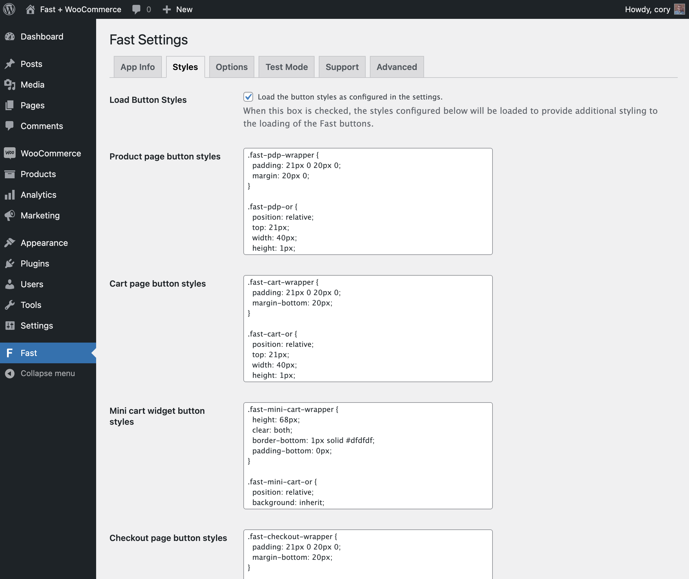

## Promote to production
Once you have tested the various sections where Fast is integrated, you're ready to turn off test mode! Navigate back to the Fast plugin settings page in your WordPress admin dashboard, scroll below the CSS boxes, then uncheck test mode, and scroll to the bottom and click Save Changes.

Once test mode is off, you're ready to enjoy your seller benefits. We're thrilled you're a Fast seller. 
