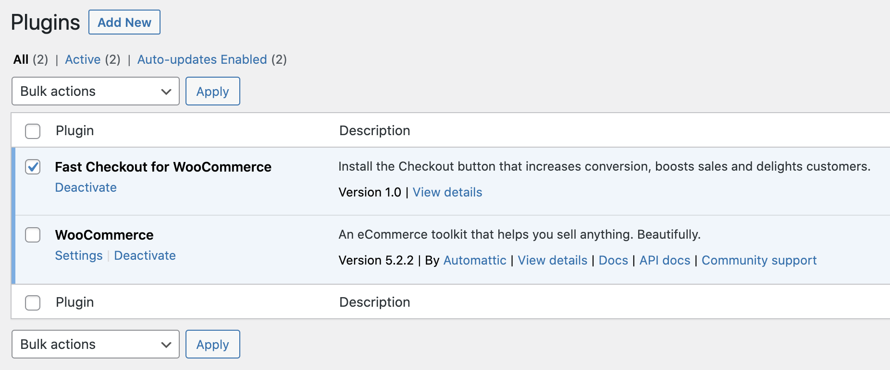
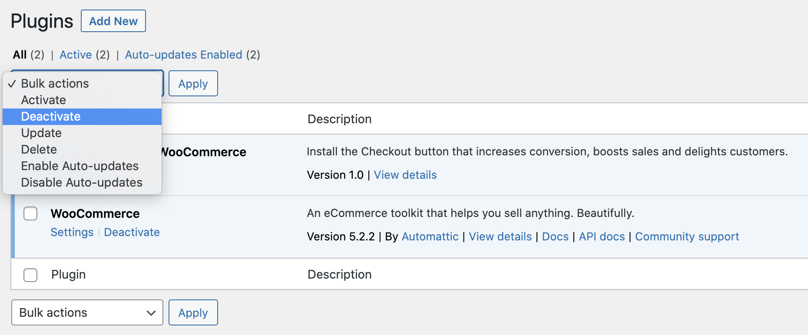
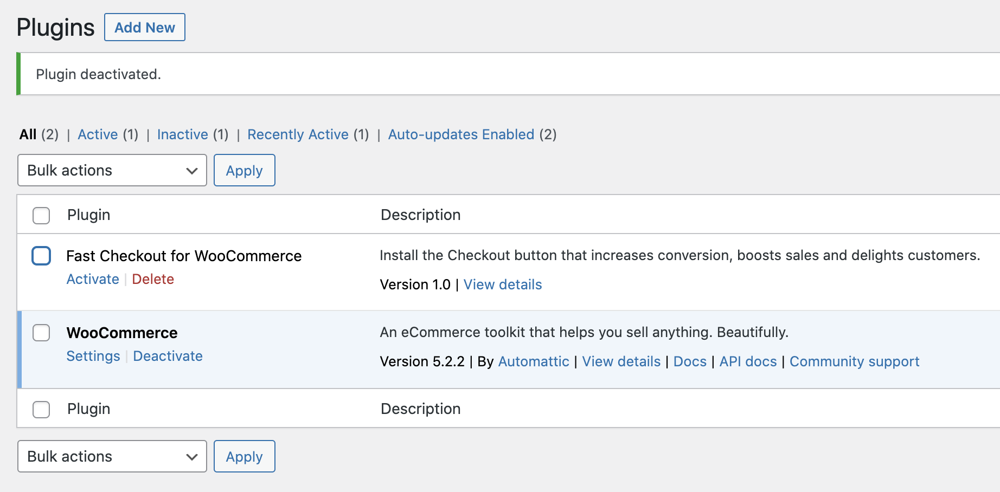
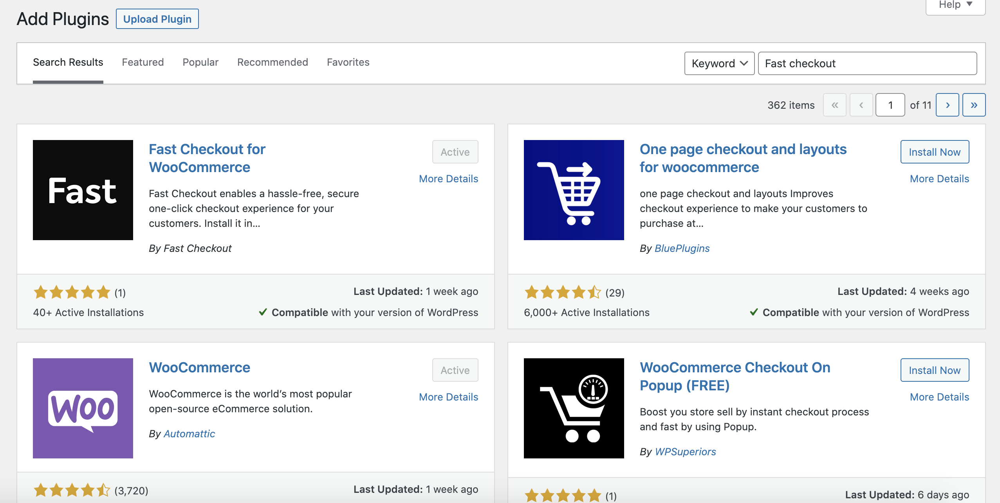
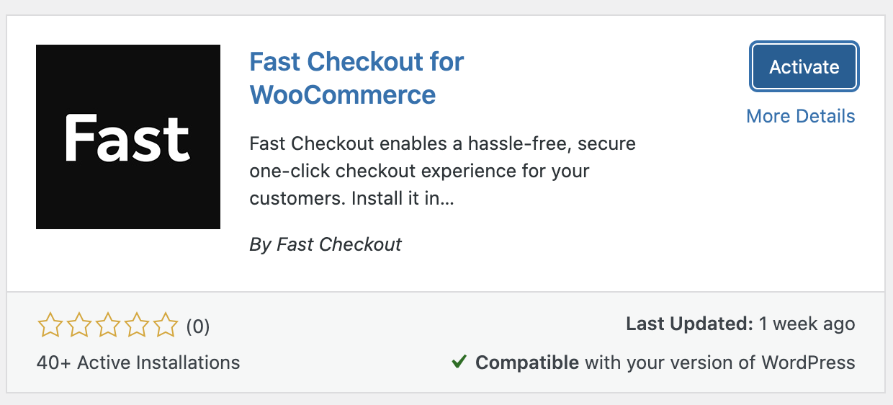

# Early Sellers: Migrate to plugin directory version

Fast Checkout for WooCommerce is officially live in the WordPress plugin directory. 

[**View our plugin in the plugin directory →**](https://wordpress.org/plugins/fast-checkout-for-woocommerce/)

Our early sellers were onboarded by our customer success team. Our plugin was not active in the WordPress plugin directory yet. However, managing your plugins through the plugin directory makes it much easier to keep up-to-date. It's imperative that WordPress stores are maintained and plugins are updated frequently. 

This will walk you through how to uninstall the version our team installed, and install the plugin directory version, making it easier to keep your plugin up-to-date.

## Migrate to the plugin directory version

### Login to your WordPress admin dashboard
Login to the admin side of your WordPress site. The url for this is usually `https://yourwebsite.com/wp-admin` 

*Tip: You must have WordPress admin access in order to install and remove plugins.*

### View all Plugins
Click on Plugins in your admin dashboard menu and locate Fast checkout.

`https://yourwebsite.com/wp-admin/plugins.php? `

### Deactivate Fast Checkout
Click the box near the Fast Checkout title. Scroll to the very top of the list, or the bottom, and click the Bulk action select box. Choose Deactivate. 

**Fast Checkout will be temporarily be unavailable while you are completing this step.** Have no fear, your plugin settings will remain intact as those are stored in your database, not the plugin code itself.

### Delete Fast Checkout
Now that the plugin is deactivated, it's time to delete the plugin. Remember, your plugin settings will remain intact as those are stored in your database, not the plugin code itself. You can either click delete near the title, or follow the same checkbox method as previously, but choosing Delete this time.

### Search & re-install Fast Checkout for WooCommerce
Search the plugin directory for "Fast Checkout" or "Fast Checkout for WooCommerce." We're really new, so you may need to scroll down a little bit to find us. 

### Activate plugin
Click Activate Plugin. Essentially this turns the plugin code functionality "on."

### Test Fast button functionality
Test the following pages and functions of your website to ensure everything is still working as expected with the plugin code swap we just made.

* Product page `https://yourwebsite.com/product/PRODUCT-NAME`
* Cart page `https://yourwebsite.com/cart`
* Checkout page `https://yourwebsite.com/checkout`
* Mini cart `varies depending on theme`
* Login page `https://yourwebsite.com/my-account`

### Ensure your site is not in test mode
When you make plugin changes—updates, removals, etc—you may need to manually turn test mode off again. Navigate to Fast Checkout settings. Scroll to the bottom and ensure test mode is unchecked. 

`http://yourwebsite.com/wp-admin/admin.php?page=fast`

### You're done!
That's it. You're back in business. If you need help, you can find us [over here](https://help.fast.co/hc/en-us). 
