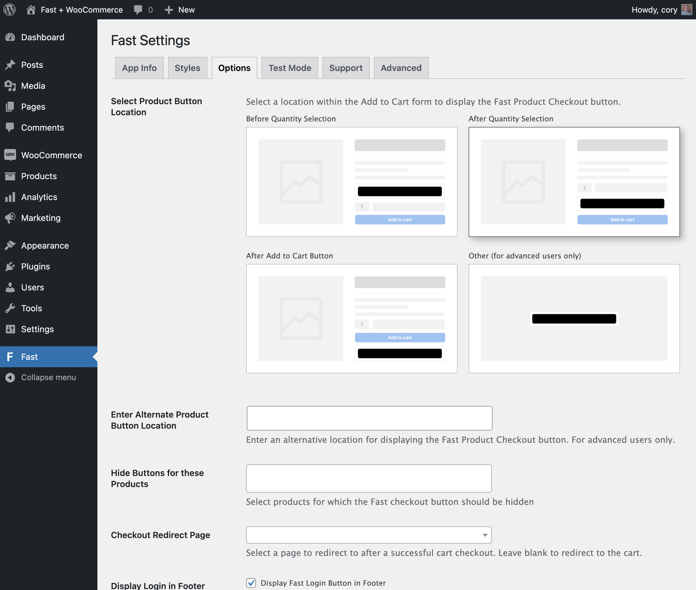

# Checkout for WooCommerce Settings

The Fast Checkout for WooCommerce plugin has several settings to configure your Fast Checkout installation. The Fast Settings page in your WordPress admin is divided into five tabs. The first four tabs contain settings, and the fifth tab is a Support tab with basic documentation and a link to get help from Fast. The first four tabs are [App Info](#app-info-tab), [Styles](#styles-tab), [Options](#options-tab), and [Test Mode](#test-mode-tab).

Direct url to your plugin settings is `http://yourwebsite.com/wp-admin/admin.php?page=fast`

## App Info Tab

#### App ID
The App Info tab contains the **App ID** setting, which you should set after becoming a seller during the [installation](/developer-portal/woocommerce-install-checkout.md) process.

## Styles Tab

#### Load Button Styles
This option is checked by default, and it tells the plugin to load styles as defined in the Styles tab. Uncheck the box if you do not wish to load these styles, and instead would prefer to style the Fast buttons another way.

#### Product page button styles
The product page button styles define how the Fast Checkout button is displayed on the WooCommerce product details page.

#### Cart page button styles
The cart page button styles define how the Fast Checkout button is displayed on the WooCommerce cart page.

#### Mini cart widget button styles
The mini cart widget button styles define how the Fast Checkout button is displayed in the mini cart widget.

#### Checkout page button styles
The checkout page button styles define how the Fast Checkout button is displayed on the WooCommerce checkout page.

#### Login button styles
The login button styles define how the Fast Login button is displayed.

## Options Tab

#### Select Product Button Location
The Fast Checkout button on the product details page can be displayed in 1 of 3 pre-set areas within the product's Add to Cart form:

* **Before Quantity Selection:** This option places the button just above the quantity selection field in the Add to Cart form.
* **After Quantity Selection:** This option places the button between the quantity selection field and the Add to Cart button.
* **After Add to Cart Button:** This option places the button just below the Add to Cart button.

A fourth option, **Other**, is available for users with advanced understanding of WordPress hooks. If **Other** is selected, a valid WordPress action hook must be entered in the next field, **Enter Alternate Product Button Location**.

#### Enter Alternate Product Button Location
Use this only if you have selected **Other** in the previous setting. This should be the name a valid WordPress [action hook](https://codex.wordpress.org/Plugin_API/Action_Reference), and will serve as the hook through which the product button is displayed.

#### Hide Buttons for these Products
This option provides a way to select products for which the Fast Checkout button will not be displayed. To select a product, begin typing the name of the product in the field and then select the product from the list that appears. This will hide the Fast Checkout button from the selected product pages as well as the cart and checkout pages if a selected product is added to the cart.

#### Display Login in Footer
The Fast Login button displays in the footer by default for non-logged in users. Uncheck this option to prevent the Fast Login button from displaying in the footer.

## Test Mode Tab

#### Test Mode
Select the Test mode option so that only logged-in admin users can see the Fast Checkout button.

#### Debug Mode
Select the Debug Mode option to enable logging in the Fast plugin. The Fast plugin will log messages to the WooCommerce logs while Debug Mode is enabled.

:::info Use for short durations

Debug Mode logs a lot of information, so it should only be used for debugging issues and only for short durations.

:::

#### Disable Multicurrency Support
This option can be used to disable multicurrency support. This is only necessary if you do not need to support multicurrency in the Fast checkout process and the store uses a third-party multicurrency plugin to handle multicurrency in WooCommerce.

:::info Not yet available

Multicurrency support is not yet available to Fast Checkout for WooCommerce. This setting will make it possible to disable multicurrency support when it becomes available in a future release.

:::