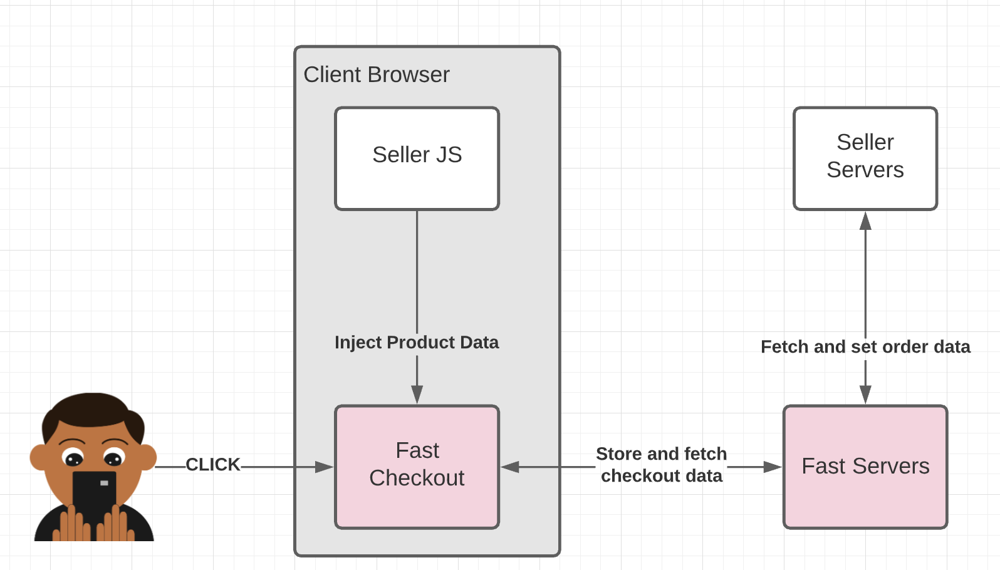

# [BETA] Direct Integrations Public Documentation Home

Welcome to the [BETA] Fast Direct Integrations documentation home. Here you will find useful documentation regarding the design and specifications of Fast Direct Integrations.

Got questions? Concerns? Contact Fast at devrel@fast.co. 

**Table of Contents**

## Documentation links

[Integration Guide](https://www.notion.so/Integration-Guide-9d70e72d1e6148409b3131851148508e)

Quick start s*tep by step guide for integration.*

[Reference Documentation](https://www.notion.so/Reference-Documentation-284fdf0295f2474db96c480c9250f8aa)

*Complete Documentation and API specifications.*

# High level flow diagrams

## New buyer clicks Fast Checkout

This diagram covers the high level flow for when a new buyer clicks the Fast checkout button.

## Buyer interacts with Fast Checkout

This diagram covers the high level flow for when a buyer interacts with Fast Checkout.

## Buyer canceled order

This diagram covers the specific case when a user cancels an order in Fast Checkout.

## Checkout timer ended & fraud check

This diagram covers our high level post processing steps prior to payment capture.

## Payment capture

This diagram covers the high level flows for payment capture. NOTE: there are 2 possible flows dependent on the seller's [configurable & direct capture](https://www.notion.so/BETA-Order-Checkout-Reference-Documentation-a15e85229ae14a38a30901ca5419c21e) configuration.

## Refund Order

This diagram covers the high level flow for refunding an order.

