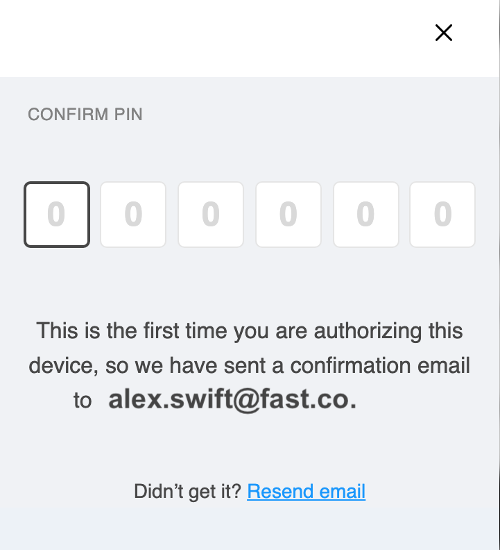

1.  On [fast.co/business](https://www.fast.co/business), **enter the following information and click "Next"**:
    - **Your company email address**
      > If you enter in a personal email address or another type of non-company email address, you can change this later.
      > You can add additional email addresses for access later.
    - **Your first name**
    - **Your last name**
      > If your business has multiple employees, the person signing up can add other sellers to the Fast account at a later date with custom permissions.
2.  **Click “Next"**
    

3.  **Fast will now send a PIN number to your email inbox**. Open your email to find this PIN number and enter it here on Fast.
    > Note: Fast doesn’t use passwords. We use PIN numbers instead.
    > 
